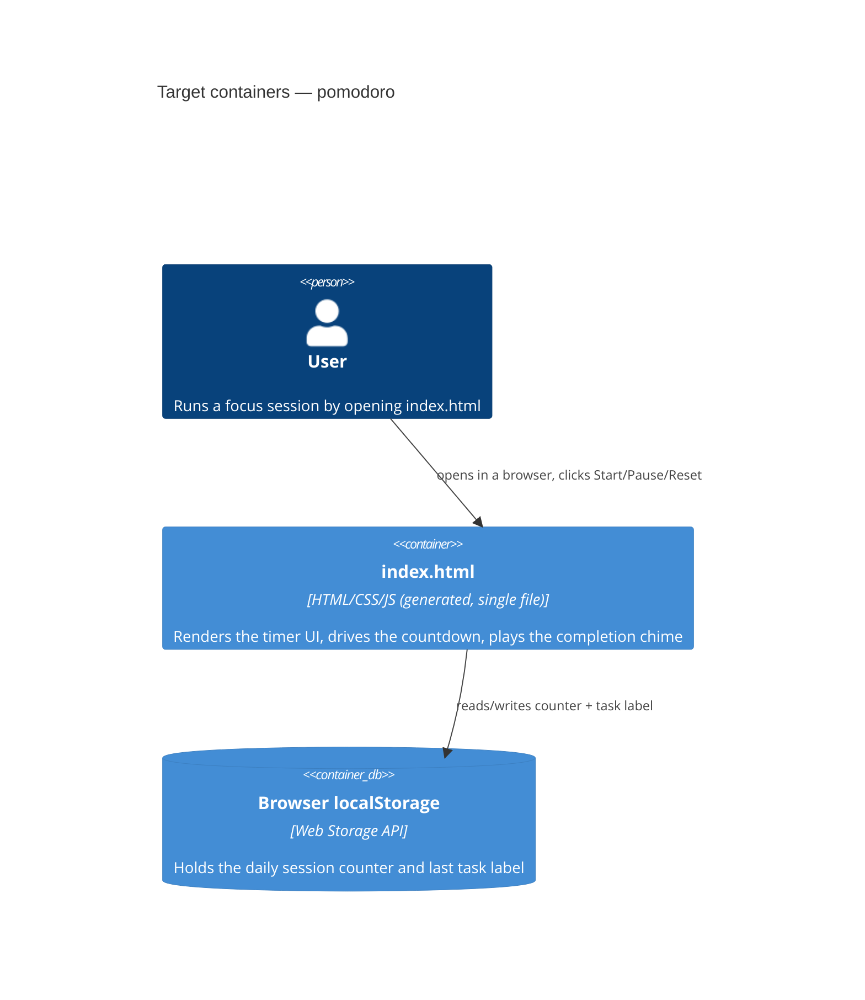

# Architecture map — pomodoro

> The **target foundation** for a greenfield repo, fixed by `survey` and read by
> specify / design / data-model / implement. Refresh with `survey` once the repo drifts past
> `reflects_commit`. No authored architecture doc exists yet — this map is the reference until one is written.

## Stack

- Language / runtime: JavaScript (ES modules), run under Node.js ≥18 for tooling/tests; the shipped artifact runs in any modern browser, no runtime dependency on Node.
- Frameworks: none — deliberately vanilla JS/CSS/HTML, per `docs/idea-brief.md` §1.
- Build / test / lint: `npm run build` (esbuild, bundles + inlines `src/` into the single committed `index.html`) · `npm test` (`node:test`, unit tests against `src/logic/`) · `npm run lint` (ESLint, plain JS ruleset).

## C4 — system as it is

## Module inventory (target — `scaffold` creates these paths; none exist yet)

| Module | Path (planned) | Layers | Wired at | Responsibility |
|---|---|---|---|---|
| logic | `src/logic/` | domain (pure functions/state machine) | imported by `src/main.js` | Phase cycling (focus/short break/long break), 4:1 long-break cadence, timestamp-based countdown math, duration config — zero DOM/browser API access, so it's testable under plain Node |
| ui | `src/ui/` | infra (DOM + browser APIs) | imported by `src/main.js` | Renders the SVG progress ring, wires Start/Pause/Reset controls, updates the tab title, generates the Web Audio chime, reads/writes localStorage |
| main | `src/main.js` | app (wiring) | build entry point | Instantiates the logic state machine and the UI layer, connects them |
| build | `scripts/build.js` | tooling | `npm run build` | Bundles `src/` (via esbuild) and inlines the result into the single root `index.html` |

## Conventions (target — planned, not yet materialized; `scaffold` creates the cited paths)

- **Module wiring / registration:** planned single manual wire-up in `src/main.js` (not yet created) — decided this session, see `docs/adr/0001-generate-single-file-from-modular-source.md`.
- **Error handling:** fail-soft in the UI layer — invalid/out-of-range input (e.g. a duration ≤0) is clamped rather than thrown; decided this session, no dedicated ADR (not an irreversible pick).
- **IDs:** none needed — no persisted records beyond scalar counters/strings in localStorage, see `docs/adr/0002-no-backend-for-v1.md`.
- **Persistence / DB access:** browser `localStorage` only, planned to be read/written exclusively from `src/ui/` (never `src/logic/`) — see `docs/adr/0002-no-backend-for-v1.md`.
- **Migrations:** none — no schema, no migration tool (`migration_tool` left empty in frontmatter deliberately), see `docs/adr/0002-no-backend-for-v1.md`.
- **Tests:** unit tests only, `node:test` + `assert`, planned one `*.test.js` per logic module under `test/logic/` (not yet created); no integration/e2e harness — manual verification in a real browser via the `run` skill stands in for it at this project's size. Decided this session, see `docs/idea-brief.md` §7.
- **Inter-module communication:** direct function calls / callbacks between `logic` and `ui`, wired once in the planned `src/main.js` — no event bus, no framework state management.
- **UI / styling:** plain CSS, no component library, no design tokens file yet — dark-mode-only per `docs/idea-brief.md` §1 (see §Frontend below).

## Datastores

| Store | Engine | Accessed via | Notes |
|---|---|---|---|
| Browser localStorage | Web Storage API | `src/ui/` only | Daily completed-session counter (reset at local midnight) + last task label; explicitly local-only, no sync, per the deferred-backend decision in `docs/idea-brief.md` §5/§7 |

## Frontend / UI foundation

- **Component library / design system:** none — first UI in the repo; this build establishes the only design system that exists so far.
- **Design tokens:** CSS custom properties in `src/styles.css` (colors, spacing) — to be defined during `design`/`screens`, dark-mode palette only for v1.
- **Styling approach:** vanilla CSS, no preprocessor, no utility framework — matches the "no framework" constraint.
- **Shared primitives:** none yet — the timer screen is the first and only screen; future features reuse whatever primitives (buttons, ring component) this one establishes.
- **State / data-fetching:** none — no server, no fetch; state lives in the `logic` module in memory plus localStorage for the two persisted fields.
- **Closest UI precedent:** none — this is the first feature; it sets the precedent for anything added later.

## Where things live / closest precedents

- A new logic rule (e.g. a new phase type) → planned `src/logic/`, modelled on the phase/cycle state machine this scaffold will establish.
- A new screen / UI component → composed from whatever primitives the timer UI establishes in planned `src/ui/` and `src/styles.css` — there is no prior precedent to reuse yet, so the first feature's build IS the precedent for the next one.

## Constraints & known tech-debt

- **No framework, no build-time dependency at runtime** — any new feature must keep working as a single generated `index.html` with zero external requests; adding a framework or CDN dependency is a foundational change, not a feature change.
- **No backend/database** — session-history features beyond the local daily counter are explicitly out of scope until a future phase re-opens that decision (see `docs/idea-brief.md` §5, §8 and `docs/adr/0002-no-backend-for-v1.md`).
- **No component library yet** — every screen/component built now is establishing the design system, not reusing one; expect this section of the map to fill in as features ship.

## Reconciliation with the authored architecture doc

No authored architecture doc exists (no `docs/architecture.md`, no root `CLAUDE.md` content — `claude.md` is currently empty); this map is the reference until one is written.
