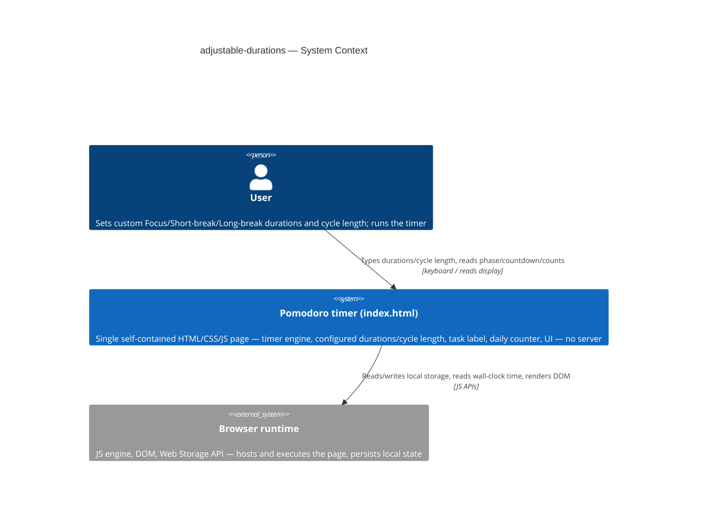
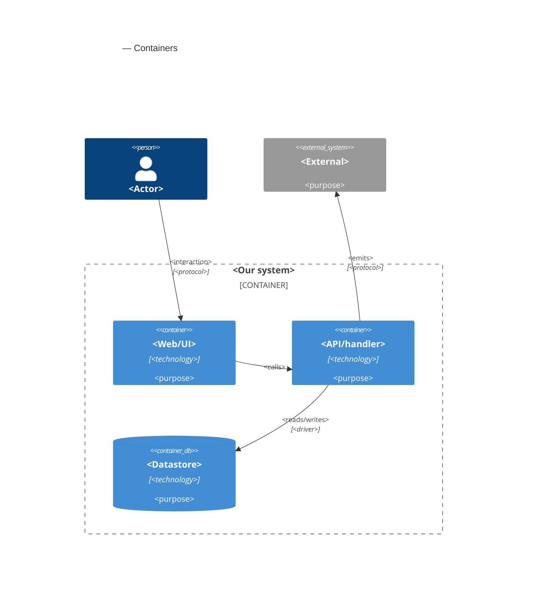

# Software Architecture Document — adjustable-durations

<!-- 12 Arc42 sections. Empty section → <!-- N/A: <one-line reason> -->. -->
<!-- C4 Context (L1) lives inline in §3. C4 Container (L2) lives inline in §5. -->
<!-- Numbers in §10 come VERBATIM from spec.md §6 NFR — no inventing, no rounding. -->

## 1. Introduction and goals

**Intent.** adjustable-durations lets a User set their own Focus / Short-break / Long-break
durations (1–180 minutes each) and their own cycle length (2–8 Focus sessions before a Long break),
replacing the classic 25/5/15/4 constants core-timer shipped — while every one of core-timer's and
session-tracking's existing correctness guarantees (wall-clock accuracy, the daily completed-session
count, the single-writer storage guard) keeps holding exactly as before, unaffected by whatever the
User configures.

**Top-3 quality goals (1-liners; full scenarios in §10):**

1. **Change-isolation correctness** — a duration or cycle-length commit is perfectly predictable: an
   idle phase updates immediately, a running or paused phase is never disturbed, and Reset always
   shows the current configuration, never a stale one.
2. **Corrupted-input resilience** — a bad committed or stored duration/cycle-length can never produce
   an instant or sub-minimum phase completion; it always falls back to the classic default.
3. **Persisted-state integrity** — extends session-tracking's write-guard discipline so only this
   feature's own three legitimate triggers (duration-commit, cycle-length-commit, load-time/pre-start
   correction) ever determine what's saved for the four new settings.

**Stakeholders.**

| Role | Interest | Sign-off owner? |
|---|---|---|
| User | Sets their own Focus/Short-break/Long-break durations and cycle length; needs a running/paused phase never disrupted and settings to survive reloads | No |
| PM (sergii.kushnir@gmail.com) | Owns the roadmap step; confirms the change-isolation and corrupted-input NFRs are met before it's marked done | No |
| Tech Lead | SAD approval | Yes |

<!-- Decision overrides (¶4) — none from the critic pass yet. -->

## 2. Constraints

**Technical.**
- JavaScript (ES modules), Node.js ≥18 for tooling/tests only — the shipped artifact runs in any
  modern browser with zero runtime dependency on Node (unchanged from core-timer/session-tracking).
- No framework — deliberately vanilla JS/CSS/HTML (`CLAUDE.md`, [`adr/0002-no-backend-for-v1`](../../adr/0002-no-backend-for-v1.md)).
- Persistence: browser local storage only, written exclusively from `src/ui/index.js`'s centralized
  write functions (never `src/logic/`), extending the existing `persistState`/`readPersistedState`
  pattern session-tracking established.
- Architecture convention: layered — `src/logic/` (pure) → `src/ui/` (DOM + storage) →
  `src/main.js` (wiring), unchanged from core-timer/session-tracking, per `CLAUDE.md`.

**Organisational.**
- Effort budget: S — 2–5 PRs, ~1 week (`.size`, `docs/roadmap.md` step 4).
- Deadline: none hard; the next unblocked roadmap step now that session-tracking has shipped.
- Team: solo — same as core-timer/session-tracking (Architect/Tech Lead/PM are the same person).

**Conventions.**
- `docs/architecture-map.md` is **stale** (`reflects_commit: 9c8717e`, predating both core-timer's
  and session-tracking's actual implementation) — this SAD relies on a fresh explorer scan of
  current `HEAD` instead of the map; flagged as a §11 risk recommending a `survey` refresh, not
  blocking this pass (same accepted gap session-tracking's own SAD already flagged).
- No ID strategy needed — no persisted records beyond scalar counters/strings in localStorage, same
  reasoning as [`adr/0002-no-backend-for-v1`](../../adr/0002-no-backend-for-v1.md).
- localStorage key convention confirmed by the scan: `feature-name:key` (e.g.
  `session-tracking:count`) — new keys follow the same shape: `adjustable-durations:focus-duration`,
  `:short-break-duration`, `:long-break-duration`, `:cycle-length`.
- Error handling: fail-soft in `src/ui/` is `CLAUDE.md`'s default (clamp, never throw) — **but** the
  duration and cycle-length fields follow the same **documented exception** session-tracking's task
  label already established: invalid commits are **rejected-with-message and revert to the last
  valid value**, never silently clamped to the range boundary (`spec.md` AC-02/AC-11).

**Regulatory / external.**
- Data classification: internal — durations and cycle length are plain numeric preferences,
  persisted only in this browser's local storage; nothing transmitted (spec §6.1).
- No personal data touched — same reasoning as core-timer/session-tracking (spec §6.1).
- No compliance controls apply — Security review: N/A (spec §6.1).

## 3. Context and scope

adjustable-durations extends the single-page Pomodoro app: a User opens `index.html`, and in addition
to running Focus/break phases and tracking a task label + daily count, can now type custom durations
for each phase type and a custom cycle length. No new external actor — the same User, the same
Browser runtime core-timer/session-tracking already declared.

<!-- brownfield: reflects a fresh explorer scan (2026-09-29) of current HEAD (aac9da7), not
     docs/architecture-map.md (stale — see §2 Conventions). Current state: src/logic/index.js
     (220 lines: createTimerEngine — the one stateful factory returning frozen {start, pause,
     reset, getSnapshot} — plus PHASES, controlStates, formatDuration from core-timer, and
     localDateString/shouldRollover/validateLabelInput/validateStoredCount/validateStoredDate/
     validateStoredLabel/applyCountUpdate from session-tracking, all pure; private
     FOCUS_DURATION_MS/SHORT_BREAK_DURATION_MS/LONG_BREAK_DURATION_MS/FOCUS_SESSIONS_PER_CYCLE
     module constants and private durationFor()/clampRemaining() helpers — this is where the
     hardcoded 25/5/15/4 this feature must make configurable currently live); src/ui/index.js
     (252 lines: mount(root, engine) — the only DOM/browser-API site — plus persistState(storage,
     state), the single write-gatekeeper function (ADR-0002, session-tracking), and
     readPersistedState(storage); current keys session-tracking:count/date/label); src/main.js
     (4 lines, unchanged: mount(document.getElementById('app'), createTimerEngine())). No
     adjustable-durations code exists yet — this feature is purely additive to both modules. -->

**External systems (in / out):**

| Actor or system | Type | Interaction |
|---|---|---|
| User | Person | Types custom durations and a custom cycle length; reads the phase, countdown, idle-duration display, label, and today's completed-session count |
| Browser runtime | System (external, the host) | Executes the page; exposes wall-clock time, tab-visibility state, and the Web Storage API |

No other external systems — deliberate, no backend, no third-party API, no analytics
([`adr/0002-no-backend-for-v1`](../../adr/0002-no-backend-for-v1.md)), unchanged from
core-timer/session-tracking.

**C4 Context (L1):**



The Context is unchanged in shape from core-timer's and session-tracking's — still only the User
talking to the single self-contained page, which depends on nothing but the browser's own
JS/DOM/Storage APIs. Nothing new crosses the system boundary: this feature adds new data the User
types into the same page and new keys in the same local storage, not a new external dependency.

## 4. Solution strategy

**Top strategic choices (the seeds for ADRs):**

1. **Target surface: `web-frontend`, continuing the surface core-timer/session-tracking already
   declared.** No new surface — `ux-flows.md` confirms the same single screen (`SCR-01`), just
   extended with new fields. No legitimate alternative (there is still no backend); fixed by
   [`adr/0002-no-backend-for-v1`](../../adr/0002-no-backend-for-v1.md), not a new decision. No ADR.
   Written to this document's frontmatter: `target_surfaces: [web-frontend]`.
2. **UI architecture: static single-view, vanilla-JS client rendering — unchanged.** Inherited from
   core-timer's/session-tracking's own §4 point 2 and the `CLAUDE.md` "no framework" constraint; no
   legitimate alternative, no ADR.
3. **Module integration: extend the existing `src/logic/index.js` and `src/ui/index.js` files, no
   new modules.** `src/main.js` stays exactly as it is — the new duration/cycle-length UI pieces live
   inside the same `mount()` call tree, not a separate wiring point. Direct function calls, no event
   bus, per the fresh explorer scan's convention and core-timer's/session-tracking's own precedent.
   No ADR for the boundary itself — but widening `src/logic/`'s public contract to serve it is
   decision 4.
4. **Engine configuration surface: extend `createTimerEngine()`'s returned object with two new
   methods, `setConfiguredDurations({focus, shortBreak, longBreak})` and `setCycleLength(n)`, rather
   than recreating the engine instance on every commit or pushing config-awareness into `src/ui/`.** →
   [ADR-0001](adr/0001-extend-engine-surface-with-configurable-durations.md). The engine currently
   closes over four private, immutable constants (`FOCUS_DURATION_MS`, `SHORT_BREAK_DURATION_MS`,
   `LONG_BREAK_DURATION_MS`, `FOCUS_SESSIONS_PER_CYCLE`) set once at construction. This decision
   extends [`core-timer/adr/0002-structural-encapsulation-control-guard`](../core-timer/adr/0002-structural-encapsulation-control-guard.md)'s
   frozen-object public surface with two new legitimate control methods — the "fourth input"
   `spec.md` §1 itself names — so the engine, which already owns `remainingMs`/`deadlineAt`/
   `running`/`focusCount` privately, can correctly decide idle-updates-now vs.
   running/paused-defers-to-next-fresh-start (AC-03/AC-04/AC-05), Reset-always-shows-current-config
   (AC-04b), and cycle-length-evaluated-at-next-completion-not-retroactively (AC-13) — without
   exposing that private state to any caller.
5. **Write-guard structure: a second centralized write function, `persistDurationConfig()`, separate
   from session-tracking's `persistState()`, called only from the three legitimate triggers.** →
   [ADR-0002](adr/0002-centralize-duration-config-writes.md). The *policy* — only a duration-field
   commit, a cycle-length-field commit, and the load-time/pre-start correction (AC-06/AC-12) may
   write the four new settings, each write always persisting the full current in-memory state of all
   four together — was already locked in during `clarify` (`spec.md` AC-08), which also mandates the
   two write guards stay structurally separate (session-tracking's count/date/label remain writable
   only by their own three existing triggers, untouched by duration/cycle-length commits). What this
   ADR records is the *structural* choice for how that split policy is implemented in code, extending
   [`session-tracking/adr/0002-centralize-session-tracking-writes`](../session-tracking/adr/0002-centralize-session-tracking-writes.md)
   to this feature's four new keys as a sibling gatekeeper, not a widened one.
6. **Persistence shape: four independent local-storage keys (`adjustable-durations:focus-duration`,
   `:short-break-duration`, `:long-break-duration`, `:cycle-length`), not one combined JSON blob.**
   Each setting's fail-soft fallback (`spec.md` AC-06/AC-12) is then trivial — a bad value in one key
   never requires partially recovering a shared object, the same reasoning session-tracking already
   applied to count/date/label. Low blast radius (contained to one module, no existing user data to
   migrate since this feature hasn't shipped yet); inline, no ADR.
7. **Input-commit UI pattern: mirror the task label's exact blur/Enter commit discipline for all four
   new fields.** Validate on the `input` event (range check, reject-and-revert per §2's documented
   exception), commit only on `blur` or `Enter` (never on an intermediate keystroke) — the same
   pattern `src/ui/index.js`'s existing `commitLabel()`/`validateLabelInput()` pair already
   establishes. No legitimate alternative given `spec.md` §1's explicit "same discipline as the task
   label" requirement; inline, no ADR.

Every tactical decision in §5–§8 traces to one of these seeds. No tactical decision below contradicts
a strategic choice.

## 5. Building block view

<!-- 🎯 Why: INTERNAL DECOMPOSITION — modules, containers, datastores. The static topology: who
     may talk to whom. Without §5, §6 (the flows) has no vocabulary of participants.
     📋 Write: 1 ¶ on the style (layered / hexagonal / clean / event-driven) + a folder tree + a
     C4Container block.
     📌 Draw ONE Container per declared `target_surface` (frontmatter): a fullstack
     [backend-service, web-frontend] = a backend-API container + a web/SPA container; a
     [backend-service, mobile-app] = the API + the mobile app. The Container(web, …) line below is
     just one surface's container — swap/add per what was declared in §4. → _shared/surfaces.md
     📌 e.g. «web app, content API, media worker, datastore, object store, CDN». -->

<One paragraph: layered / hexagonal / clean / event-driven, and why.>

**Internal decomposition:**

```
<e.g. modules/<feature>/>
├── domain/       <entities + sentinel errors>
├── app/          <use cases / services>
├── infra/        <repository + integration impl>
├── ports/        <handlers, DTOs, error mapping>
└── wiring        <self-wiring entry point>
```

**C4 Container (L2):** <!-- syntax → references/c4-mermaid-syntax.md. Real names, no <placeholder> stubs. ONE Container per declared target_surface (frontmatter); the web container below is one example surface. -->



## 6. Runtime view

<!-- 🎯 Why: the RUNTIME FLOW of 1–2 critical scenarios — who talks to whom, when, in what order.
     Without §6, §5 is just boxes with no life.
     📋 Write: a Mermaid sequenceDiagram. Participants are names from §5 (don't invent new ones).
     Messages are semantic («saves a draft»), NO HTTP verbs / paths / status codes — endpoint-level
     sequences arrive at the `api` stage.
     📌 e.g. «author → web: composes draft → web → content API: save». Seed the primary flow(s) here;
     the `sequences` stage then covers every §5 AC (no cap). Never N/A for M+; XS/S keeps ≥1 happy-path flow. -->

**Critical flow 1: <flow name>**

```mermaid
sequenceDiagram
    actor Actor
    participant Web
    participant Service
    participant Store
    Actor->>Web: <action>
    Web->>Service: <call>
    Service->>Store: <write>
    Store-->>Service: ok
    Service-->>Web: result
    Web-->>Actor: confirmation
```

**Critical flow 2: <e.g. async event propagation>** — <if applicable, otherwise N/A>.

## 7. Deployment view

<!-- 🎯 Why: the TOPOLOGY DevOps must know without reading the deploy charts — how many replicas,
     where the background worker lives, AT WHAT NUMBERS we scale.
     📋 Write: 2–3 sentences on topology + monitoring + concrete threshold numbers.
     📌 e.g. «500 authors → partition by quarter» (not «we'll think about scale later»).
     🎯 N/A allowed for XS/S that reuses an existing deployment unit with no change.
     Deployment-diagram scaffold → templates/deployment.md. -->

<Topology in 2–3 sentences. Where it runs, replicas, scaling thresholds.>

**Monitoring:**
- <Metrics — e.g. `<metric_name>`>
- <Alerts — e.g. «worker lag > 10 min → page on-call»>
- <Tracing — e.g. spans on the request boundary>

**Scaling thresholds:**
- <e.g. comfortable in one table up to N rows/year>
- <e.g. partition by quarter above N rows/year>

<!-- For XS/S with no deployment change: <!-- N/A: reuses existing deployment unit, no infra change --> -->

## 8. Crosscutting concepts

<!-- 🎯 Why: CROSS-CUTTING PATTERNS spanning several modules: logging, errors, authorization, ID
     strategy, events, caching. ⭐ The second-densest section. A pattern inside one module is NOT
     here; a project-wide convention belongs in the convention file.
     📋 Write: a table — concept / convention / where defined. One row per concept.
     📌 e.g. «sortable time-based IDs generated in the app layer» as a default from the convention file. -->

| Concept | Convention | Where defined |
|---|---|---|
| Logging | <e.g. structured, fields `module=<name>`> | <convention file §X or here> |
| Authentication | <e.g. token-based via middleware> | <convention file §X> |
| Error handling | <e.g. domain sentinel → ports error mapping → JSON> | <convention file §X> |
| ID strategy | <e.g. sortable time-based ID in the app layer> | <convention file §X> |
| Internationalisation | <e.g. N/A, single language> | — |
| Observability | <e.g. tracing on the request boundary> | — |
| Events | <module-specific patterns, if any> | <here> |

## 9. Architecture decisions

<!-- 🎯 Why: the REVERSE INDEX onto the adr/ folder. `ls adr/` gives the files; §9 gives the
     semantics — why they exist, which SAD section they attach to, what status.
     📋 Write: a 4-column table, one row per ADR. Mixed status is fine.
     📌 e.g. «0001 | Store content as a table of typed blocks | Accepted | §4». -->

| # | Title | Status | Section |
|---|---|---|---|
| <NNNN> | <imperative — e.g. "Use a sliding-window counter for rate limiting"> | Accepted | §<N> |
| <NNNN> | <imperative — e.g. "Co-locate the worker in the API process"> | Accepted | §<N> |

ADR files live under `docs/features/<slug>/adr/NNNN-<title>.md`.

## 10. Quality requirements

<!-- 🎯 Why: the QUALITY TREE — take a goal from §1 and break it into concrete leaves: tests,
     metrics, configs, drills. ⭐ Without §10, §1 is a manifesto. With §10 each declaration maps
     to something PROVABLE.
     📋 Write: per §1 goal — When / Then / How-verify. Numbers from spec §6 NFR VERBATIM (don't
     round ≤250ms to ≤300ms — that's a critic F6 hit).
     📌 e.g. «p95 ≤ 500 ms on a block update, verified by a 100 req/s load test». -->

Each top-3 goal from §1 expanded into a full scenario:

**QG-1. <quality attribute>**
- **When:** <trigger condition>
- **Then:** <expected behaviour with numbers from spec §6 NFR>
- **How verify:** <test / chaos drill / load test / metric>

**QG-2. <quality attribute>**
- **When:** <trigger>
- **Then:** <expected>
- **How verify:** <how>

**QG-3. <quality attribute>**
- **When:** <trigger>
- **Then:** <expected>
- **How verify:** <how>

## 11. Risks and technical debt

<!-- 🎯 Why: ⭐ collects EVERYTHING that can break — not only the technical. Without §11 risks get
     discussed at standups and lost; debt lives only in the head of whoever accepted it.
     📋 Write: a risk/debt table — severity — mitigation — owner. Accepted debt in its own block.
     📌 The first risk is often a product risk, not a technical one. That's normal. -->

<!-- Severity literals: Low / Medium / High for regular risks; "Open question" for rows created by
     a Save-as-OQ resolution during the Socratic walk (see references/socratic.md). -->

| Risk / debt | Severity | Mitigation | Owner |
|---|---|---|---|
| <e.g. Worker lag may reach hours during a downstream outage> | Medium | <alert >10 min, on-call playbook, retry backoff> | <DevOps> |
| <e.g. No event-schema versioning in v1> | Medium | <ADR-NNNN planned for v2, tolerate unknown fields> | <Backend> |
| Open architectural decision: <decision-headline> | Open question | Resolve before <stage trigger or YYYY-MM-DD>; <inline rationale from the Save-as-OQ> | <owner> |

**Accepted debt (acceptable in v1, plan to fix later):**
- <e.g. the entity is immutable / unversioned — OK for v1, may need audit versioning in v2>

## 12. Glossary

<!-- 🎯 Why: ⭐ the DOMAIN GLOSSARY that ends arguments a year later («checkpoint — weekly or
     biweekly? quarter — calendar or fiscal?»).
     📋 Write: a term / meaning table. Business + technical terms mixed.
     📌 e.g. «Lesson | a unit inside a course made of blocks (text, video)». -->

| Term | Meaning |
|---|---|
| <e.g. domain object A> | <its meaning in this domain> |
| <e.g. domain object B> | <its meaning> |
| <e.g. domain invariant name> | <the rule, in plain language> |
