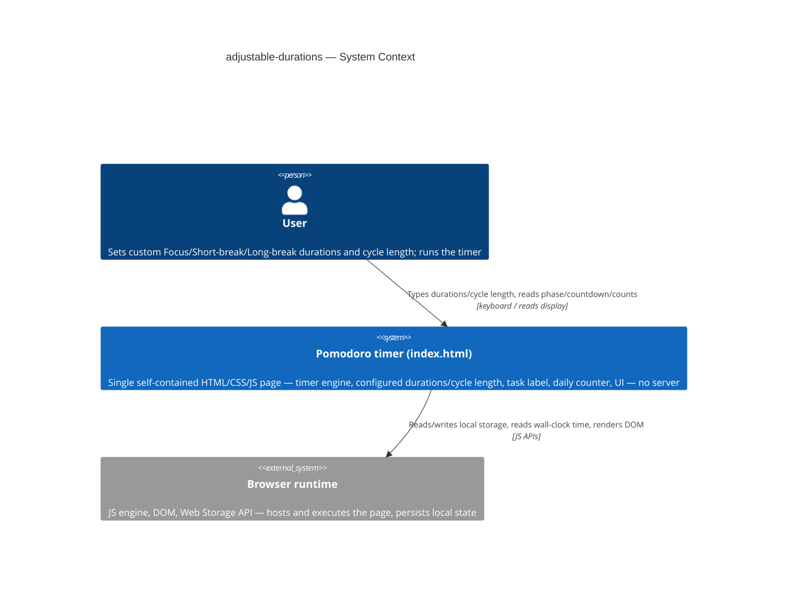
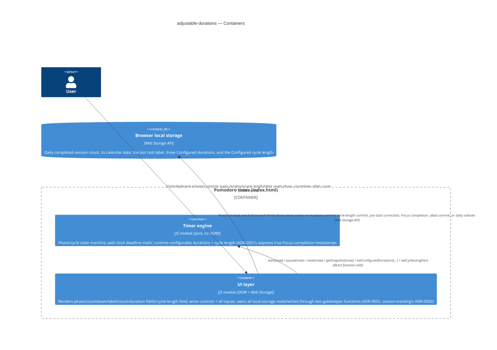
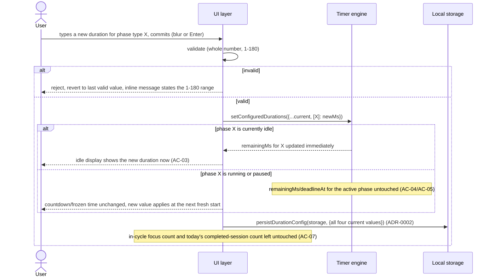
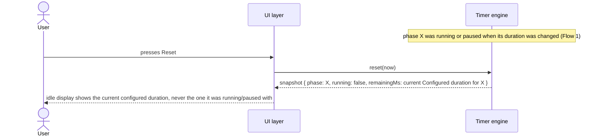
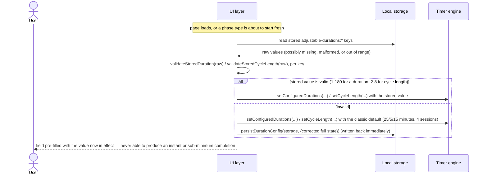
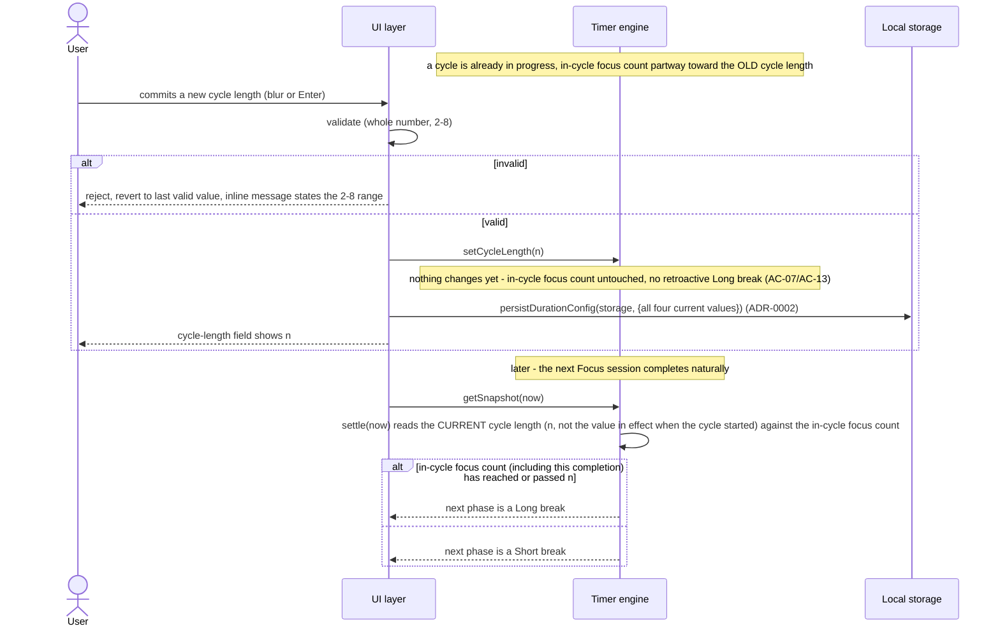
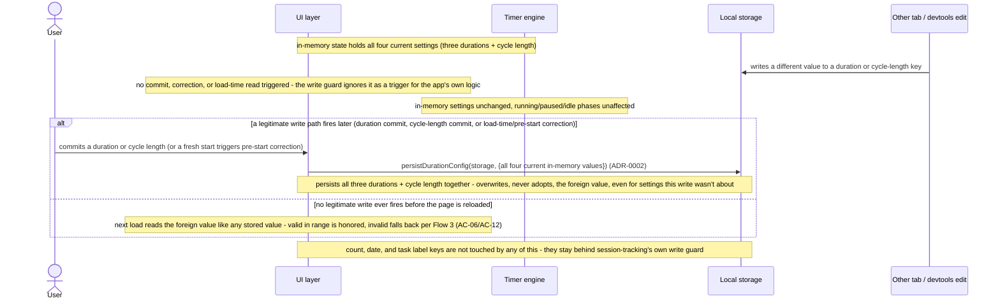

# Software Architecture Document — adjustable-durations

<!-- 12 Arc42 sections. Empty section → <!-- N/A: <one-line reason> -->. -->
<!-- C4 Context (L1) lives inline in §3. C4 Container (L2) lives inline in §5. -->
<!-- Numbers in §10 come VERBATIM from spec.md §6 NFR — no inventing, no rounding. -->

## 1. Introduction and goals

**Intent.** adjustable-durations lets a User set their own Focus / Short-break / Long-break
durations (1–180 minutes each) and their own cycle length (2–8 Focus sessions before a Long break),
replacing the classic 25/5/15/4 constants core-timer shipped — while every one of core-timer's and
session-tracking's existing correctness guarantees (wall-clock accuracy, the daily completed-session
count, the single-writer storage guard) keeps holding exactly as before, unaffected by whatever the
User configures.

**Top-3 quality goals (1-liners; full scenarios in §10):**

1. **Change-isolation correctness** — a duration or cycle-length commit is perfectly predictable: an
   idle phase updates immediately, a running or paused phase is never disturbed, and Reset always
   shows the current configuration, never a stale one.
2. **Corrupted-input resilience** — a bad committed or stored duration/cycle-length can never produce
   an instant or sub-minimum phase completion; it always falls back to the classic default.
3. **Persisted-state integrity** — extends session-tracking's write-guard discipline so only this
   feature's own three legitimate triggers (duration-commit, cycle-length-commit, load-time/pre-start
   correction) ever determine what's saved for the four new settings.

**Stakeholders.**

| Role | Interest | Sign-off owner? |
|---|---|---|
| User | Sets their own Focus/Short-break/Long-break durations and cycle length; needs a running/paused phase never disrupted and settings to survive reloads | No |
| PM (sergii.kushnir@gmail.com) | Owns the roadmap step; confirms the change-isolation and corrupted-input NFRs are met before it's marked done | No |
| Tech Lead | SAD approval | Yes |

<!-- Decision overrides (¶4) — none from the critic pass yet. -->

## 2. Constraints

**Technical.**
- JavaScript (ES modules), Node.js ≥18 for tooling/tests only — the shipped artifact runs in any
  modern browser with zero runtime dependency on Node (unchanged from core-timer/session-tracking).
- No framework — deliberately vanilla JS/CSS/HTML (`CLAUDE.md`, [`adr/0002-no-backend-for-v1`](../../adr/0002-no-backend-for-v1.md)).
- Persistence: browser local storage only, written exclusively from `src/ui/index.js`'s centralized
  write functions (never `src/logic/`), extending the existing `persistState`/`readPersistedState`
  pattern session-tracking established.
- Architecture convention: layered — `src/logic/` (pure) → `src/ui/` (DOM + storage) →
  `src/main.js` (wiring), unchanged from core-timer/session-tracking, per `CLAUDE.md`.

**Organisational.**
- Effort budget: S — 2–5 PRs, ~1 week (`.size`, `docs/roadmap.md` step 4).
- Deadline: none hard; the next unblocked roadmap step now that session-tracking has shipped.
- Team: solo — same as core-timer/session-tracking (Architect/Tech Lead/PM are the same person).

**Conventions.**
- `docs/architecture-map.md` is **stale** (`reflects_commit: 9c8717e`, predating both core-timer's
  and session-tracking's actual implementation) — this SAD relies on a fresh explorer scan of
  current `HEAD` instead of the map; flagged as a §11 risk recommending a `survey` refresh, not
  blocking this pass (same accepted gap session-tracking's own SAD already flagged).
- No ID strategy needed — no persisted records beyond scalar counters/strings in localStorage, same
  reasoning as [`adr/0002-no-backend-for-v1`](../../adr/0002-no-backend-for-v1.md).
- localStorage key convention confirmed by the scan: `feature-name:key` (e.g.
  `session-tracking:count`) — new keys follow the same shape: `adjustable-durations:focus-duration`,
  `:short-break-duration`, `:long-break-duration`, `:cycle-length`.
- Error handling: fail-soft in `src/ui/` is `CLAUDE.md`'s default (clamp, never throw) — **but** the
  duration and cycle-length fields follow the same **documented exception** session-tracking's task
  label already established: invalid commits are **rejected-with-message and revert to the last
  valid value on commit** (blur/Enter) — never on an intermediate keystroke, and never silently
  clamped to the range boundary (`spec.md` AC-02/AC-11, `spec.md` §6 NFR "Commit discipline").
- **Not zero-impact on existing tests** (critic finding, 2026-09-29): implementing ADR-0001/ADR-0002
  requires amending two already-shipped tests, not just adding new production code —
  `test/logic/write-guard.test.js`'s all-of-`src/` scan (currently asserts nothing outside
  `persistState` calls `storage.setItem`; must be extended to also permit `persistDurationConfig`)
  and `test/logic/timer-engine.test.js`'s pinned `Object.keys(engine)` assertion (currently exactly
  `['getSnapshot','pause','reset','start']`; must include the two new methods). Both amendments are
  mechanical and expected — tracked as a `tasks`-stage item, not a design-time blocker.

**Regulatory / external.**
- Data classification: internal — durations and cycle length are plain numeric preferences,
  persisted only in this browser's local storage; nothing transmitted (spec §6.1).
- No personal data touched — same reasoning as core-timer/session-tracking (spec §6.1).
- No compliance controls apply — Security review: N/A (spec §6.1).

## 3. Context and scope

adjustable-durations extends the single-page Pomodoro app: a User opens `index.html`, and in addition
to running Focus/break phases and tracking a task label + daily count, can now type custom durations
for each phase type and a custom cycle length. No new external actor — the same User, the same
Browser runtime core-timer/session-tracking already declared.

<!-- brownfield: reflects a fresh explorer scan (2026-09-29) of current HEAD (aac9da7), not
     docs/architecture-map.md (stale — see §2 Conventions). Current state: src/logic/index.js
     (220 lines: createTimerEngine — the one stateful factory returning frozen {start, pause,
     reset, getSnapshot} — plus PHASES, controlStates, formatDuration from core-timer, and
     localDateString/shouldRollover/validateLabelInput/validateStoredCount/validateStoredDate/
     validateStoredLabel/applyCountUpdate from session-tracking, all pure; private
     FOCUS_DURATION_MS/SHORT_BREAK_DURATION_MS/LONG_BREAK_DURATION_MS/FOCUS_SESSIONS_PER_CYCLE
     module constants and private durationFor()/clampRemaining() helpers — this is where the
     hardcoded 25/5/15/4 this feature must make configurable currently live); src/ui/index.js
     (252 lines: mount(root, engine) — the only DOM/browser-API site — plus persistState(storage,
     state), the single write-gatekeeper function (ADR-0002, session-tracking), and
     readPersistedState(storage); current keys session-tracking:count/date/label); src/main.js
     (4 lines, unchanged: mount(document.getElementById('app'), createTimerEngine())). No
     adjustable-durations code exists yet — this feature is purely additive to both modules. -->

**External systems (in / out):**

| Actor or system | Type | Interaction |
|---|---|---|
| User | Person | Types custom durations and a custom cycle length; reads the phase, countdown, idle-duration display, label, and today's completed-session count |
| Browser runtime | System (external, the host) | Executes the page; exposes wall-clock time, tab-visibility state, and the Web Storage API |

No other external systems — deliberate, no backend, no third-party API, no analytics
([`adr/0002-no-backend-for-v1`](../../adr/0002-no-backend-for-v1.md)), unchanged from
core-timer/session-tracking.

**C4 Context (L1):**



The Context is unchanged in shape from core-timer's and session-tracking's — still only the User
talking to the single self-contained page, which depends on nothing but the browser's own
JS/DOM/Storage APIs. Nothing new crosses the system boundary: this feature adds new data the User
types into the same page and new keys in the same local storage, not a new external dependency.

## 4. Solution strategy

**Top strategic choices (the seeds for ADRs):**

1. **Target surface: `web-frontend`, continuing the surface core-timer/session-tracking already
   declared.** No new surface — `ux-flows.md` confirms the same single screen (`SCR-01`), just
   extended with new fields. No legitimate alternative (there is still no backend); fixed by
   [`adr/0002-no-backend-for-v1`](../../adr/0002-no-backend-for-v1.md), not a new decision. No ADR.
   Written to this document's frontmatter: `target_surfaces: [web-frontend]`.
2. **UI architecture: static single-view, vanilla-JS client rendering — unchanged.** Inherited from
   core-timer's/session-tracking's own §4 point 2 and the `CLAUDE.md` "no framework" constraint; no
   legitimate alternative, no ADR.
3. **Module integration: extend the existing `src/logic/index.js` and `src/ui/index.js` files, no
   new modules.** `src/main.js` stays exactly as it is — the new duration/cycle-length UI pieces live
   inside the same `mount()` call tree, not a separate wiring point. Direct function calls, no event
   bus, per the fresh explorer scan's convention and core-timer's/session-tracking's own precedent.
   No ADR for the boundary itself — but widening `src/logic/`'s public contract to serve it is
   decision 4.
4. **Engine configuration surface: extend `createTimerEngine()`'s returned object with two new
   methods, `setConfiguredDurations({focus, shortBreak, longBreak})` and `setCycleLength(n)`, rather
   than recreating the engine instance on every commit or pushing config-awareness into `src/ui/`.** →
   [ADR-0001](adr/0001-extend-engine-surface-with-configurable-durations.md). The engine currently
   closes over four private, immutable constants (`FOCUS_DURATION_MS`, `SHORT_BREAK_DURATION_MS`,
   `LONG_BREAK_DURATION_MS`, `FOCUS_SESSIONS_PER_CYCLE`) set once at construction. This decision
   extends [`core-timer/adr/0002-structural-encapsulation-control-guard`](../core-timer/adr/0002-structural-encapsulation-control-guard.md)'s
   frozen-object public surface with two new legitimate control methods — the "fourth input"
   `spec.md` §1 itself names — so the engine, which already owns `remainingMs`/`deadlineAt`/
   `running`/`focusCount` privately, can correctly decide idle-updates-now vs.
   running/paused-defers-to-next-fresh-start (AC-03/AC-04/AC-05), Reset-always-shows-current-config
   (AC-04b), and cycle-length-evaluated-at-next-completion-not-retroactively (AC-13) — without
   exposing that private state to any caller.
5. **Write-guard structure: a second centralized write function, `persistDurationConfig()`, separate
   from session-tracking's `persistState()`, called only from the three legitimate triggers.** →
   [ADR-0002](adr/0002-centralize-duration-config-writes.md). The *policy* — only a duration-field
   commit, a cycle-length-field commit, and the load-time/pre-start correction (AC-06/AC-12) may
   write the four new settings, each write always persisting the full current in-memory state of all
   four together — was already locked in during `clarify` (`spec.md` AC-08), which also mandates the
   two write guards stay structurally separate (session-tracking's count/date/label remain writable
   only by their own three existing triggers, untouched by duration/cycle-length commits). What this
   ADR records is the *structural* choice for how that split policy is implemented in code, extending
   [`session-tracking/adr/0002-centralize-session-tracking-writes`](../session-tracking/adr/0002-centralize-session-tracking-writes.md)
   to this feature's four new keys as a sibling gatekeeper, not a widened one.
6. **Persistence shape: four independent local-storage keys (`adjustable-durations:focus-duration`,
   `:short-break-duration`, `:long-break-duration`, `:cycle-length`), not one combined JSON blob.**
   Each setting's fail-soft fallback (`spec.md` AC-06/AC-12) is then trivial — a bad value in one key
   never requires partially recovering a shared object, the same reasoning session-tracking already
   applied to count/date/label. Low blast radius (contained to one module, no existing user data to
   migrate since this feature hasn't shipped yet); inline, no ADR.
7. **Input-commit UI pattern: mirror only the task label's commit-trigger discipline (blur/Enter), not
   its per-keystroke validation.** The label's own `validateLabelInput()` rejects-and-reverts on every
   `input` event because a length cap is meaningful to enforce live. A duration/cycle-length field is
   different: the User must be free to type an intermediate, momentarily-invalid state (e.g. clearing
   "25" to type "50") without it being reverted mid-edit. So these four fields validate **only at
   commit time** (`blur`/`Enter`) — the field accepts any typed text live, and validation +
   reject-and-revert-with-message happens once, at the same commit moment `commitLabel()` already
   fires, per `spec.md` AC-02/AC-11 and `spec.md` §6 NFR "Commit discipline" (corrected 2026-09-29 —
   the earlier draft of this decision copied the label's *per-keystroke* validation by mistake; only
   the *commit-trigger* discipline is shared). No legitimate alternative given `spec.md` §1's explicit
   "same discipline as the task label" requirement (referring to the commit trigger); inline, no ADR.

Every tactical decision in §5–§8 traces to one of these seeds. No tactical decision below contradicts
a strategic choice.

## 5. Building block view

Layered, unchanged from core-timer/session-tracking: `src/logic/` (domain, extended) → `src/ui/`
(infra, extended) → `src/main.js` (unchanged wiring). `src/logic/` still never imports `src/ui/`;
`src/ui/` remains the only module that touches the DOM or the Web Storage API.

**Internal decomposition:**

```
src/
├── logic/
│   └── index.js   <createTimerEngine() extended: returned object grows two new methods,
│                   setConfiguredDurations({focus, shortBreak, longBreak}) and
│                   setCycleLength(n) (ADR-0001) — updates the idle phase's remainingMs
│                   immediately if the target phase type is currently idle, defers to the
│                   next fresh start otherwise; settle()'s Long-break decision reads the
│                   current cycle length at completion time, not a value baked in earlier
│                   (AC-13). "Idle" here means the phase has never been started since its
│                   last reset AND remainingMs still equals the full duration it was given
│                   AT THAT START/RESET moment — not the live current config — so a config
│                   change while a phase is genuinely running or paused is distinguishable
│                   from one while it's idle without a new boolean flag (see ADR-0001
│                   Amendment for the full reasoning and clampRemaining()/durationFor()'s
│                   corrected contract). New pure functions, no engine-state access:
│                   per-setting stored-value fallback validation (validateStoredDuration(raw),
│                   validateStoredCycleLength(raw)) and input-commit validation
│                   (validateDurationInput / validateCycleLengthInput), mirroring
│                   validateStoredCount's existing shape.>
├── ui/
│   └── index.js   <mount(root, engine) extended: three duration input fields + one
│                   cycle-length input field, each committing on blur/Enter only (mirroring
│                   commitLabel()'s commit-trigger discipline, not validateLabelInput()'s
│                   per-keystroke validation — see §4 decision 7) — a commit calls the
│                   engine's new setConfiguredDurations/setCycleLength method, then
│                   persistDurationConfig(storage, {...}), the second write gatekeeper
│                   (ADR-0002). readPersistedDurationConfig(storage) added alongside
│                   readPersistedState — run at mount, AND re-run as a pre-start correction
│                   check right before any phase type starts fresh (AC-06/AC-12), each field
│                   validated independently; an invalid value found at either read point is
│                   corrected and written back via persistDurationConfig immediately.>
└── main.js        <unchanged: mount(document.getElementById('app'), createTimerEngine())>
```

**C4 Container (L2):** still one `Container` for the declared `web-frontend` surface — unchanged
shape from session-tracking's, since this feature adds no new datastore, only new data inside the
same local storage.



The Containers view keeps the same two-module split session-tracking already drew — the Timer engine
(pure logic) and the UI layer (DOM + storage) inside one boundary, one shared local-storage box
outside it. What's new: the engine gains two more callable methods, and the storage box now holds
three more scalars (three durations + cycle length) alongside the existing count/date/label, still
written through two separate gatekeeper functions rather than one merged writer.

## 6. Runtime view

**Critical flow 1: Duration commit across phase states (ADR-0001 in action)**



**Critical flow 2: Reset after a running/paused duration change (AC-04b)**



**Critical flow 3: Corrupted or invalid stored value falls back to the classic default (AC-06/AC-12)**



**Critical flow 4: Cycle-length commit mid-cycle (AC-13)**



**Critical flow 5: Foreign write to a saved setting is ignored, next legitimate write overwrites it (AC-08)**



**Coverage (sequences pass).** US-01 → Flow 1 · US-02 → Flows 1, 2 · US-03 → Flow 3 (valid branch; AC-09/AC-14) · US-04 → Flow 1 · US-05 → Flow 1 · US-06 → Flow 3 · US-07 → Flows 1, 4 · US-08 → Flow 5 · US-09 → Flows 3, 4 · US-10 → Flow 4. Every AC-01…AC-14 (incl. AC-04b) is shown by a flow or branch; none is N/A.

**Flags for `design`.** (1) §6 participants use §5 block names (UI layer / Timer engine / Local storage) rather than the generic `<ui>`/`<service>`/`<data-store>` vocabulary — kept consistent across all five flows by choice. (2) Flow 5 adds an external actor (other tab / devtools edit) not declared in §5. (3) Flow 5 draws two-tab last-writer-wins overwrite (spec §6.1); no ADR proposed.

## 7. Deployment view

<!-- N/A: reuses the existing single-file deployment unit (index.html, generated by `npm run build`
     and committed at the repo root, served by GitHub Pages) — no server, no infra, no change to how
     the app is delivered. Unchanged from core-timer §7 / session-tracking §7. -->

## 8. Crosscutting concepts

| Concept | Convention | Where defined |
|---|---|---|
| Logging | N/A — no server; browser devtools only | — |
| Authentication | N/A — no accounts, single local User, no login | — |
| Authorization | Two independent write guards: session-tracking's own (count/date/label, unchanged) and this feature's new one — only a duration-field commit, a cycle-length-field commit, or the load-time/pre-start correction may **trigger a write** to the four `adjustable-durations:*` keys, and each such write always persists the app's own full current in-memory state of all four together. An external write (another tab, devtools) never triggers any app logic — but that is distinct from whether its *value* is later read: a valid value found at the next read point (mount, or the pre-start correction check) is used like any other stored value, per `spec.md` §6.1's own "honored by design" language — it is not "adopted" via a triggered write, it is simply read, same as any value that happened to be there | [ADR-0002](adr/0002-centralize-duration-config-writes.md), `spec.md` §5 AC-08, §6.1 |
| Error handling | Fail-soft in `src/ui/` is the repo default (clamp, never throw) — **except** the duration/cycle-length fields, which deliberately reject-with-message and revert on commit rather than clamp, mirroring the task label's own already-documented exception | `CLAUDE.md` Conventions; `spec.md` §1 (documented exception, §2 of this SAD) |
| ID strategy | N/A — no persisted records beyond scalar counters/a date/strings, none of them requiring an identifier | [`adr/0002-no-backend-for-v1`](../../adr/0002-no-backend-for-v1.md) |
| Internationalisation | N/A — single language (English UI text) | — |
| Observability | N/A — no metrics/tracing infra; NFRs verified by unit tests + the manual checks in `spec.md` §6 | `spec.md` §6 |
| Events | N/A — no event bus; direct function calls only, extended by two new engine methods (not callbacks) — see §4 decision 4 | [ADR-0001](adr/0001-extend-engine-surface-with-configurable-durations.md) |
| Layout convention | The countdown display reserves fixed width for a 3-digit minute value (up to 180) at all times, so no surrounding control shifts position — including mid-countdown as displayed minutes cross from 3 digits to 2. A CSS/rendering detail, not an architectural decision — no ADR; verified manually per `spec.md` §6 NFR "Display width" | `spec.md` §6 NFR "Display width"; implementation detail for `screens`/`implement` |

## 9. Architecture decisions

<!-- 🎯 Why: the REVERSE INDEX onto the adr/ folder. `ls adr/` gives the files; §9 gives the
     semantics — why they exist, which SAD section they attach to, what status.
     📋 Write: a 4-column table, one row per ADR. Mixed status is fine.
     📌 e.g. «0001 | Store content as a table of typed blocks | Accepted | §4». -->

| # | Title | Status | Section |
|---|---|---|---|
| 0001 | Extend the timer engine's public surface with runtime-configurable durations and cycle length | Accepted | §4 |
| 0002 | Centralize the four duration/cycle-length settings' local-storage writes through a second gatekeeper function | Accepted | §4 |

ADR files live under `docs/features/adjustable-durations/adr/NNNN-<title>.md`.

## 10. Quality requirements

**QG-1. Change-isolation correctness**
- **When:** a duration commit occurs while that same phase type is running, paused, or idle; a Reset
  follows a running/paused duration change.
- **Then:** 100% of duration commits while that same phase type is running or paused leave its
  current remaining time byte-for-byte unchanged (AC-04/AC-05); a commit while idle updates the
  display immediately instead (AC-03); Reset after such a change shows the current Configured
  duration, not the one that was running (AC-04b) — all three behaviors verified (`spec.md` §6 NFR
  "Running/paused isolation", verbatim).
- **How verify:** unit test (`spec.md` §6 NFR, verbatim).

**QG-2. Corrupted-input resilience**
- **When:** a stored duration or cycle-length value isn't a valid whole number in its range
  (missing, malformed, non-numeric, decimal, or out of range) — encountered on page load or before
  that phase type would start fresh.
- **Then:** each phase type's Configured duration falls back to its own classic default on any
  stored value that isn't a valid whole number in 1–180, immediately written back to storage — 0
  thrown exceptions, 0 instant completions (`spec.md` §6 NFR "Corrupted/missing persisted duration",
  verbatim); the Configured cycle length falls back to 4 the same way, 0 thrown exceptions
  (`spec.md` §6 NFR "Cycle-length persistence + fallback", verbatim).
- **How verify:** unit test with invalid stored data (`spec.md` §6 NFR, verbatim).

**QG-3. Persisted-state integrity**
- **When:** a write attempt to any of the four duration/cycle-length settings arrives from anything
  other than this app's own duration-commit, cycle-length-commit, or load-time/pre-start correction
  actions.
- **Then:** the write guard ignores that attempt as a **trigger** for its own logic — the external
  write itself never runs any app logic — and the next legitimate write persists the full current
  in-memory state of all four settings together, overwriting whatever was saved in the meantime
  (`spec.md` §5 AC-08, verbatim; this is distinct from whether a valid external *value* is later read
  at the next read point — see §8 Authorization); every Configured duration stays within 1–180
  minutes at all times, 0 exceptions (`spec.md` §6 NFR "Duration bounds", verbatim); the Configured
  cycle length stays within 2–8 at all times, 0 exceptions (`spec.md` §6 NFR "Cycle-length bounds",
  verbatim).
- **How verify:** unit tests on `persistDurationConfig()` and a source-level guard scan, mirroring
  core-timer's own AC-03 test style and session-tracking's own AC-07 test style.

## 11. Risks and technical debt

<!-- brownfield gotchas: docs/architecture-map.md predates core-timer's and session-tracking's
     implementation entirely — see the stale-map risk row below. No other legacy code carries debt
     into this feature; src/logic/index.js and src/ui/index.js are the same two files
     session-tracking shipped and tested. -->

| Risk / debt | Severity | Mitigation | Owner |
|---|---|---|---|
| `docs/architecture-map.md` is stale (`reflects_commit: 9c8717e`, predates both core-timer and session-tracking entirely) | Medium | This SAD used a fresh explorer scan instead; recommend running `survey` to refresh the map, not blocking this pass | Tech Lead |
| Widening `createTimerEngine()`'s public surface from 4 to 6 methods touches an already-shipped, reviewed module (ADR-0001), and requires amending `test/logic/timer-engine.test.js`'s pinned `Object.keys(engine)` assertion (critic finding, 2026-09-29 — see §2's "not zero-impact" note) | Medium | Kept additive at the production-code level (two new methods, no signature change to the existing four, no altered existing behavior); the pinned-keys test is amended in the same PR as an expected, mechanical change, not a surprise regression | Tech Lead |
| Two structurally similar but independent write-guard functions (`persistState`, `persistDurationConfig`) now live in `src/ui/index.js` — a future reader must know which owns which keys, and `test/logic/write-guard.test.js`'s existing all-of-`src/` scan must be extended to also permit `persistDurationConfig` as a legitimate `storage.setItem` caller (critic finding, 2026-09-29) | Low | Named distinctly, documented in §8; the scan-test amendment is tracked as a `tasks`-stage item alongside the two new functions themselves | Tech Lead |
| The engine has no dedicated `paused` flag (idle and paused both read as `running === false`) — `setConfiguredDurations`/`setCycleLength` (ADR-0001) distinguish them by comparing `remainingMs` against the full duration captured at the phase's last start/reset, not the live current config (critic finding, 2026-09-29 — see ADR-0001 Amendment) | Medium | Documented explicitly in ADR-0001's Amendment and §5's internal decomposition; covered by a dedicated unit test for the "config changes while paused with a partially-elapsed remainingMs" case, distinct from the idle case | Tech Lead |
| Two tabs of this same app open at once can race on writes to the same shared local storage, including the four new duration/cycle-length keys | Low | Accepted per `spec.md` §6.1 — each tab's own next legitimate write (ADR-0002) overwrites the other's; no reconciliation attempted this step, same accepted gap session-tracking already carries for count/date/label | N/A (accepted) |
| Open decision: is the accepted multi-tab non-reconciliation gap worth solving generally across the storage layer, rather than per-feature? | Open question | Resolve before a future step that adds a second write surface (e.g. cross-device sync), if one is ever added (`spec.md` §8) | sergii.kushnir@gmail.com |

**Resolved during this pass:** `spec.md` §8's first open question ("should quick-select duration
presets be added alongside free-form input?") carried a due date of "before `design`, if
reconsidered" — this pass is that trigger. Resolution: **keep the default** — free-form numeric
input only, no presets, consistent with `spec.md` §3 Non-goals. Closed, not carried forward.

**Accepted debt (acceptable in v1, plan to fix later):**
- The two-tab write race (see risk row above) is accepted for v1; a future step could add cross-tab
  reconciliation via the storage-change event if it becomes a real problem (`spec.md` §6.1).
- No preset duration profiles — free-form numeric input only for v1, resolved above; presets remain
  a UX nicety for a possible future step (`spec.md` §3 Non-goals).

## 12. Glossary

| Term | Meaning |
|---|---|
| Configured duration | The User-set length per phase type (Focus/Short break/Long break), persisted across reloads, applying the next time that phase type starts fresh (`CONTEXT.md`) |
| Configured cycle length | The User-set number of Focus phases (2–8, default 4) that must complete before the next Long break, persisted across reloads and applied to the very next Long-break decision, including mid-cycle (`CONTEXT.md`) |
| Phase | The current segment of the cycle — Focus, Short break, or Long break (`CONTEXT.md`) |
| Cycle | The repeating sequence of N Focus phases (N = the Configured cycle length) separated by Short breaks, followed by one Long break (`CONTEXT.md`) |
| In-cycle focus count | The ephemeral, in-memory count of Focus sessions completed since the last Long break, compared against the Configured cycle length to decide the next break type (`CONTEXT.md`) |
| User | The single person running the timer in their own browser tab; no other roles (`CONTEXT.md`) |
