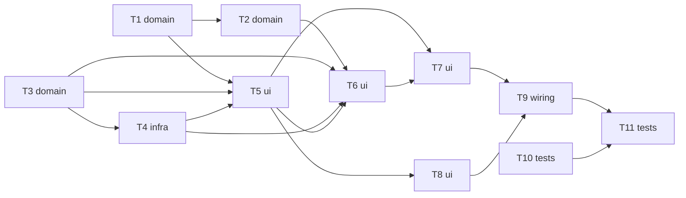

# Epic — adjustable-durations

> **Spec:** [spec.md](../spec.md) · **Design:** [sad.md](../sad.md) · **Screens:** [screens.md](../screens.md) · **API:** none (no external interface — [api-sync-report.md](../contracts/api-sync-report.md)) · **ADRs:** [adr/](../adr/)

## Goal

Let a User set their own Focus / Short-break / Long-break durations (1–180 min) and cycle length (2–8), persisted in local storage, without ever disturbing a running or paused phase, the in-cycle count or today's session count (spec §2 Goals).

## Scope

- **In:** `src/logic/index.js` (engine setters + validators), `src/ui/index.js` (fields, second write gatekeeper), `src/styles.css`, regenerated `index.html`.
- **Out:** presets, backend/sync, cross-tab reconciliation (spec §3 Non-goals, §6.1).

## Task map

T1/T2/T3 share `src/logic/index.js` and T4–T7 share `src/ui/index.js`, so each group runs serialized; the two groups run in parallel with each other. T10 (e2e harness, `package.json` + `test-e2e/`) has no overlap and can start at once; T11 runs last against the built `index.html`.

## Tasks

See [tracker.md](./tracker.md) for status. Machine contract: [tasks.json](../tasks.json).

| # | Task | Layer | Blocked by | DoD (short) |
|---|---|---|---|---|
| T1 | Make the engine's three phase durations configurable at runtime, with idle vs running/paused semantics | domain | — | Unit tests assert idle updates immediately, running and paused remainingMs stay byte-for-byte unchanged (paused case distinct), Reset shows current config, and counts are untouched. |
| T2 | Make the engine's cycle length configurable and read it at completion time | domain | T1 | Unit tests assert setCycleLength alone changes nothing, and the next Focus completion picks Long vs Short break against the newly set cycle length, including the reached-or-passed boundary. |
| T3 | Add pure duration/cycle-length input and stored-value validation functions | domain | — | Unit tests pass for all valid/invalid classes (boundaries, out-of-range, decimal, exponent, empty, non-numeric) for both input and stored validators, with 0 thrown exceptions. |
| T4 | Add persistDurationConfig / readPersistedDurationConfig as the second storage gatekeeper | infra | T3 | Unit tests assert every persistDurationConfig call writes all four keys, invalid stored values fall back per key and are written back, and the source-level scan permits only persistState and persistDurationConfig. |
| T5 | Add the three duration fields (Numeric setting field) with commit on blur/Enter and inline validation | ui | T1, T3, T4 | Manual check: a valid commit updates an idle countdown at once, leaves a running/paused countdown unchanged, an invalid commit reverts with the 1–180 message, and reload pre-fills the committed values. |
| T6 | Add the cycle-length field with commit on blur/Enter and inline validation | ui | T2, T3, T4, T5 | Manual check: a valid cycle-length commit persists and is pre-filled after reload, an invalid commit reverts with the 2–8 message, and the session count is unchanged. |
| T7 | Wire load-time and pre-start correction of stored durations and cycle length | ui | T5, T6 | A test with invalid stored values set between load and start shows the phase runs its classic default, the correction is written back, and 0 exceptions or instant completions occur. |
| T8 | Reserve fixed width for a 3-digit minute countdown so no control shifts | ui | T5 | Manual check across 1–180 minutes, observed live through a 100→99 minute crossing, shows no control shifts position. |
| T9 | Rebuild index.html and run the manual NFR checks | wiring | T7, T8 | `npm run build` regenerates index.html committed alongside src/, and the manual persistence, commit-discipline, network and width checks pass. |
| T10 | Add a dev-only headless-browser harness for e2e-through-UI tests | tests | — | `npm run test:e2e` runs a smoke test green against the built index.html, `npm test` does not execute it, and the driver is a devDependency only. |
| T11 | Write the e2e-through-UI tests for duration and cycle-length flows | tests | T9, T10 | `npm run test:e2e` passes against the freshly built index.html with a named test for each listed AC, including running/paused isolation, reload pre-fill and the write guard. |

## Risks / Hard rules

- Engine public surface stays a frozen object; only two new methods are added (ADR-0001). `src/logic/` never touches DOM/storage.
- Only `persistState` and `persistDurationConfig` may call `storage.setItem`; each duration write persists all four settings (ADR-0002, AC-08).
- The pinned `Object.keys(engine)` and write-guard scan tests are amended, not deleted (sad §2, §11).
- The paused-vs-idle unit test (ADR-0001 Amendment) must exist before the feature counts as done.
- `index.html` is generated: rebuild and commit with any `src/` change (CLAUDE.md).
