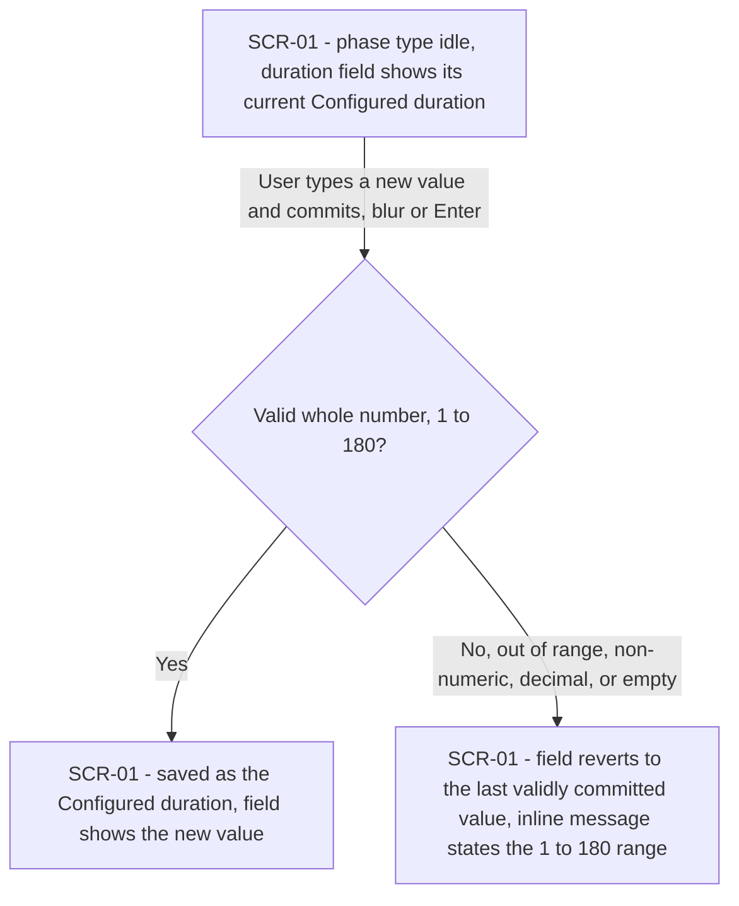
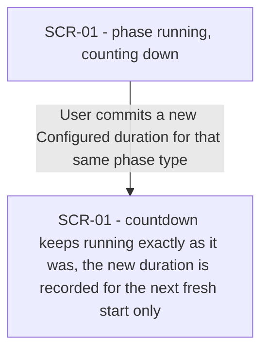
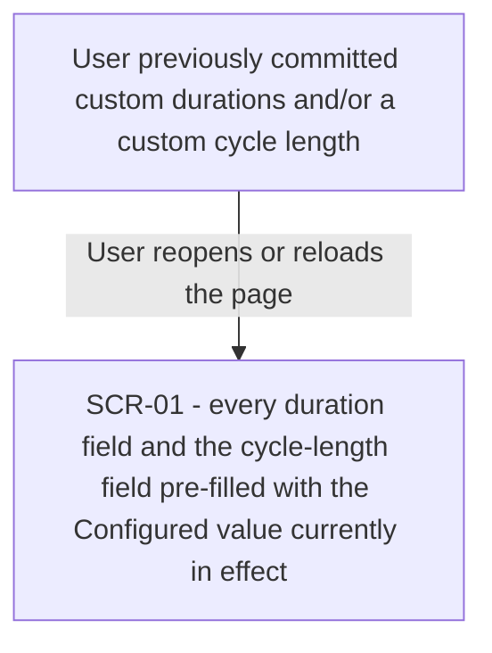
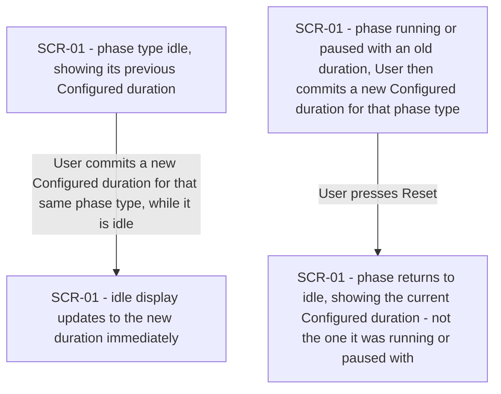
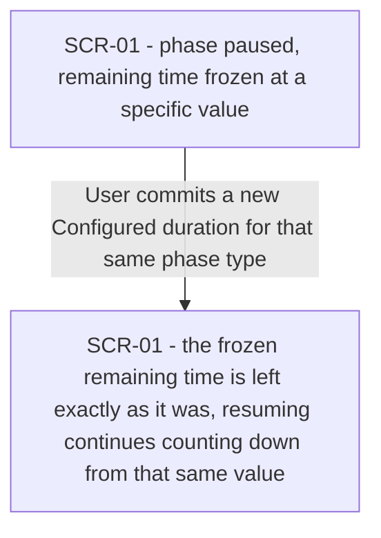
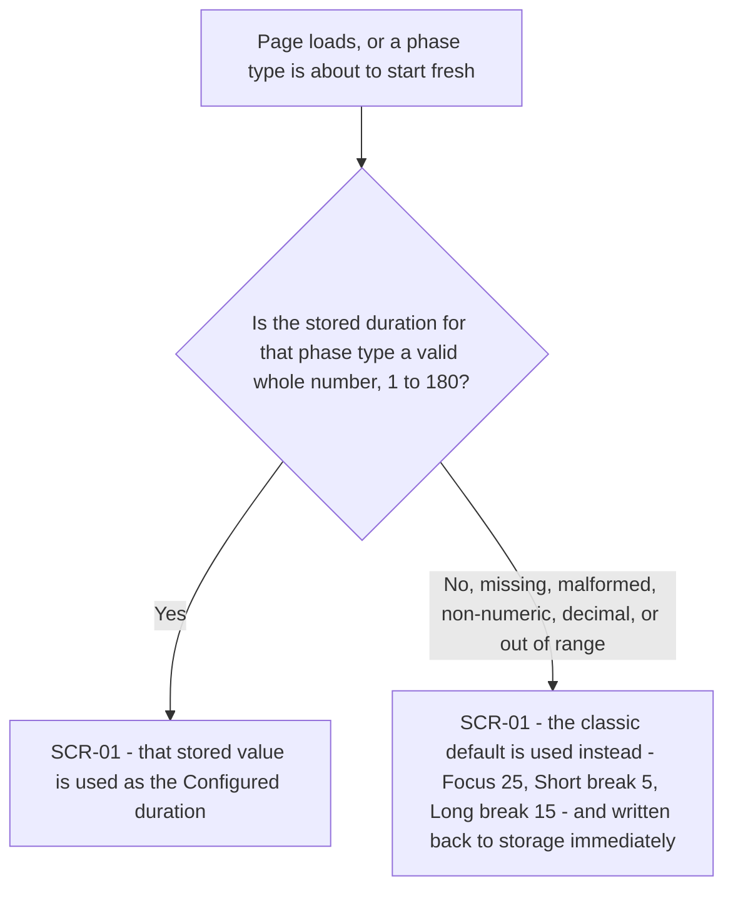
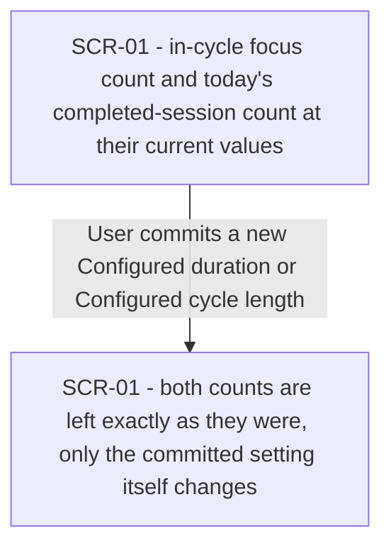
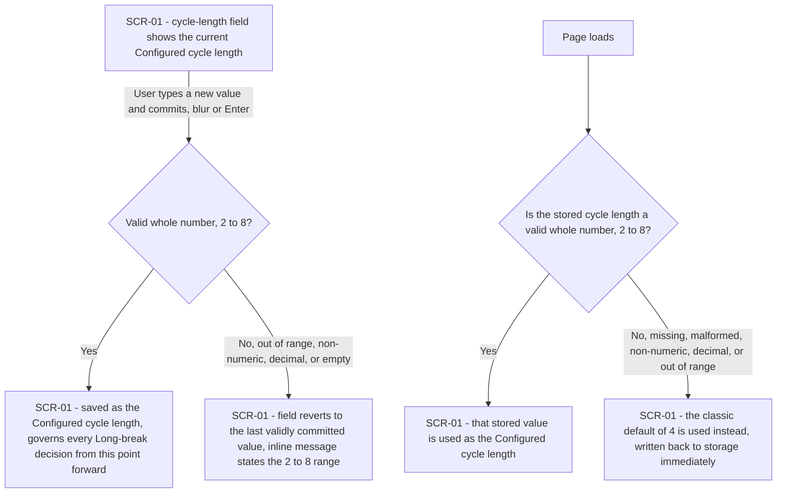
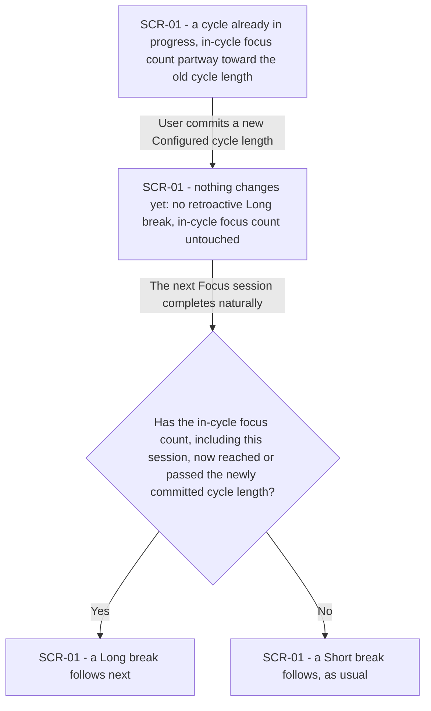

# UX flows — adjustable-durations

> User flows for every UI-touching §4 user story, produced by `ux-flows` (after `clarify`, before
> `design`) and read by `design` (evidence for the target-surface + UI-architecture decisions),
> `sequences` (UI-driven flows align on SCR ids), `screens` (details every inventory row) and
> `plan-tests` (the e2e-through-UI paths). Always markdown + mermaid `flowchart`.

## Platform decisions

- **Posture:** responsive single web page, code-only — no `docs/design-system.md` exists yet (recommend running `/sdd:design-system`); matches `docs/architecture-map.md` and both existing features' `ux-flows.md` exactly.
- This feature adds duration and cycle-length input fields to the **same single screen** core-timer and session-tracking already established — no new screen, no navigation, no settings page or modal. Every "transition" below is an in-place UI update (a field's displayed value, a commit outcome), not a page change.
- A duration or cycle-length field commits on blur/Enter, the same discipline the task label already uses (`docs/features/session-tracking/ux-flows.md` US-03) — never on an intermediate keystroke.

## Screen inventory

| ID | Screen | Purpose | Entry | Exit |
|---|---|---|---|---|
| SCR-01 | Timer screen | Shows the active phase, its remaining time, the Start/Pause/Reset controls, the task label input, today's completed-session count, and — new in this feature — the three per-phase-type duration fields and the cycle-length field | Opening `index.html` | None — a single-page app, no navigation away within the feature |

## Flows

### Flow: US-01 — Set my own durations

The User types into a phase type's duration field and commits it by leaving the field or pressing Enter. A cleanly-formed whole number from 1 to 180 is saved as that phase type's Configured duration immediately (AC-01). Anything else — out of range, non-numeric, a decimal, or an empty commit — is rejected outright: the field snaps back to the last validly committed value and an inline message tells the User the valid 1–180 range (AC-02).

### Flow: US-02 — Trust a running phase isn't disrupted

While a phase is actively running, committing a new Configured duration for that same phase type changes nothing about the countdown in progress — it keeps ticking down unchanged. The new value is only recorded to apply the next time that phase type starts fresh (AC-04).

### Flow: US-03 — See my configured settings after reload

On reopening or reloading the page, every duration field and the cycle-length field are pre-filled with whatever is currently in effect for that setting — the last value the User validly committed, or the classic default if none was ever validly committed or storage needed correcting (AC-09, AC-14; the correction mechanism itself is Flow US-06 / branches of Flow US-09).

### Flow: US-04 — See an idle phase reflect my latest change immediately

If the phase type is idle when the User commits a new Configured duration, the idle display updates to the new value right away, with no need to start it first (AC-03). Separately, if the User changed a duration while that phase was running or paused (Flow US-02 / Flow US-05), pressing Reset afterward returns it to idle showing the current Configured duration — never the value it happened to be running or paused with (AC-04b).

### Flow: US-05 — Trust a paused phase keeps its frozen time

Committing a new Configured duration while that phase type is paused never touches the frozen remaining time — resuming picks up from exactly where the User left off, not from a jumped-to value. The new duration only applies the next time that phase type starts fresh (AC-05).

### Flow: US-06 — Trust a bad stored duration can't be gamed

Every time a stored duration is read — on page load, or right before that phase type would start fresh — the system checks it's a valid whole number in the 1–180 range. A valid value is used as-is. Anything else is treated as no valid Configured duration at all: the system falls back to that phase type's classic default and writes it back to storage immediately, so an invalid or corrupted value can never let a phase complete faster than its own valid minimum, let alone instantly (AC-06).

### Flow: US-07 — Trust my progress isn't disturbed by a settings change

Committing a new duration or a new cycle length never advances, resets, or otherwise touches the in-cycle focus count or today's completed-session count — those keep showing exactly what they showed a moment before the commit (AC-07). (How a new cycle length shapes the *next* Long-break decision is a separate point in time, covered by Flow US-10.)

### Flow: US-09 — Set my own cycle length

The User types into the cycle-length field and commits it the same way as a duration. A whole number from 2 to 8 is saved as the Configured cycle length and governs every Long-break decision from that point on (AC-10); anything else is rejected outright, the field reverts, and an inline message states the valid 2–8 range (AC-11). Separately, on every page load the stored cycle length is checked the same way a duration is: a valid 2–8 value is used as-is, anything invalid falls back to the classic default of 4 and is written back to storage immediately (AC-12).

### Flow: US-10 — Trust a cycle-length change is applied consistently, even mid-cycle

Committing a new cycle length mid-cycle changes nothing at that instant — no Long break is triggered retroactively, and the in-cycle focus count isn't reset or altered (this half also restates AC-07, from the cycle-length side). The new value only takes effect at the next real decision point: when the next Focus session completes naturally, the system checks the in-cycle focus count against the just-committed cycle length, and decides Long break vs. Short break accordingly — even if that decision lands partway through what had been a longer or shorter cycle before (AC-13).

### Out of scope: US-08 — Trust nothing but my own edits change what's saved

US-08's only acceptance criterion (AC-08) is an engine-level write guard triggered by non-actor input — a message from another tab or origin, or a devtools edit — not by any User action taken through this screen. There is no User-driven path that reaches it, so it has no flow to draw; it is verified by a unit test, not a UI path (the same treatment `session-tracking` gave its own analogous write-guard AC-07).

## AC coverage

| AC | Shown by | Notes |
|---|---|---|
| AC-01 | Flow US-01 → A→B(Yes)→C | Valid commit saves the new duration |
| AC-02 | Flow US-01 → B(No)→D | Invalid commit rejected, reverts, inline range message |
| AC-03 | Flow US-04 → A→B | Idle display updates the moment it's committed |
| AC-04 | Flow US-02 → A→B | Running phase's countdown untouched by a commit |
| AC-04b | Flow US-04 → C→D | Reset after a running/paused change shows the current Configured duration |
| AC-05 | Flow US-05 → A→B | Paused phase's frozen remaining time untouched by a commit |
| AC-06 | Flow US-06 → B(No)→D | Invalid stored duration falls back to the classic default, written back |
| AC-07 | Flow US-07 → A→B; also Flow US-10 → A→B | Neither counts nor in-cycle count move on a commit, for either setting |
| AC-08 | N/A — not a user-driven branch | AC-08's trigger is non-actor input (another tab/origin, a devtools edit); no User action reaches it — an engine-level write guard verified by unit test, not a UX path (same treatment as session-tracking's AC-07) |
| AC-09 | Flow US-03 → A→B | Reload pre-fills every duration field with the currently effective value |
| AC-10 | Flow US-09 → A→B(Yes)→C | Valid commit saves the new cycle length |
| AC-11 | Flow US-09 → B(No)→D | Invalid commit rejected, reverts, inline range message |
| AC-12 | Flow US-09 → E→F(No)→H | Invalid stored cycle length falls back to 4, written back |
| AC-13 | Flow US-10 → B→C→D/E | Mid-cycle commit takes effect on the next natural Focus completion, not retroactively |
| AC-14 | Flow US-03 → A→B | Reload pre-fills the cycle-length field with the currently effective value |
