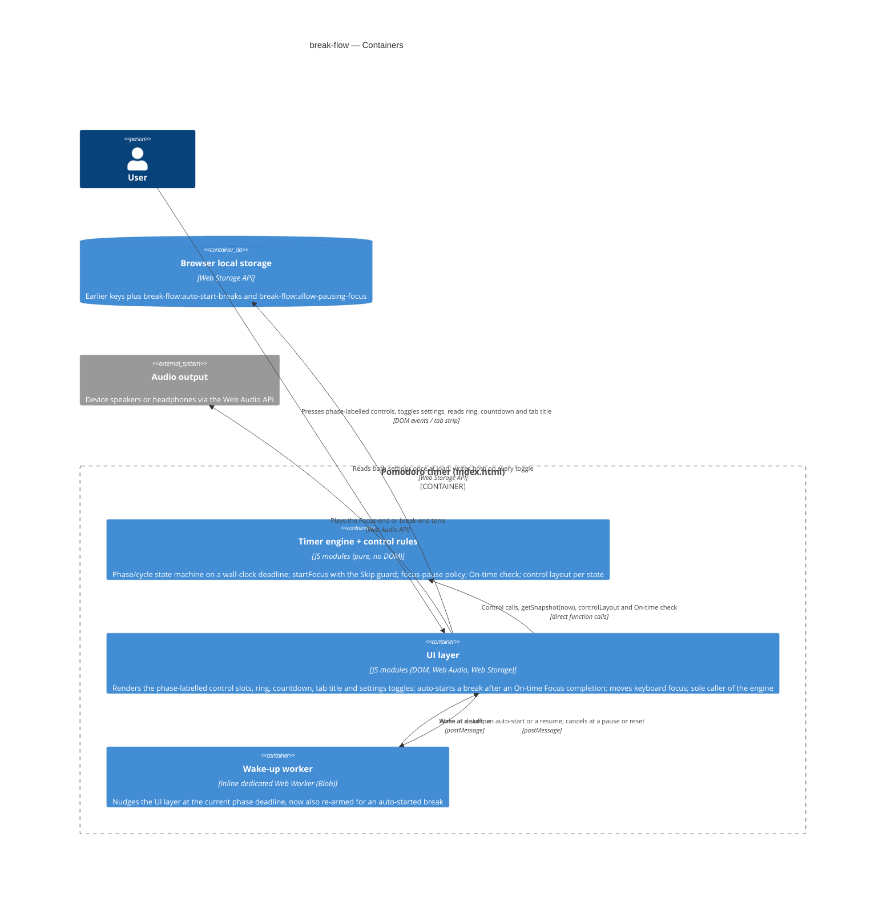

# Software Architecture Document — break-flow

<!-- 12 Arc42 sections. Empty section → <!-- N/A: <one-line reason> -->. -->
<!-- C4 Context (L1) lives inline in §3. C4 Container (L2) lives inline in §5. -->
<!-- Numbers in §10 come VERBATIM from spec.md §6 NFR — no inventing, no rounding. -->

## 1. Introduction and goals

**Intent.** break-flow changes what happens between phases, so the User can't lose a break by
missing it and doesn't have to press anything to start one. With **Auto-start breaks** on (the
default), a break starts counting down by itself after an On-time completion of a Focus phase.
A late completion (device asleep, tab frozen) leaves the break waiting at full length, Long break
included. Focus never starts on its own. During any break, one **Start focus** control ends the
break and starts the next Focus. A 3 s **Skip guard** after every break start absorbs a reflex
press. With **Allow pausing focus** off (the default), a Focus phase can't be paused: it either
runs to zero or Reset focus discards it. Every control names the phase it acts on, and keyboard
focus is never left on a control that disappeared. The segment is the owner, who uses the timer
daily as a personal focus tool (`spec.md` §1–§2). The feature adds two stored on/off preferences
and no network access, and it supersedes only the core-timer and sensory-feedback criteria that
`spec.md` §1 lists.

**Top-3 quality goals (1-liners; full scenarios in §10):**

1. **No lost or stolen breaks.** A break auto-starts only after an On-time completion (≤ 5 s after
   the Focus phase's true end) and counts down from that true end within 1 s. A late completion
   leaves it waiting at full length. At most one phase starts per completion, Focus never does, and
   exactly one chime plays per completion.
2. **Reflex-proof, phase-labelled controls.** Every control names its phase. Start focus is
   unavailable for 3 s (± 0.25 s) of real time after any break start. A pause of Focus that isn't
   allowed does nothing, whatever the input path. Keyboard focus never stays on a control that
   disappeared.
3. **Fail-soft settings.** Both settings fall back to their defaults (Auto-start breaks on, Allow
   pausing focus off) when nothing valid can be read, and keep a change the browser can't save for
   the rest of the page load. Only this page's own inputs change them (AC-12).

**Stakeholders.**

| Role | Interest | Sign-off owner? |
|---|---|---|
| User | Takes every break they were present for without a press; leaves a break for Focus with one press; never loses a break to sleep or a reflex press | No |
| PM (sergii.kushnir@gmail.com) | Owns the KPIs in `spec.md` §7 (missed breaks → 0, 4 presses per cycle) and `spec.md` §8's open questions on the Skip guard, the Long break and Reset focus confirmation | No |
| Tech Lead | SAD approval; owner of `spec.md` §8's On-time tolerance question (due before `design`, resolved in §4) | Yes |

<!-- Decision overrides (¶4) — populated by the critic resolution loop, empty otherwise. -->

- Decision (2026-10-01, owner): AC-11 is read with Pause *X* and Resume *X* of the same phase as
  **one pause toggle control** in one slot. After Pause break or Pause focus, keyboard focus stays
  on the slot that now reads Resume, instead of moving to the main position. A reflex double
  press therefore pauses and resumes, and can't skip the break (`spec.md` §7 KPI "breaks lost to
  an accidental Start focus press → 0"). Every other control that disappears still moves focus as
  AC-11 says. Recorded in ADR-0003; `screens` keeps the two in one slot.
- Decision (2026-10-01, Tech Lead): `spec.md` §8's On-time tolerance question is resolved: keep
  5 s (§4 decision 6).

## 2. Constraints

**Technical.**
- JavaScript (ES modules). Node.js ≥18 is used for tooling and tests only. The shipped `index.html`
  runs in any modern browser with no runtime dependency on Node (`CLAUDE.md`).
- No framework. The app stays vanilla JS/CSS/HTML in one generated, self-contained `index.html`
  bundled by esbuild ([`adr/0001`](../../adr/0001-generate-single-file-from-modular-source.md),
  [`adr/0003`](../../adr/0003-esbuild-as-the-build-tool.md)). There are zero network requests
  beyond the initial page load (`spec.md` §6 "Self-contained load").
- No backend. Persistence is browser local storage only
  ([`adr/0002`](../../adr/0002-no-backend-for-v1.md)). This feature adds two scalar on/off values.
- The background timing promise covers current stable desktop Chrome and Edge only, unchanged from
  sensory-feedback (`spec.md` AC-01, sensory-feedback §3). Other browsers and phones fall under the
  On-time / late rule (§4).
- Architecture convention: layered, `src/logic/` (pure, no DOM, no browser API) → `src/ui/` (DOM +
  browser APIs) → `src/main.js` (the one wiring point), unchanged (`CLAUDE.md`).

**Organisational.**
- Effort budget: S, meaning 2–5 PRs (`.size`). Route `quick` (`.route`).
- Deadline: none hard. The owner wants it before anything else on `docs/roadmap.md` (`spec.md` §1).
- Team: solo. The Architect, Tech Lead and PM are the same person, as in the four earlier features.

**Conventions.**
- `docs/architecture-map.md` is **stale** (`reflects_commit: 9c8717e`, 114 commits behind `HEAD`
  `15b1534`, before all four shipped features). This SAD was drafted from a direct read of `HEAD`:
  `src/logic/index.js`, `src/ui/index.js`, `src/main.js`, `test/logic/` and `test-e2e/`. The stale
  map is carried as a §11 risk, the same accepted gap the sensory-feedback and adjustable-durations
  SADs flagged.
- Timing is an absolute wall-clock deadline, not a tick counter
  ([`core-timer/adr/0001`](../core-timer/adr/0001-wall-clock-deadline-timing.md)). The On-time
  check, the auto-started break's countdown and the Skip guard are all measured against wall-clock
  timestamps the engine already holds or receives.
- The engine changes only through methods called by `src/ui/`, with no `message`/`storage`
  listener anywhere ([`core-timer/adr/0002`](../core-timer/adr/0002-structural-encapsulation-control-guard.md)).
  `test/logic/timer-engine.test.js` pins the engine surface at six methods ("no new control
  method", sensory-feedback). This feature **deliberately changes that pin** (§4).
- Local storage writes go through named gatekeepers that always write their full key set
  (session-tracking ADR-0002, adjustable-durations ADR-0002). `test/logic/write-guard.test.js`
  enforces it. The two new keys get a third gatekeeper of the same shape (§8).
- Error handling is fail-soft in `src/ui/`: clamp, never throw to the User (`CLAUDE.md`).
- Design tokens are CSS custom properties on `:root` in `src/styles.css`, dark-mode only. There is
  no `docs/design-system.md` yet; `ux-flows.md` recorded a responsive-both posture.

**Regulatory / external.**
- Data classification: public, two on/off preferences that aren't personal (`spec.md` §6.1).
- WCAG 2.x AA remains the self-imposed accessibility bar set by sensory-feedback. Keyboard focus
  handling (AC-11) is part of it.
- Security review: N/A. No new data beyond two preferences, no network access, no permission
  boundary (`spec.md` §6.1).

## 3. Context and scope

break-flow changes the same single-page Pomodoro app. The User still opens `index.html` in a
browser. The page now starts a break by itself after an On-time Focus completion, offers Start
focus during every break, and shows two more settings next to the durations. No new external
system appears. The browser runtime matters more than before, because whether the page is awake
at the Focus end now decides if the break auto-starts or waits.

<!-- brownfield: direct read of HEAD 15b1534 (the architecture map is stale — §2 Conventions).
     src/logic/index.js (335 lines): createTimerEngine() → frozen {start, pause, reset, getSnapshot,
     setConfiguredDurations, setCycleLength}; snapshot {phase, running, idle, remainingMs, focusCount,
     justCompletedFocusAt, phaseFullMs, justCompleted}; settle(now) advances at most one boundary and
     always leaves the next phase idle; controlStates(snapshot) → {startDisabled, pauseDisabled}.
     src/ui/index.js (591 lines): mount(root, engine) with three fixed buttons labelled
     Start/Pause/Reset, a 250 ms setInterval render loop, a visibilitychange re-render, the wake-up
     worker (wakeup.js), the chime player (audio.js), the ring (ring.js), two storage gatekeepers
     (persistState, persistDurationConfig), prepareStart() as the pre-start correction for a fresh
     start, refocusIfStranded() for keyboard focus. test-e2e/: playwright-core with a fake page clock. -->

**External systems (in / out):**

| Actor or system | Type | Interaction |
|---|---|---|
| User | Person | Presses the phase-labelled controls (Start/Pause/Resume/Reset focus, Start/Pause/Resume/Reset break), toggles Auto-start breaks and Allow pausing focus, commits durations; hears the chimes; reads the ring, countdown, phase name and tab title |
| Browser runtime | System (external, the host) | Runs the page and provides wall-clock time, tab visibility, timers, the DOM, keyboard focus and local storage. It may sleep, freeze or throttle the page, which is what makes a completion late (§4) |
| Audio output (via the browser) | System (external) | Plays the Focus-end and break-end tones through the Web Audio API, unchanged from sensory-feedback. An auto-started break needs no new sound path |

Nothing crosses the system boundary to a network: no backend, no third party, no analytics. Other
tabs of the same app are outside the trust boundary: their messages and their saved values never
change this page's running timer or settings (`spec.md` AC-12).

**C4 Context (L1):**


The User talks only to the single page. The page depends on the browser for time, rendering,
keyboard focus and the two saved preferences, and on the audio output for the chimes. There are
no network edges, and other tabs are outside the trust boundary.

## 4. Solution strategy

**Top strategic choices (the seeds for ADRs):**

1. **Target surface: `web-frontend`, the same single page the four earlier features declared.**
   `ux-flows.md` inventories one page, with SCR-01…SCR-06 as timer states of that page and SCR-07
   as its settings area. There is no backend ([`adr/0002-no-backend-for-v1`](../../adr/0002-no-backend-for-v1.md)).
   There's no legitimate alternative, so no ADR. Written to this document's frontmatter:
   `target_surfaces: [web-frontend]`.
2. **UI architecture: unchanged static single view, vanilla-JS client rendering.** The new
   controls and the two toggles are plain DOM built by `src/ui/`. A state change is a re-render of
   the same page, not navigation (`ux-flows.md` Platform decisions). Inherited from `CLAUDE.md` and
   the earlier SADs' §4 point 2. No ADR.
3. **Break auto-start: `src/ui/` starts the break with a backdated fresh start after an On-time
   Focus completion, and the engine keeps "a completion always leaves the next phase waiting".** →
   [ADR-0001](adr/0001-auto-start-breaks-with-a-backdated-start-from-the-ui.md). A pure
   `isOnTimeCompletion(at, now)` in `src/logic/` decides whether the completion is On-time. When
   `render()` sees an On-time Focus completion with Auto-start breaks on, it runs the existing
   pre-start correction (`prepareStart`) on the waiting break and then calls `engine.start(at)`,
   where `at` is the Focus phase's true end. The break counts down from that true end (AC-01,
   §6 ≤ 1 s accuracy), the saved durations are re-read before its length is pinned (AC-12, AC-14),
   and a late completion never reaches that branch, so the break waits (AC-03). The engine's settle
   rule (core-timer AC-05: at most one boundary, the new phase is idle) stays intact. "At most one
   phase per completion starts without the User" therefore holds by construction: only the UI's
   auto-start branch starts a phase without a press, and it runs only for a Focus completion (AC-02).
4. **Skip guard and the focus-pause policy are enforced inside the engine.** →
   [ADR-0002](adr/0002-enforce-skip-guard-and-focus-pause-policy-in-the-engine.md). The engine gains
   two methods: `startFocus(now)` ends a break (running, paused or waiting) and starts the next
   Focus, and `setAllowPausingFocus(on)` sets whether `pause(now)` may pause a running Focus. The
   snapshot gains `startedAt` (the moment of the current phase's fresh start, kept across
   pause/resume) and `allowPausingFocus`. `startFocus` does nothing inside the Skip guard, which is
   a pure `isSkipGuardActive(snapshot, now)`. `pause` does nothing for a running Focus while pausing
   isn't allowed (AC-15: "by any other means"). A Skipped break adds nothing to and removes nothing
   from the in-cycle focus count (AC-04b). This grows the engine surface from six methods to eight
   and amends core-timer ADR-0002's "exactly these controls" wording and sensory-feedback's
   six-method pin.
5. **Phase-labelled controls come from a pure layout rule rendered into three fixed slots.** →
   [ADR-0003](adr/0003-derive-controls-from-a-pure-layout-rendered-into-fixed-slots.md). A pure
   `controlLayout(snapshot, now)` in `src/logic/` returns the action in the main position and in up
   to two side positions, and whether the main one is greyed out. It encodes the AC-10 table and
   replaces `controlStates`. `src/ui/` renders three fixed buttons that take their label and action
   from it. An empty slot is `hidden` (a control the settings never allow). The greyed-out Start
   focus uses `aria-disabled="true"`, not `disabled`, so it can still hold keyboard focus (AC-11).
   Keyboard focus moves only when the slot it is on changes to a different control or becomes
   hidden.
6. **On-time completion tolerance: 5 s, and the Skip guard: 3 s, as named constants in
   `src/logic/`.** This resolves `spec.md` §8's first open question (owner Tech Lead, due before
   `design`). A hidden desktop Chrome/Edge tab already notices a completion within 1 s through the
   sensory-feedback wake-up worker, so 5 s leaves margin for a slow tick without letting a real
   sleep count as on time. It's a configuration value (one PR to change), so no ADR. The 3 s Skip
   guard stays as specified, and its review after 7 days of use remains the PM's open question.
7. **The two settings are UI preferences behind a third storage gatekeeper, read once per page
   load.** Auto-start breaks lives in `src/ui/` memory, because only the UI's auto-start branch
   reads it. Allow pausing focus is pushed into the engine with `setAllowPausingFocus` at mount and
   on every toggle, and that's the only place it lives (decision 4). Both are read from local storage
   only at mount (AC-12: another tab's saved values apply at the next load), through a new
   `persistBreakFlowSettings` / `readPersistedBreakFlowSettings` pair shaped like the two existing
   gatekeepers (§8). It follows session-tracking ADR-0002 and adjustable-durations ADR-0002, so no
   ADR.

Every tactical decision in §5–§8 traces to one of these seeds. None contradicts a strategic choice.

## 5. Building block view

The layering is unchanged: `src/logic/` (domain, pure) → `src/ui/` (DOM + browser APIs) →
`src/main.js` (unchanged wiring), and `src/logic/` never imports `src/ui/`. The new rules (On-time
check, Skip guard, control layout, stored-toggle validation) go into a new pure sibling module
`src/logic/controls.js`, re-exported from `src/logic/index.js`. That follows sensory-feedback's
`feedback.js` split. The new slot rendering and keyboard-focus handling go into a new
`src/ui/controls.js`, following sensory-feedback's split of `src/ui/` into one module per concern,
since `src/ui/index.js` is already 591 lines. esbuild bundles everything into the one `index.html`
as before.

**Internal decomposition:**

```
src/
├── logic/
│   ├── index.js      <createTimerEngine(): + startFocus(now) (ends a break or starts a waiting
│   │                  Focus; no-op inside the Skip guard or while Focus is running/paused),
│   │                  + setAllowPausingFocus(on); pause(now) is a no-op for a running Focus while
│   │                  pausing isn't allowed; start(now) records startedAt on a fresh start (now may
│   │                  be the backdated true Focus end, ADR-0001); reset clears it. Snapshot +
│   │                  startedAt, + allowPausingFocus. settle() unchanged: one boundary, next phase
│   │                  idle (ADR-0002). controlStates removed in favour of controlLayout.>
│   └── controls.js   <NEW, pure, re-exported from index.js: ON_TIME_TOLERANCE_MS = 5000,
│                      SKIP_GUARD_MS = 3000, isOnTimeCompletion(at, now), isSkipGuardActive(snapshot,
│                      now), controlLayout(snapshot, now) → {main, side: [a, b], mainGreyed}
│                      with actions startFocus | pauseFocus | resumeFocus | resetFocus | startBreak |
│                      pauseBreak | resumeBreak | resetBreak (the AC-10 table, ADR-0003),
│                      CONTROL_LABELS (phase-named labels), DEFAULT_BREAK_FLOW_SETTINGS
│                      {autoStartBreaks: true, allowPausingFocus: false},
│                      validateStoredToggle(raw, fallback).>
├── ui/
│   ├── index.js      <mount(root, engine): builds the controls from ui/controls.js instead of the
│   │                  Start/Pause/Reset buttons; adds the Auto-start breaks and Allow pausing focus
│   │                  toggles next to the durations; the third storage gatekeeper
│   │                  persistBreakFlowSettings / readPersistedBreakFlowSettings; render() gains the
│   │                  auto-start branch (ADR-0001, §6 Flow 1) and re-arms the wake-up after it;
│   │                  prepareStart() learns that Start focus from a break is a fresh Focus start.
│   │                  Still the ONLY caller of the engine's methods (core-timer ADR-0002).>
│   ├── controls.js   <NEW: createControls(onAction) → {element, update(layout)}: three fixed slot
│   │                  buttons (main, side-1, side-2); label + data-action from the layout; hidden
│   │                  when empty; aria-disabled when greyed; moves keyboard focus per AC-11
│   │                  (ADR-0003); the phase name + countdown get tabindex="-1" as the fallback
│   │                  focus target.>
│   ├── wakeup.js     <unchanged — armed again after an auto-start>
│   ├── audio.js      <unchanged — the Focus-end chime of an auto-start is the ordinary
│   │                  completion chime>
│   └── ring.js       <unchanged>
├── styles.css        <greyed-out main control style (aria-disabled), toggle styles, slot layout;
│                      exact arrangement is the screens stage's (AC-10)>
└── main.js           <unchanged: mount(document.getElementById('app'), createTimerEngine())>

test/logic/
├── timer-engine.test.js  <amended: engine surface pin 6 → 8 methods, snapshot shape + startedAt
│                          + allowPausingFocus; controlStates tests replaced by controlLayout>
├── write-guard.test.js   <amended: third gatekeeper allowed for the two break-flow keys>
└── break-flow.test.js    <NEW: On-time 5 s / 5.001 s, backdated-start accuracy, Skip guard,
                           startFocus, pause policy, controlLayout table, stored-toggle fallback>
test-e2e/break-flow.e2e.js <NEW: fake-clock auto-start, return-after-sleep, Start focus, focus moves>
```

**C4 Container (L2):** still the single `web-frontend` surface, drawn as the containers the
earlier SADs drew. Nothing new runs. The engine container gains the guard and the layout rules,
and local storage holds two more keys.



The UI layer stays the hub. It asks the pure engine for a snapshot and the control layout, starts
a break itself when a Focus phase ends on time, keeps the wake-up worker armed for whatever is
running, saves the two preferences and plays the chimes. The engine is where the Skip guard and
the "no pausing Focus" rule are enforced, so no input path can get around them.

## 6. Runtime view

<!-- 🎯 Why: the RUNTIME FLOW of 1–2 critical scenarios — who talks to whom, when, in what order.
     Without §6, §5 is just boxes with no life.
     📋 Write: a Mermaid sequenceDiagram. Participants are names from §5 (don't invent new ones).
     Messages are semantic («saves a draft»), NO HTTP verbs / paths / status codes — endpoint-level
     sequences arrive at the `api` stage.
     📌 e.g. «author → web: composes draft → web → content API: save». Seed the primary flow(s) here;
     the `sequences` stage then covers every §5 AC (no cap). Never N/A for M+; XS/S keeps ≥1 happy-path flow. -->

**Critical flow 1: <flow name>**

```mermaid
sequenceDiagram
    actor Actor
    participant Web
    participant Service
    participant Store
    Actor->>Web: <action>
    Web->>Service: <call>
    Service->>Store: <write>
    Store-->>Service: ok
    Service-->>Web: result
    Web-->>Actor: confirmation
```

**Critical flow 2: <e.g. async event propagation>** — <if applicable, otherwise N/A>.

## 7. Deployment view

<!-- 🎯 Why: the TOPOLOGY DevOps must know without reading the deploy charts — how many replicas,
     where the background worker lives, AT WHAT NUMBERS we scale.
     📋 Write: 2–3 sentences on topology + monitoring + concrete threshold numbers.
     📌 e.g. «500 authors → partition by quarter» (not «we'll think about scale later»).
     🎯 N/A allowed for XS/S that reuses an existing deployment unit with no change.
     Deployment-diagram scaffold → templates/deployment.md. -->

<Topology in 2–3 sentences. Where it runs, replicas, scaling thresholds.>

**Monitoring:**
- <Metrics — e.g. `<metric_name>`>
- <Alerts — e.g. «worker lag > 10 min → page on-call»>
- <Tracing — e.g. spans on the request boundary>

**Scaling thresholds:**
- <e.g. comfortable in one table up to N rows/year>
- <e.g. partition by quarter above N rows/year>

<!-- For XS/S with no deployment change: <!-- N/A: reuses existing deployment unit, no infra change --> -->

## 8. Crosscutting concepts

<!-- 🎯 Why: CROSS-CUTTING PATTERNS spanning several modules: logging, errors, authorization, ID
     strategy, events, caching. ⭐ The second-densest section. A pattern inside one module is NOT
     here; a project-wide convention belongs in the convention file.
     📋 Write: a table — concept / convention / where defined. One row per concept.
     📌 e.g. «sortable time-based IDs generated in the app layer» as a default from the convention file. -->

| Concept | Convention | Where defined |
|---|---|---|
| Logging | <e.g. structured, fields `module=<name>`> | <convention file §X or here> |
| Authentication | <e.g. token-based via middleware> | <convention file §X> |
| Error handling | <e.g. domain sentinel → ports error mapping → JSON> | <convention file §X> |
| ID strategy | <e.g. sortable time-based ID in the app layer> | <convention file §X> |
| Internationalisation | <e.g. N/A, single language> | — |
| Observability | <e.g. tracing on the request boundary> | — |
| Events | <module-specific patterns, if any> | <here> |

## 9. Architecture decisions

<!-- 🎯 Why: the REVERSE INDEX onto the adr/ folder. `ls adr/` gives the files; §9 gives the
     semantics — why they exist, which SAD section they attach to, what status.
     📋 Write: a 4-column table, one row per ADR. Mixed status is fine.
     📌 e.g. «0001 | Store content as a table of typed blocks | Accepted | §4». -->

| # | Title | Status | Section |
|---|---|---|---|
| <NNNN> | <imperative — e.g. "Use a sliding-window counter for rate limiting"> | Accepted | §<N> |
| <NNNN> | <imperative — e.g. "Co-locate the worker in the API process"> | Accepted | §<N> |

ADR files live under `docs/features/<slug>/adr/NNNN-<title>.md`.

## 10. Quality requirements

<!-- 🎯 Why: the QUALITY TREE — take a goal from §1 and break it into concrete leaves: tests,
     metrics, configs, drills. ⭐ Without §10, §1 is a manifesto. With §10 each declaration maps
     to something PROVABLE.
     📋 Write: per §1 goal — When / Then / How-verify. Numbers from spec §6 NFR VERBATIM (don't
     round ≤250ms to ≤300ms — that's a critic F6 hit).
     📌 e.g. «p95 ≤ 500 ms on a block update, verified by a 100 req/s load test». -->

Each top-3 goal from §1 expanded into a full scenario:

**QG-1. <quality attribute>**
- **When:** <trigger condition>
- **Then:** <expected behaviour with numbers from spec §6 NFR>
- **How verify:** <test / chaos drill / load test / metric>

**QG-2. <quality attribute>**
- **When:** <trigger>
- **Then:** <expected>
- **How verify:** <how>

**QG-3. <quality attribute>**
- **When:** <trigger>
- **Then:** <expected>
- **How verify:** <how>

## 11. Risks and technical debt

<!-- 🎯 Why: ⭐ collects EVERYTHING that can break — not only the technical. Without §11 risks get
     discussed at standups and lost; debt lives only in the head of whoever accepted it.
     📋 Write: a risk/debt table — severity — mitigation — owner. Accepted debt in its own block.
     📌 The first risk is often a product risk, not a technical one. That's normal. -->

<!-- Severity literals: Low / Medium / High for regular risks; "Open question" for rows created by
     a Save-as-OQ resolution during the Socratic walk (see references/socratic.md). -->

| Risk / debt | Severity | Mitigation | Owner |
|---|---|---|---|
| <e.g. Worker lag may reach hours during a downstream outage> | Medium | <alert >10 min, on-call playbook, retry backoff> | <DevOps> |
| <e.g. No event-schema versioning in v1> | Medium | <ADR-NNNN planned for v2, tolerate unknown fields> | <Backend> |
| Open architectural decision: <decision-headline> | Open question | Resolve before <stage trigger or YYYY-MM-DD>; <inline rationale from the Save-as-OQ> | <owner> |

**Accepted debt (acceptable in v1, plan to fix later):**
- <e.g. the entity is immutable / unversioned — OK for v1, may need audit versioning in v2>

## 12. Glossary

<!-- 🎯 Why: ⭐ the DOMAIN GLOSSARY that ends arguments a year later («checkpoint — weekly or
     biweekly? quarter — calendar or fiscal?»).
     📋 Write: a term / meaning table. Business + technical terms mixed.
     📌 e.g. «Lesson | a unit inside a course made of blocks (text, video)». -->

| Term | Meaning |
|---|---|
| <e.g. domain object A> | <its meaning in this domain> |
| <e.g. domain object B> | <its meaning> |
| <e.g. domain invariant name> | <the rule, in plain language> |
