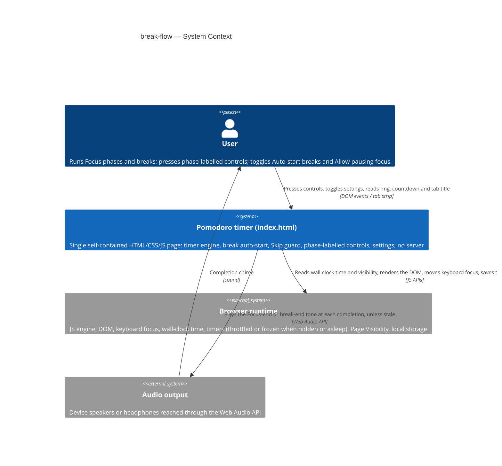
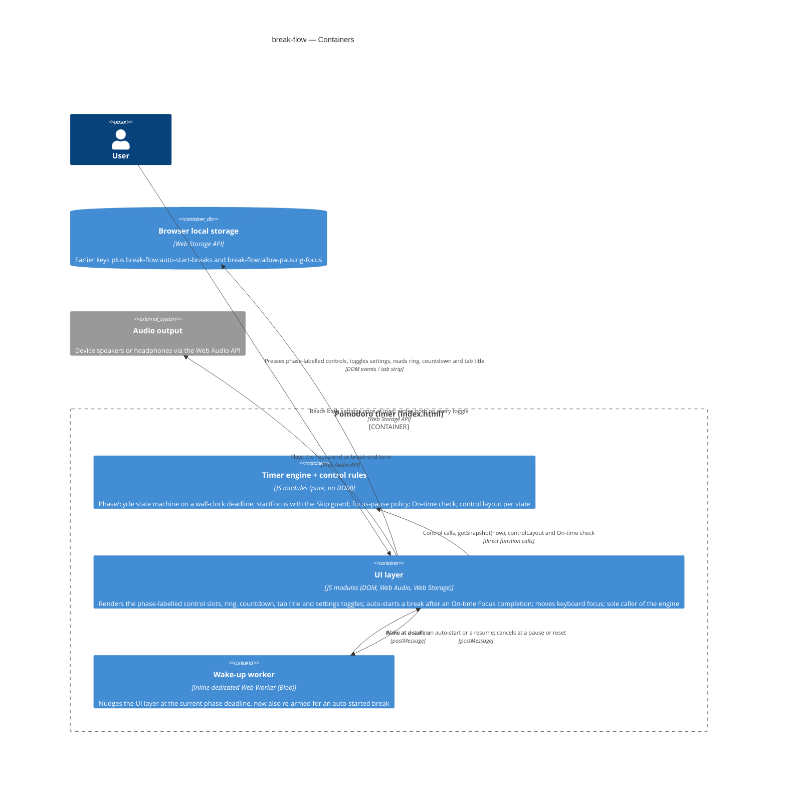
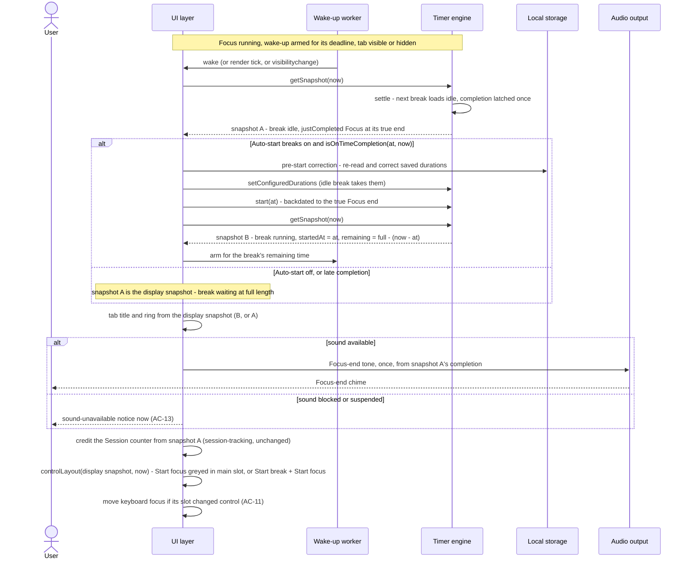
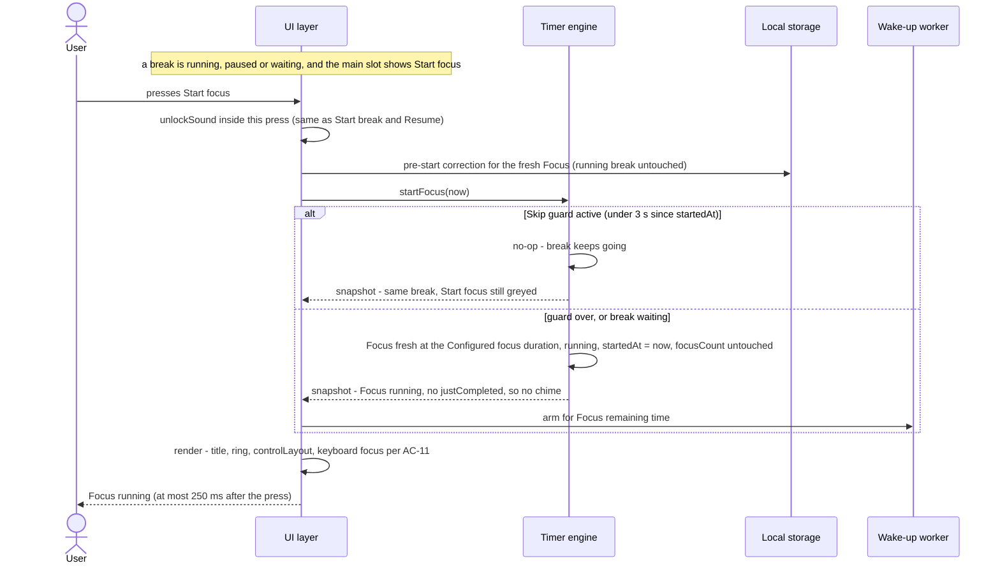
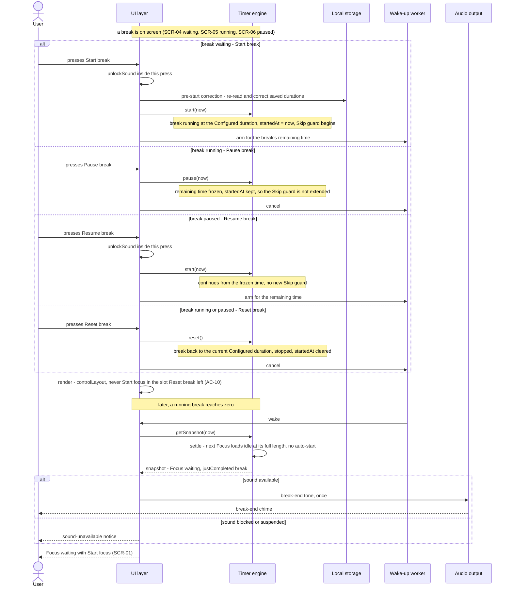
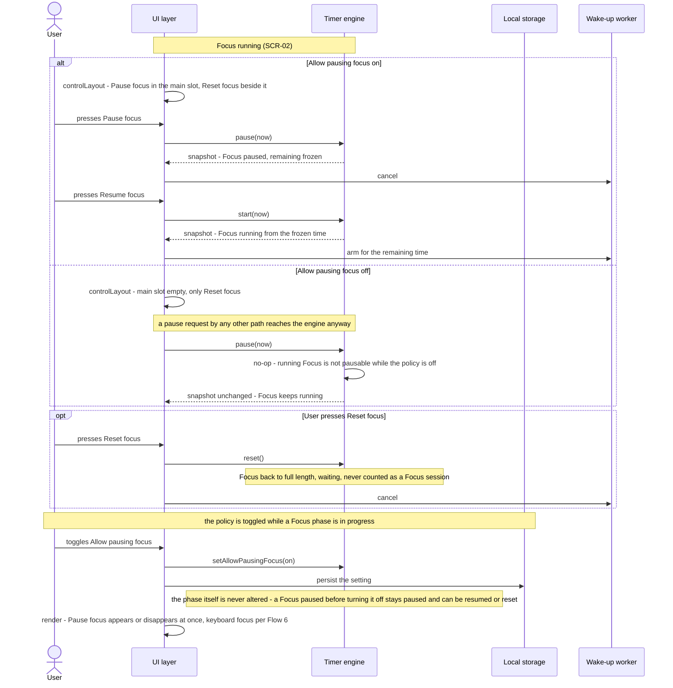
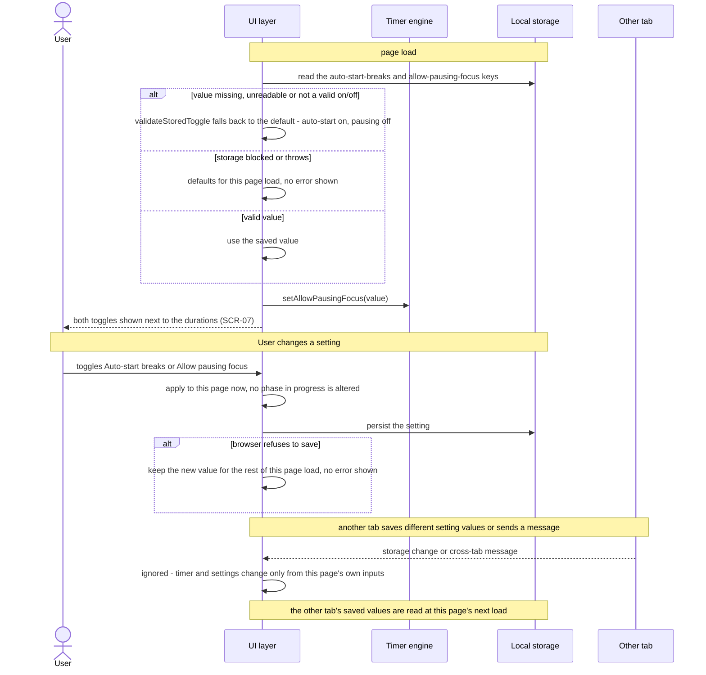
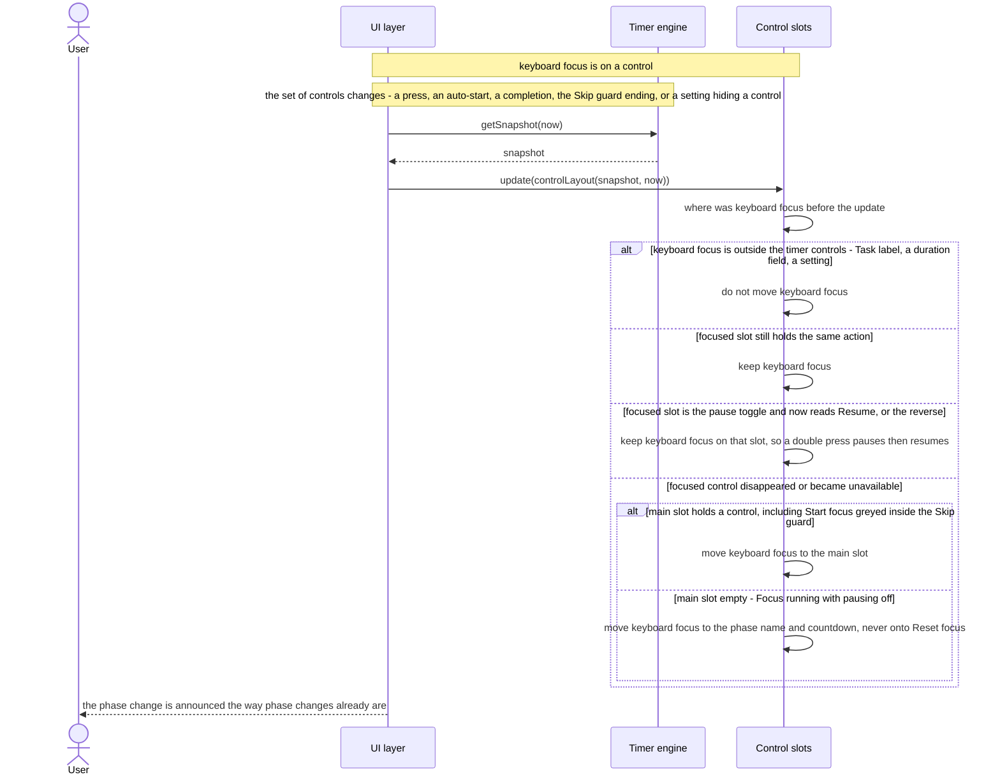

# Software Architecture Document — break-flow

<!-- 12 Arc42 sections. Empty section → <!-- N/A: <one-line reason> -->. -->
<!-- C4 Context (L1) lives inline in §3. C4 Container (L2) lives inline in §5. -->
<!-- Numbers in §10 come VERBATIM from spec.md §6 NFR — no inventing, no rounding. -->

## 1. Introduction and goals

**Intent.** break-flow changes what happens between phases, so the User can't lose a break by
missing it and doesn't have to press anything to start one. With **Auto-start breaks** on (the
default), a break starts counting down by itself after an On-time completion of a Focus phase.
A late completion (device asleep, tab frozen) leaves the break waiting at full length, Long break
included. Focus never starts on its own. During any break, one **Start focus** control ends the
break and starts the next Focus. A 3 s **Skip guard** after every break start absorbs a reflex
press. With **Allow pausing focus** off (the default), a Focus phase can't be paused: it either
runs to zero or Reset focus discards it. Every control names the phase it acts on, and keyboard
focus is never left on a control that disappeared. The segment is the owner, who uses the timer
daily as a personal focus tool (`spec.md` §1–§2). The feature adds two stored on/off preferences
and no network access, and it supersedes only the core-timer and sensory-feedback criteria that
`spec.md` §1 lists.

**Top-3 quality goals (1-liners; full scenarios in §10):**

1. **No lost or stolen breaks.** A break auto-starts only after an On-time completion (≤ 5 s after
   the Focus phase's true end) and counts down from that true end within 1 s. A late completion
   leaves it waiting at full length. At most one phase starts per completion, Focus never does, and
   one chime plays per completion noticed within 2 minutes of its true moment, none for a stale one (sensory-feedback AC-06b).
2. **Reflex-proof, phase-labelled controls.** Every control names its phase. Start focus is
   unavailable for 3 s (± 0.25 s) of real time after any break start. A pause of Focus that isn't
   allowed does nothing, whatever the input path. Keyboard focus never stays on a control that
   disappeared.
3. **Fail-soft settings.** Both settings fall back to their defaults (Auto-start breaks on, Allow
   pausing focus off) when nothing valid can be read, and keep a change the browser can't save for
   the rest of the page load. Only this page's own inputs change them (AC-12).

**Stakeholders.**

| Role | Interest | Sign-off owner? |
|---|---|---|
| User | Takes every break they were present for without a press; leaves a break for Focus with one press; never loses a break to sleep or a reflex press | No |
| PM (sergii.kushnir@gmail.com) | Owns the KPIs in `spec.md` §7 (missed breaks → 0, 4 presses per cycle) and `spec.md` §8's open questions on the Skip guard, the Long break and Reset focus confirmation | No |
| Tech Lead | SAD approval; owner of `spec.md` §8's On-time tolerance question (due before `design`, resolved in §4) | Yes |

<!-- Decision overrides (¶4) — populated by the critic resolution loop, empty otherwise. -->

- Decision (2026-10-01, owner): AC-11 is read with Pause *X* and Resume *X* of the same phase as
  **one pause toggle control** in one slot. After Pause break or Pause focus, keyboard focus stays
  on the slot that now reads Resume, instead of moving to the main position. A reflex double
  press therefore pauses and resumes, and can't skip the break (`spec.md` §7 KPI "breaks lost to
  an accidental Start focus press → 0"). Every other control that disappears still moves focus as
  AC-11 says. Recorded in ADR-0003; `screens` keeps the two in one slot.
- Decision (2026-10-01, Tech Lead): `spec.md` §8's On-time tolerance question is resolved: keep
  5 s (§4 decision 6).

## 2. Constraints

**Technical.**
- JavaScript (ES modules). Node.js ≥18 is used for tooling and tests only. The shipped `index.html`
  runs in any modern browser with no runtime dependency on Node (`CLAUDE.md`).
- No framework. The app stays vanilla JS/CSS/HTML in one generated, self-contained `index.html`
  bundled by esbuild ([`adr/0001`](../../adr/0001-generate-single-file-from-modular-source.md),
  [`adr/0003`](../../adr/0003-esbuild-as-the-build-tool.md)). There are zero network requests
  beyond the initial page load (`spec.md` §6 "Self-contained load").
- No backend. Persistence is browser local storage only
  ([`adr/0002`](../../adr/0002-no-backend-for-v1.md)). This feature adds two scalar on/off values.
- The background timing promise covers current stable desktop Chrome and Edge only, unchanged from
  sensory-feedback (`spec.md` AC-01, sensory-feedback §3). Other browsers and phones fall under the
  On-time / late rule (§4).
- Architecture convention: layered, `src/logic/` (pure, no DOM, no browser API) → `src/ui/` (DOM +
  browser APIs) → `src/main.js` (the one wiring point), unchanged (`CLAUDE.md`).

**Organisational.**
- Effort budget: S, meaning 2–5 PRs (`.size`). Route `quick` (`.route`).
- Deadline: none hard. The owner wants it before anything else on `docs/roadmap.md` (`spec.md` §1).
- Team: solo. The Architect, Tech Lead and PM are the same person, as in the four earlier features.

**Conventions.**
- `docs/architecture-map.md` is **stale** (`reflects_commit: 9c8717e`, 114 commits behind `HEAD`
  `15b1534`, before all four shipped features). This SAD was drafted from a direct read of `HEAD`:
  `src/logic/index.js`, `src/ui/index.js`, `src/main.js`, `test/logic/` and `test-e2e/`. The stale
  map is carried as a §11 risk, the same accepted gap the sensory-feedback and adjustable-durations
  SADs flagged.
- Timing is an absolute wall-clock deadline, not a tick counter
  ([`core-timer/adr/0001`](../core-timer/adr/0001-wall-clock-deadline-timing.md)). The On-time
  check, the auto-started break's countdown and the Skip guard are all measured against wall-clock
  timestamps the engine already holds or receives.
- The engine changes only through methods called by `src/ui/`, with no `message`/`storage`
  listener anywhere ([`core-timer/adr/0002`](../core-timer/adr/0002-structural-encapsulation-control-guard.md)).
  `test/logic/timer-engine.test.js` pins the engine surface at six methods ("no new control
  method", sensory-feedback). This feature **deliberately changes that pin** (§4).
- Local storage writes go through named gatekeepers that always write their full key set
  (session-tracking ADR-0002, adjustable-durations ADR-0002). `test/logic/write-guard.test.js`
  enforces it. The two new keys get a third gatekeeper of the same shape (§8).
- Error handling is fail-soft in `src/ui/`: clamp, never throw to the User (`CLAUDE.md`).
- Design tokens are CSS custom properties on `:root` in `src/styles.css`, dark-mode only. There is
  no `docs/design-system.md` yet; `ux-flows.md` recorded a responsive-both posture.

**Regulatory / external.**
- Data classification: public, two on/off preferences that aren't personal (`spec.md` §6.1).
- WCAG 2.x AA remains the self-imposed accessibility bar set by sensory-feedback. Keyboard focus
  handling (AC-11) is part of it.
- Security review: N/A. No new data beyond two preferences, no network access, no permission
  boundary (`spec.md` §6.1).

## 3. Context and scope

break-flow changes the same single-page Pomodoro app. The User still opens `index.html` in a
browser. The page now starts a break by itself after an On-time Focus completion, offers Start
focus during every break, and shows two more settings next to the durations. No new external
system appears. The browser runtime matters more than before, because whether the page is awake
at the Focus end now decides if the break auto-starts or waits.

<!-- brownfield: direct read of HEAD 15b1534 (the architecture map is stale — §2 Conventions).
     src/logic/index.js (335 lines): createTimerEngine() → frozen {start, pause, reset, getSnapshot,
     setConfiguredDurations, setCycleLength}; snapshot {phase, running, idle, remainingMs, focusCount,
     justCompletedFocusAt, phaseFullMs, justCompleted}; settle(now) advances at most one boundary and
     always leaves the next phase idle; controlStates(snapshot) → {startDisabled, pauseDisabled}.
     src/ui/index.js (591 lines): mount(root, engine) with three fixed buttons labelled
     Start/Pause/Reset, a 250 ms setInterval render loop, a visibilitychange re-render, the wake-up
     worker (wakeup.js), the chime player (audio.js), the ring (ring.js), two storage gatekeepers
     (persistState, persistDurationConfig), prepareStart() as the pre-start correction for a fresh
     start, refocusIfStranded() for keyboard focus. test-e2e/: playwright-core with a fake page clock. -->

**External systems (in / out):**

| Actor or system | Type | Interaction |
|---|---|---|
| User | Person | Presses the phase-labelled controls (Start/Pause/Resume/Reset focus, Start/Pause/Resume/Reset break), toggles Auto-start breaks and Allow pausing focus, commits durations; hears the chimes; reads the ring, countdown, phase name and tab title |
| Browser runtime | System (external, the host) | Runs the page and provides wall-clock time, tab visibility, timers, the DOM, keyboard focus and local storage. It may sleep, freeze or throttle the page, which is what makes a completion late (§4) |
| Audio output (via the browser) | System (external) | Plays the Focus-end and break-end tones through the Web Audio API, unchanged from sensory-feedback. An auto-started break needs no new sound path |

Nothing crosses the system boundary to a network: no backend, no third party, no analytics. Other
tabs of the same app are outside the trust boundary: their messages and their saved values never
change this page's running timer or settings (`spec.md` AC-12).

**C4 Context (L1):**



The User talks only to the single page. The page depends on the browser for time, rendering,
keyboard focus and the two saved preferences, and on the audio output for the chimes. There are
no network edges, and other tabs are outside the trust boundary.

## 4. Solution strategy

**Top strategic choices (the seeds for ADRs):**

1. **Target surface: `web-frontend`, the same single page the four earlier features declared.**
   `ux-flows.md` inventories one page, with SCR-01…SCR-06 as timer states of that page and SCR-07
   as its settings area. There is no backend ([`adr/0002-no-backend-for-v1`](../../adr/0002-no-backend-for-v1.md)).
   There's no legitimate alternative, so no ADR. Written to this document's frontmatter:
   `target_surfaces: [web-frontend]`.
2. **UI architecture: unchanged static single view, vanilla-JS client rendering.** The new
   controls and the two toggles are plain DOM built by `src/ui/`. A state change is a re-render of
   the same page, not navigation (`ux-flows.md` Platform decisions). Inherited from `CLAUDE.md` and
   the earlier SADs' §4 point 2. No ADR.
3. **Break auto-start: `src/ui/` starts the break with a backdated fresh start after an On-time
   Focus completion, and the engine keeps "a completion always leaves the next phase waiting".** →
   [ADR-0001](adr/0001-auto-start-breaks-with-a-backdated-start-from-the-ui.md). A pure
   `isOnTimeCompletion(at, now)` in `src/logic/` decides whether the completion is On-time. When
   `render()` sees an On-time Focus completion with Auto-start breaks on, it runs the existing
   pre-start correction (`prepareStart`) on the waiting break and then calls `engine.start(at)`,
   where `at` is the Focus phase's true end. The break counts down from that true end (AC-01,
   §6 ≤ 1 s accuracy), the saved durations are re-read before its length is pinned (AC-12, AC-14),
   and a late completion never reaches that branch, so the break waits (AC-03). The engine's settle
   rule (core-timer AC-05: at most one boundary, the new phase is idle) stays intact. "At most one
   phase per completion starts without the User" therefore holds by construction: only the UI's
   auto-start branch starts a phase without a press, and it runs only for a Focus completion (AC-02).
4. **Skip guard and the focus-pause policy are enforced inside the engine.** →
   [ADR-0002](adr/0002-enforce-skip-guard-and-focus-pause-policy-in-the-engine.md). The engine gains
   two methods: `startFocus(now)` ends a break (running, paused or waiting) and starts the next
   Focus, and `setAllowPausingFocus(on)` sets whether `pause(now)` may pause a running Focus. The
   snapshot gains `startedAt` (the moment of the current phase's fresh start, kept across
   pause/resume) and `allowPausingFocus`. `startFocus` does nothing inside the Skip guard, which is
   a pure `isSkipGuardActive(snapshot, now)`. `pause` does nothing for a running Focus while pausing
   isn't allowed (AC-15: "by any other means"). A Skipped break adds nothing to and removes nothing
   from the in-cycle focus count (AC-04b). This grows the engine surface from six methods to eight
   and amends core-timer ADR-0002's "exactly these controls" wording and sensory-feedback's
   six-method pin.
5. **Phase-labelled controls come from a pure layout rule rendered into three fixed slots.** →
   [ADR-0003](adr/0003-derive-controls-from-a-pure-layout-rendered-into-fixed-slots.md). A pure
   `controlLayout(snapshot, now)` in `src/logic/` returns the action in the main position and in up
   to two side positions, and whether the main one is greyed out. It encodes the AC-10 table and
   replaces `controlStates`. `src/ui/` renders three fixed buttons that take their label and action
   from it. An empty slot is `hidden` (a control the settings never allow). The greyed-out Start
   focus uses `aria-disabled="true"`, not `disabled`, so it can still hold keyboard focus (AC-11).
   Keyboard focus moves only when the slot it is on changes to a different control or becomes
   hidden.
6. **On-time completion tolerance: 5 s, and the Skip guard: 3 s, as named constants in
   `src/logic/`.** This resolves `spec.md` §8's first open question (owner Tech Lead, due before
   `design`). A hidden desktop Chrome/Edge tab already notices a completion within 1 s through the
   sensory-feedback wake-up worker, so 5 s leaves margin for a slow tick without letting a real
   sleep count as on time. It's a configuration value (one PR to change), so no ADR. The 3 s Skip
   guard stays as specified, and its review after 7 days of use remains the PM's open question.
7. **The two settings are UI preferences behind a third storage gatekeeper, read once per page
   load.** Auto-start breaks lives in `src/ui/` memory, because only the UI's auto-start branch
   reads it. Allow pausing focus is pushed into the engine with `setAllowPausingFocus` at mount and
   on every toggle, and that's the only place it lives (decision 4). Both are read from local storage
   only at mount (AC-12: another tab's saved values apply at the next load), through a new
   `persistBreakFlowSettings` / `readPersistedBreakFlowSettings` pair shaped like the two existing
   gatekeepers (§8). It follows session-tracking ADR-0002 and adjustable-durations ADR-0002, so no
   ADR.

Every tactical decision in §5–§8 traces to one of these seeds. None contradicts a strategic choice.

## 5. Building block view

The layering is unchanged: `src/logic/` (domain, pure) → `src/ui/` (DOM + browser APIs) →
`src/main.js` (unchanged wiring), and `src/logic/` never imports `src/ui/`. The new rules (On-time
check, Skip guard, control layout, stored-toggle validation) go into a new pure sibling module
`src/logic/controls.js`, re-exported from `src/logic/index.js`. That follows sensory-feedback's
`feedback.js` split. The new slot rendering and keyboard-focus handling go into a new
`src/ui/controls.js`, following sensory-feedback's split of `src/ui/` into one module per concern,
since `src/ui/index.js` is already 591 lines. esbuild bundles everything into the one `index.html`
as before.

**Internal decomposition:**

```
src/
├── logic/
│   ├── index.js      <createTimerEngine(): + startFocus(now) (break-only: ends a running, paused
│   │                  or waiting break and starts the next Focus; no-op inside the Skip guard and
│   │                  in any Focus state; Start focus on a waiting Focus (SCR-01) goes through the
│   │                  existing start(now)), + setAllowPausingFocus(on); pause(now) is a no-op for a
│   │                  running Focus while pausing isn't allowed; start(now) records startedAt on a
│   │                  fresh start (now may be the backdated true Focus end, ADR-0001). settle() and
│   │                  reset() both clear startedAt, so a waiting phase never carries a Skip guard
│   │                  (AC-05). Otherwise settle() keeps its rule: one boundary, next phase idle
│   │                  (core-timer AC-05, kept by ADR-0001). Snapshot + startedAt,
│   │                  + allowPausingFocus. controlStates removed in favour of controlLayout.>
│   └── controls.js   <NEW, pure, re-exported from index.js: ON_TIME_TOLERANCE_MS = 5000,
│                      SKIP_GUARD_MS = 3000, isOnTimeCompletion(at, now), isSkipGuardActive(snapshot,
│                      now), controlLayout(snapshot, now) → {main, side: [a, b], mainGreyed}
│                      with actions startFocus | pauseFocus | resumeFocus | resetFocus | startBreak |
│                      pauseBreak | resumeBreak | resetBreak (the AC-10 table, ADR-0003),
│                      CONTROL_LABELS (phase-named labels), DEFAULT_BREAK_FLOW_SETTINGS
│                      {autoStartBreaks: true, allowPausingFocus: false},
│                      validateStoredToggle(raw, fallback).>
├── ui/
│   ├── index.js      <mount(root, engine): builds the controls from ui/controls.js instead of the
│   │                  Start/Pause/Reset buttons; adds the Auto-start breaks and Allow pausing focus
│   │                  toggles next to the durations; the third storage gatekeeper
│   │                  persistBreakFlowSettings / readPersistedBreakFlowSettings; render() gains the
│   │                  auto-start branch (ADR-0001, §6 Flow 1) and re-arms the wake-up after it;
│   │                  lastSnapshot is set to the display snapshot (B after an auto-start), so the
│   │                  wake-up callback's syncWakeup(lastSnapshot) keeps the break's alarm armed;
│   │                  prepareStart() learns that Start focus from a break is a fresh Focus start.
│   │                  The Start focus, Start break and Resume focus/break handlers call
│   │                  unlockSound() synchronously first, the presses that now unlock audio in place
│   │                  of the old Start (sensory-feedback AC-11), so a later auto-start can chime.
│   │                  Still the ONLY caller of the engine's methods (core-timer ADR-0002).>
│   ├── controls.js   <NEW: createControls(onAction) → {element, update(layout)}: three fixed slot
│   │                  buttons (main, side-1, side-2); label + data-action from the layout; hidden
│   │                  when empty; aria-disabled when greyed; moves keyboard focus per AC-11
│   │                  (ADR-0003); the phase name + countdown get tabindex="-1" as the fallback
│   │                  focus target.>
│   ├── wakeup.js     <unchanged — armed again after an auto-start>
│   ├── audio.js      <unchanged — the Focus-end chime of an auto-start is the ordinary
│   │                  completion chime>
│   └── ring.js       <unchanged>
├── styles.css        <greyed-out main control style (aria-disabled), toggle styles, slot layout;
│                      exact arrangement is the screens stage's (AC-10)>
└── main.js           <unchanged: mount(document.getElementById('app'), createTimerEngine())>

test/logic/
├── timer-engine.test.js  <amended: engine surface pin 6 → 8 methods, snapshot shape + startedAt
│                          + allowPausingFocus; controlStates tests replaced by controlLayout>
├── write-guard.test.js   <amended: third gatekeeper allowed for the two break-flow keys; the
│                          pre-start-correction call-site pins (prepareStart only via
│                          refreshConfigFromStorage, called exactly once, from the startBtn handler,
│                          before engine.start) are re-pinned to the three legitimate triggers:
│                          the Start break and Start focus handlers and the auto-start step>
└── break-flow.test.js    <NEW: On-time 5 s / 5.001 s, backdated-start accuracy, Skip guard,
                           startFocus, pause policy, controlLayout table, stored-toggle fallback>
test-e2e/break-flow.e2e.js <NEW: fake-clock auto-start, return-after-sleep, Start focus, focus moves>
```

**C4 Container (L2):** still the single `web-frontend` surface, drawn as the containers the
earlier SADs drew. Nothing new runs. The engine container gains the guard and the layout rules,
and local storage holds two more keys.



The UI layer stays the hub. It asks the pure engine for a snapshot and the control layout, starts
a break itself when a Focus phase ends on time, keeps the wake-up worker armed for whatever is
running, saves the two preferences and plays the chimes. The engine is where the Skip guard and
the "no pausing Focus" rule are enforced, so no input path can get around them.

## 6. Runtime view

**Critical flow 1: Focus completion → break auto-starts, or waits after a late completion (ADR-0001)**



The page notices the Focus end through whichever wake source runs first. If Auto-start breaks is
on and the end was noticed within 5 s, the UI re-reads the saved durations, starts the break
backdated to the true Focus end, and re-arms the wake-up for the break. Otherwise the break stays
waiting at full length. In both cases the session credit comes once, and so does the Focus-end chime (or the notice)
unless the completion is stale (more than 2 minutes after its true end: neither), from the snapshot that carried the completion. The ring, title and controls show what
is now on screen. When an auto-started break later reaches zero, the existing completion path runs
again and leaves Focus waiting, because only a Focus completion enters the auto-start branch
(AC-02).

**Critical flow 2: Start focus during a break, inside and outside the Skip guard (ADR-0002, ADR-0003)**



**Late completion after a sleep or a frozen tab (AC-03)** — no separate diagram. It is Flow 1's
"late completion" branch: the Focus-end chime only if the page is back within 2 minutes of the Focus end (none, and no notice, if later), the session credited as session-tracking decides,
and the break waiting at full length with Start break and Start focus, since `settle()` leaves it
idle and nothing starts it. Flows 3 to 6 below cover the break controls, the Focus pause policy, the settings and the keyboard focus rule.

**Critical flow 3: Break controls and break end (AC-02, AC-05, AC-06, AC-14)**



Every break control acts only on the break and never starts Focus. A break paused inside the Skip
guard keeps Start focus greyed until three real seconds have passed since the break's start, and
Resume break starts no new guard. A running break that reaches zero always leaves Focus waiting,
with one break-end chime (none if the break end is only noticed more than 2 minutes late), whether it was auto-started or started by the User and whatever
Auto-start breaks says (AC-02). A change to a Configured duration made after a break started leaves
that break at its length and takes effect at Reset break or the next fresh start (AC-14).

**Critical flow 4: Pausing Focus under the Allow pausing focus policy (AC-15, AC-16, AC-17)**



The rule lives in the engine, so the hidden Pause focus control is a presentation of the rule and
not its enforcement (ADR-0002). Turning the setting off never freezes or discards a phase, and
turning it on offers Pause focus immediately to a Focus already running.

**Critical flow 5: Settings load, change and other-tab input (AC-07, AC-09, AC-12, AC-17)**



Auto-start breaks is read when a Focus phase completes, from the value held on this page, so a
Focus already running follows whatever the toggle says at that moment. Neither setting is
re-read from storage while the page is open, so another tab cannot change this page's behaviour
(AC-12). Saved durations keep their existing read points: page load and before each fresh start.

**Critical flow 6: Keyboard focus after the control set changes (AC-11, ADR-0003)**



A greyed-out Start focus uses `aria-disabled`, so it can hold keyboard focus and a reflex key press
does nothing. Reset focus and Reset break are never a landing target, so a repeated press cannot
discard a phase.

**Coverage map (every §4 user story and §5 acceptance criterion)**

| Item | Where it is shown |
|---|---|
| US-01 | Flow 1, Flow 3 |
| US-02 | Flow 2 |
| US-03 | Flow 3 |
| US-04 | Flow 1 (auto-start and off branches), Flow 5 |
| US-05 | Flow 1 (late-completion branch) |
| US-06 | Flow 6, plus AC-10 below |
| US-07 | Flow 4 |
| AC-01, AC-03, AC-08, AC-13 | Flow 1 |
| AC-02 | Flow 1 (only a Focus completion auto-starts), Flow 3 (break end leaves Focus waiting) |
| AC-04, AC-05 | Flow 2, Flow 3 (pause inside the guard) |
| AC-04b | Flow 2: Start focus leaves the in-cycle focus count untouched, and a Skipped break adds nothing |
| AC-06 | Flow 3 |
| AC-07, AC-09, AC-12 | Flow 5 |
| AC-10 | Non-runtime: the pure `controlLayout` table is unit-tested, with no runtime sequence |
| AC-11 | Flow 6 |
| AC-14 | Flow 1 (pre-start correction), Flow 3 (a started break keeps its length) |
| AC-15, AC-16, AC-17 | Flow 4, Flow 5 (persisted toggle) |

**Flagged for design (not changed here):** Flow 5 shows `Other tab` as an extra actor that §5 does
not declare; it only marks input the page must ignore. Flow 6 uses `Ctl` for the three slot
buttons of `src/ui/controls.js`, already named in §5.

## 7. Deployment view

<!-- N/A: reuses the existing deployment unit (the one generated, committed index.html, opened from disk or any static host); no infra change, no monitoring, no scaling thresholds for a single-user local page. -->

## 8. Crosscutting concepts

| Concept | Convention | Where defined |
|---|---|---|
| Time | Every rule is a pure function of wall-clock timestamps passed in as `now`: the deadline, the On-time check (`now − at ≤ 5000 ms`), the Skip guard (`now − startedAt < 3000 ms`, real time, pause doesn't stop it). No tick counting. Tests inject the clock | core-timer ADR-0001; here §4 decisions 3, 4, 6 |
| One-shot consumption | One render may take two snapshots when it auto-starts a break. Snapshot A (with the completion) feeds the chime/notice and the Session counter credit. The display snapshot (B after an auto-start, else A) feeds the title, ring, controls and wake-up, and it is what `lastSnapshot` holds when `render()` returns, so the wake-up callback's `syncWakeup(lastSnapshot)` never cancels the alarm the auto-start armed. Fixed order: getSnapshot A → auto-start (correction, `start(at)`, getSnapshot B, re-arm wake-up) → title → ring → chime/notice → credit → controls → keyboard focus | sensory-feedback §8, amended by ADR-0001 |
| Input guard (authorization) | The engine changes only through methods called by `src/ui/` from this page's own controls, toggles and duration/cycle commits, plus the auto-start branch. There is no `message`/`storage` listener and no `BroadcastChannel`. Both settings are read from storage only at mount, so another tab's saved values apply at the next load (AC-12). Saved durations keep their read points (load + before each fresh start, now including an auto-start and Start focus) | core-timer ADR-0002 (amended by ADR-0002 here) |
| Persistence | A third gatekeeper, `persistBreakFlowSettings(storage, {autoStartBreaks, allowPausingFocus})`, is the only writer of `break-flow:auto-start-breaks` and `break-flow:allow-pausing-focus` and always writes both, as `'true'`/`'false'`. `readPersistedBreakFlowSettings(storage)` validates each key on its own through `validateStoredToggle(raw, fallback)` and does no write-back; the next toggle writes the full pair. `write-guard.test.js` is extended to allow it | session-tracking ADR-0002, adjustable-durations ADR-0002 |
| Error handling | Fail-soft. Unreadable, missing or invalid saved value → that setting's default (Auto-start breaks on, Allow pausing focus off). A refused write is swallowed, and the in-memory value applies for the rest of the page load. No error is ever shown (AC-09). A refused Start focus (Skip guard) or pause (policy off) is a silent no-op | `CLAUDE.md`; `spec.md` AC-09 |
| Accessibility | Every control label names its phase (`CONTROL_LABELS`). A control the settings never allow is `hidden`. The greyed-out Start focus is `aria-disabled="true"`, so it stays focusable and is announced as unavailable. Pause *X* / Resume *X* is one toggle slot. Keyboard focus moves only off a slot that became hidden or holds a different control, to the main slot, or to the phase name + countdown (`tabindex="-1"`) when the main slot is empty, never to Reset focus, and never away from the Task label, a field or a toggle. Phase changes are announced by the existing `aria-live` phase name | ADR-0003; `spec.md` AC-10, AC-11 |
| Settings UI | Two labelled checkbox toggles, Auto-start breaks and Allow pausing focus, placed next to the duration settings in the same settings area (SCR-07). A toggle applies immediately and never alters a phase already running, paused or waiting | `spec.md` AC-07, AC-17; `ux-flows.md` SCR-07 |
| Logging / observability | N/A — single-user local page, no telemetry (no network) | — |
| ID strategy | N/A — no persisted records, two scalar values | `adr/0002-no-backend-for-v1` |
| Internationalisation | N/A — English only, as the earlier features | — |

## 9. Architecture decisions

| # | Title | Status | Section |
|---|---|---|---|
| [0001](adr/0001-auto-start-breaks-with-a-backdated-start-from-the-ui.md) | Auto-start breaks with a backdated start from the UI, keeping the engine's idle-after-completion rule | Accepted | §4 |
| [0002](adr/0002-enforce-skip-guard-and-focus-pause-policy-in-the-engine.md) | Enforce the Skip guard and the focus-pause policy inside the engine with two new methods | Accepted | §4 |
| [0003](adr/0003-derive-controls-from-a-pure-layout-rendered-into-fixed-slots.md) | Derive the phase-labelled controls from a pure layout rule rendered into three fixed slots | Accepted | §4 |

ADR files live under `docs/features/break-flow/adr/NNNN-<title>.md`. Inline decisions that didn't
cross the gate are §4 decisions 1, 2, 6 and 7 (target surface, UI architecture, the 5 s / 3 s
constants, the settings gatekeeper).

## 10. Quality requirements

Each top-3 goal from §1 expanded into scenarios. Numbers are quoted from `spec.md` §6.

**QG-1. No lost or stolen breaks**

- **QG-1a On-time tolerance.**
  - **When:** a Focus phase ends with Auto-start breaks on.
  - **Then:** "a Focus completion noticed ≤ 5 s after its true end counts as On-time and auto-starts the break; > 5 s counts as late and leaves the break waiting".
  - **How verify:** "unit test on the timer engine with an injected clock, at 5 s and 5.001 s", on `isOnTimeCompletion` and the auto-start orchestration (ADR-0001).
- **QG-1b Auto-started break accuracy.**
  - **When:** a break has auto-started after an On-time completion noticed up to 5 s late.
  - **Then:** "remaining break time differs from (full length − real time since the Focus end) by ≤ 1 s".
  - **How verify:** "unit test with an injected clock; manual stopwatch check on desktop Chrome", on `engine.start(at)` with a backdated `at`.
- **QG-1c Chimes per completion.**
  - **When:** any phase completes, on time or late, auto-started break or not.
  - **Then:** chimes per completion: "exactly 1 when the completion is noticed within 2 minutes of its true moment; 0, and no notice, when noticed later". After a late Focus completion the break is waiting, no break-end chime plays (AC-03), and Focus never starts by itself (AC-02).
  - **How verify:** "unit test: one completion → one chime, none past 2 minutes; e2e return-after-sleep check" (`test-e2e/break-flow.e2e.js`, fake page clock).

**QG-2. Reflex-proof, phase-labelled controls**

- **QG-2a Skip guard.**
  - **When:** Start focus is pressed after a break starts, auto-started or by Start break, including while paused.
  - **Then:** Skip guard length "3 s (± 0.25 s) of real time from the break's start — the Focus phase's true end for an auto-started break, the Start break press otherwise". Inside it the press does nothing. Resume break starts no new guard, and a waiting break has none.
  - **How verify:** "unit test on the guard rule with an injected clock" (`isSkipGuardActive`, `engine.startFocus`).
- **QG-2b Start focus response.**
  - **When:** Start focus is pressed outside the guard during a running break.
  - **Then:** "Focus shown running ≤ 250 ms after the press" (the click handler renders synchronously).
  - **How verify:** "manual check during a running break".
- **QG-2c Focus-pause policy and labels.**
  - **When:** Allow pausing focus is off and a pause of a running Focus is requested by any path; or any phase × state is shown.
  - **Then:** the pause does nothing and Focus keeps running (AC-15). Every state shows exactly the AC-10 controls with phase-named labels, and keyboard focus follows AC-11 as decided in §1 ¶4.
  - **How verify:** unit tests on `engine.pause` with the policy off and on `controlLayout` over every AC-10 row; e2e keyboard-focus checks after a press, an auto-start and the guard ending.

**QG-3. Fail-soft settings, self-contained page**

- **QG-3a Settings fallback.**
  - **When:** a saved setting is missing, unreadable or invalid, or the browser refuses to save it.
  - **Then:** the default applies (Auto-start breaks on, Allow pausing focus off), a refused change still applies for this page load, and no error is shown (AC-09). Another tab's saved values are ignored until the next load (AC-12).
  - **How verify:** unit tests on `validateStoredToggle` and the gatekeeper pair with a fake and a throwing storage, and `write-guard.test.js` extended.
- **QG-3b Self-contained load.**
  - **When:** the page is loaded and used through a full cycle with auto-started breaks.
  - **Then:** "zero network requests beyond the initial page load".
  - **How verify:** "browser devtools Network tab" (the existing e2e zero-request check covers the build).

## 11. Risks and technical debt

| Risk / debt | Severity | Mitigation | Owner |
|---|---|---|---|
| The render-orchestration order (ADR-0001) is easy to break: taking the display snapshot first, or reading the chime from snapshot B, would drop the Focus-end chime or the session credit, or play it twice | Medium | Extract the auto-start step into an exported, injectable function in `src/ui/` (like `applyCompletionCue`) with a unit test asserting one chime + one credit + break running. The e2e auto-start test covers the wired path | Tech Lead |
| The wake-up for an auto-started break is lost, so its break-end chime is late in a hidden tab. Two paths: a render-tick auto-start that never re-arms, and the worker-wake callback's `syncWakeup(lastSnapshot)` cancelling the new alarm if `lastSnapshot` still holds snapshot A (waiting break) | Medium | The auto-start step calls `syncWakeup` with the display snapshot, and `lastSnapshot` is set to that display snapshot (§5, §8 One-shot consumption). Tests cover both the render-tick path and the worker-wake path, asserting the alarm stays armed for the break | Tech Lead |
| A present User in a background tab of a browser outside the background timing promise (e.g. Firefox) gets a late completion, so the break waits instead of auto-starting | Low | Accepted by `spec.md` AC-01. Firefox background timing stays a parked roadmap item | PM (sergii.kushnir@gmail.com) |
| Amending pinned contracts: the engine surface goes from 6 to 8 methods, the snapshot shape grows, `controlStates`/`refocusIfStranded` are removed, and the e2e helpers and scripts (`test-e2e/helpers.js`, `durations.e2e.js`, `sensory-feedback-chime.e2e.js`) select buttons labelled Start/Pause/Reset, and `write-guard.test.js` pins the pre-start correction to the single `startBtn` handler | Low | ADR-0002 records the amendment of core-timer ADR-0002. `tasks` includes updating the pins, re-pinning the pre-start correction to the Start break / Start focus handlers and the auto-start step (§5), and moving the existing e2e selectors to the phase-labelled controls | Tech Lead |
| The pause toggle reading of AC-11 (§1 ¶4) depends on Pause and Resume sharing one slot in the final arrangement | Low | `screens` keeps them in one slot. `controlLayout` returns them at the same index | PM (sergii.kushnir@gmail.com) |
| `spec.md` §8 open questions still owned by the PM: a 3 s Skip guard long enough (due 7 days after ship), a harder-to-skip Long break (due before `tasks`), Reset focus confirmation (due before `screens`) | Low | Each lands as a constant or layout change (ADR-0002 Neutral, ADR-0003). No design rework | PM (sergii.kushnir@gmail.com) |
| `docs/architecture-map.md` is stale (`reflects_commit 9c8717e`, 114 commits behind) | Low | This SAD was drafted from a direct read of `HEAD`. Run `/sdd:survey` after this feature ships | Tech Lead |

**Accepted debt (acceptable in v1, plan to fix later):**
- No coordination between two open tabs: each keeps the setting values it loaded with until it
  reloads (`spec.md` §3).
- In private browsing or with site storage blocked, both settings return to their defaults at every
  reload (`spec.md` §3).

## 12. Glossary

Domain terms are canonical in [`CONTEXT.md`](./CONTEXT.md) (feature) and the root
[`CONTEXT.md`](../../../CONTEXT.md). This table restates them and adds the design terms.

| Term | Meaning |
|---|---|
| Auto-start breaks | The User's on/off setting (on by default, saved) that makes a break start counting down by itself after an On-time completion of a Focus phase. Never auto-starts Focus |
| Allow pausing focus | The User's on/off setting (off by default, saved) that decides whether a running Focus phase can be paused. Breaks can always be paused |
| On-time completion | A Focus completion the page notices ≤ 5 s after its true end. Only this auto-starts a break |
| Late completion | A completion noticed more than 5 s after its true end (sleep, lock, frozen tab). The break is shown waiting at full length |
| Skipped break | A break ended early with Start focus. No chime, and no change to the in-cycle focus count, the Session counter or the Long-break cadence |
| Discarded focus | A Focus phase ended early with Reset focus. Never counted as a Focus session |
| Skip guard | The 3 s of real time after a break's fresh start during which Start focus does nothing. Measured from the true Focus end (auto-start) or the Start break press, not extended by a pause, not restarted by Resume |
| Backdated start | The UI's `engine.start(at)` call for an auto-started break, where `at` is the Focus phase's true end rather than the moment the page noticed it (ADR-0001) |
| `startedAt` | Snapshot field: the timestamp of the current phase's fresh start (null while waiting), kept through pause and resume. The Skip guard is measured from it (ADR-0002) |
| Control layout | The pure `controlLayout(snapshot, now)` result: the action in the main slot and the two side slots, and whether the main one is greyed out (ADR-0003) |
| Main position / slot | The first of the three fixed control slots. It holds the primary action of the state; keyboard focus falls back to it |
| Pause toggle | Pause *X* and Resume *X* of the same phase, treated as one control in one slot. Keyboard focus stays on it across a press (§1 ¶4) |
