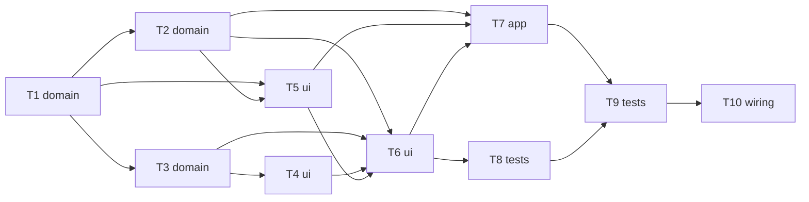

# Epic — break-flow

> **Spec:** [spec.md](../spec.md) · **Design:** [sad.md](../sad.md) · **Data model:** none (two localStorage scalars) · **API:** none (internal) · **ADRs:** [adr/](../adr/)

## Goal

Ship Auto-start breaks, a one-press Start focus during any break (behind a 3 s Skip guard), phase-labelled controls and the Allow pausing focus setting, so the User takes every break they were present for, never loses one to sleep or a reflex press, and keeps Focus sessions undisturbed by default (spec §2).

## Scope

- **In:** pure rules in `src/logic/controls.js`; engine `startFocus` / `setAllowPausingFocus` / `startedAt`; `src/ui/controls.js` slots; two settings toggles + gatekeeper; the render auto-start branch; e2e; regenerated `index.html`.
- **Out:** auto-starting Focus, skipping Focus into the break, forbidding break pauses, count-up display, a "break started" cue, multi-tab coordination (spec §3).

## Task map

Parallel branches: T2 ∥ T3 (wave 2), T4 ∥ T5 (wave 3), T7 ∥ T8 (wave 5).

## Tasks

See [tracker.md](./tracker.md) for status. Machine contract: [tasks.json](../tasks.json).

| # | Task | Layer | Blocked by | DoD (short) |
|---|---|---|---|---|
| T1 | Add pure On-time, Skip-guard and stored-toggle rules in src/logic/controls.js | domain | — | Unit tests pass |
| T2 | Extend the engine: startedAt, startFocus(now), setAllowPausingFocus(on) and the focus-pause policy | domain | T1 | Engine unit tests (injected clock) pass |
| T3 | Add the pure controlLayout(snapshot, now) rule and phase-named CONTROL_LABELS | domain | T1 | An exhaustive unit test over every phase × run-state × Skip-guard × allowPausingFocus combination ma |
| T4 | Build createControls(onAction): three fixed slot buttons and the keyboard-focus rule | ui | T3 | Unit tests (plain Node, no DOM) of the exported focus-target decision pass for |
| T5 | Add the Auto-start breaks and Allow pausing focus toggles with a third storage gatekeeper | ui | T1, T2 | Unit tests with a fake and a throwing storage pass |
| T6 | Replace Start/Pause/Reset with the phase-labelled slots and route every action to the engine | ui | T2, T3, T4, T5 | The built page shows the AC-10 controls for every state |
| T7 | Auto-start the break after an On-time Focus completion (backdated start in render) | app | T2, T5, T6 | Unit tests of an exported, injectable auto-start step pass |
| T8 | Move the existing e2e helpers and scripts to the phase-labelled controls | tests | T6 | npm run build then npm run test |
| T9 | Add test-e2e/break-flow.e2e.js: auto-start, return-after-sleep, Start focus, keyboard focus | tests | T7, T8 | npm run build then node --test test-e2e/break-flow.e2e.js passes on the fake page clock |
| T10 | Regenerate index.html and run the spec §6 manual timing checks | wiring | T9 | The regenerated index.html is committed with the source |

## Risks / Hard rules

- Layering: `src/logic/` pure, `src/ui/` the only engine caller, no `message`/`storage` listener (sad §2, §8).
- Render order is load-bearing: snapshot A feeds chime + credit; the display snapshot feeds the rest and `lastSnapshot` (sad §8, §11).
- Pinned contracts change deliberately: engine 6 → 8 methods, snapshot shape, `controlStates` removal, write-guard call sites, e2e selectors (T2, T6, T8).
- `docs/architecture-map.md` is stale — run `/sdd:survey` after shipping.
- No `screens` stage ran (route `quick`), so T3 fixes the control arrangement; spec §8's "harder-to-skip Long break" is assumed **no**.
