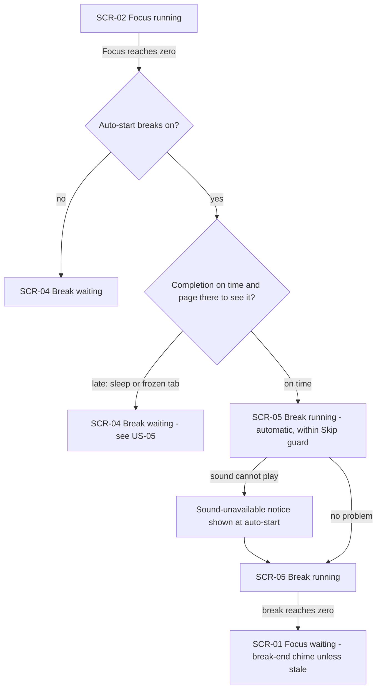
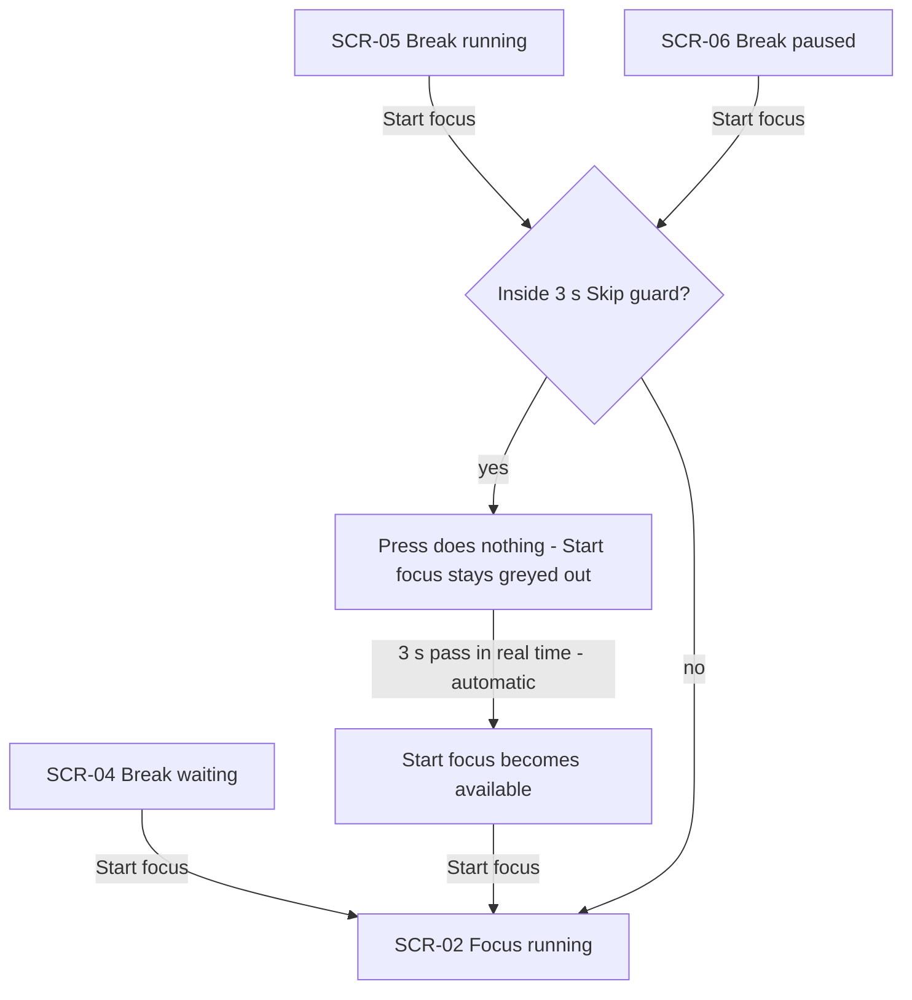
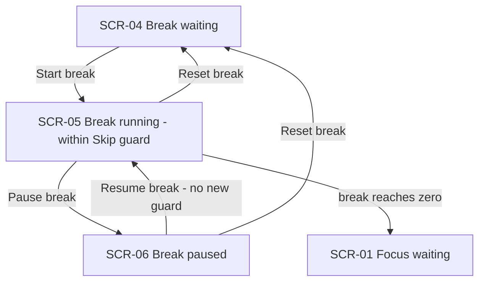
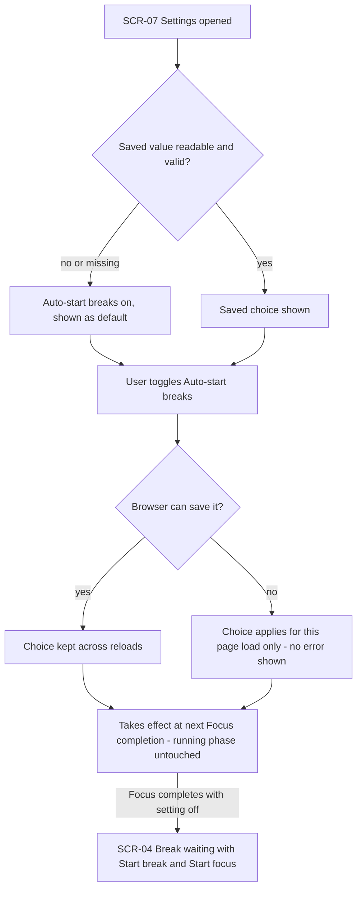
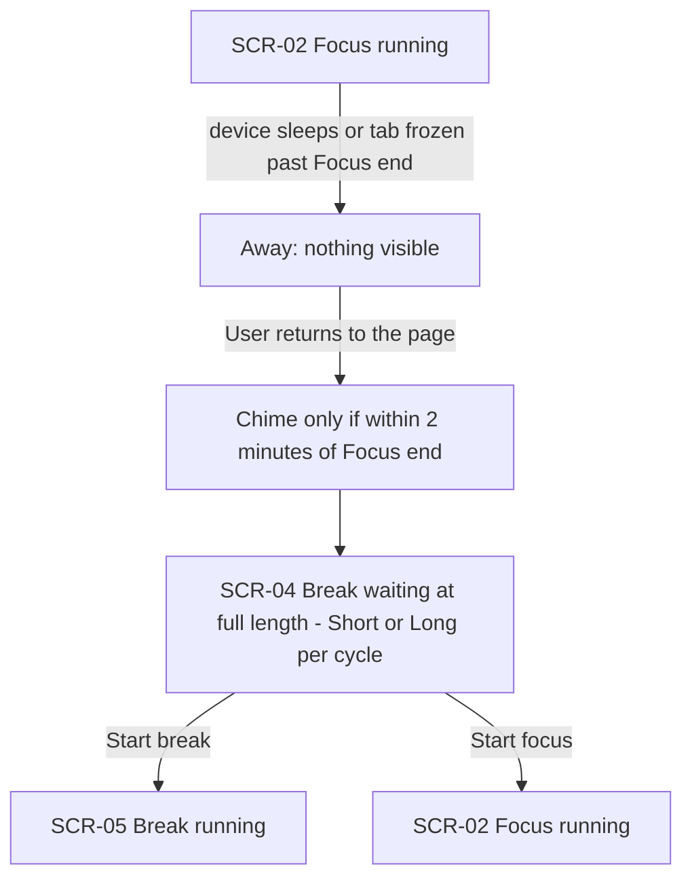
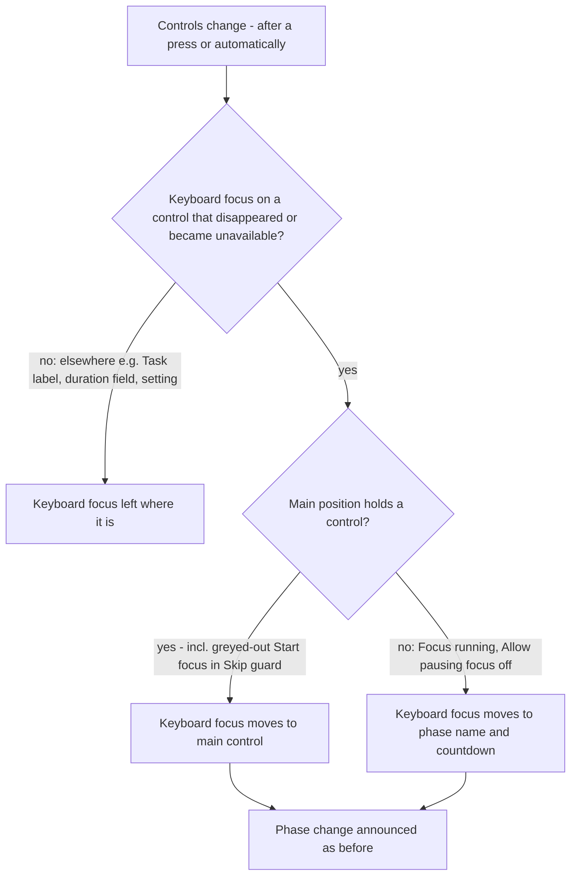
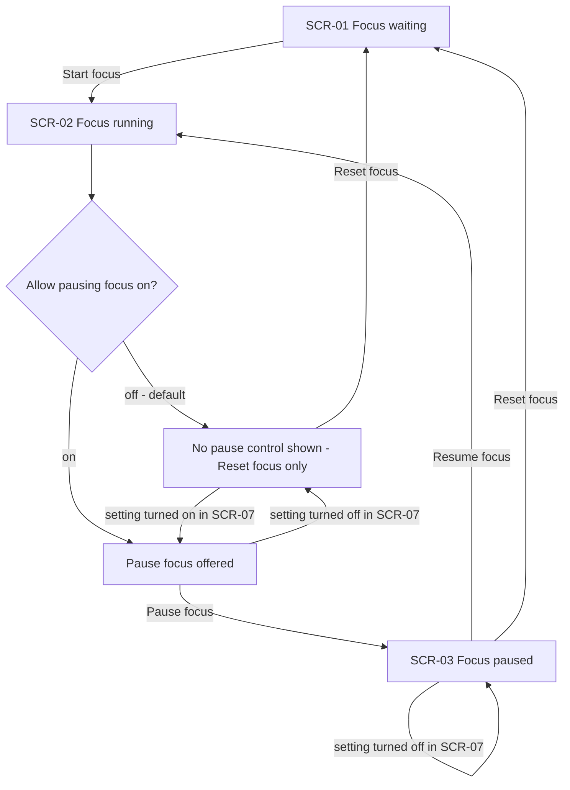

# UX flows — break-flow

> User flows for every UI-touching §4 user story, produced by `ux-flows` (after `clarify`, before
> `design`) and read by `design` (evidence for the target-surface + UI-architecture decisions),
> `sequences` (UI-driven flows align on SCR ids), `screens` (details every inventory row) and
> `plan-tests` (the e2e-through-UI paths). **Always markdown + mermaid `flowchart`**, whatever the
> design tool — this artifact is flow-altitude, not visual design.

## Platform decisions

- **Posture:** responsive-both — `docs/design-system.md` is absent, so there is no canon default; the owner confirmed responsive-both (single-page timer, no form-factor-specific flow). Run `/sdd:design-system` before `screens`.
- The app is one page. A "screen" here is a **timer state** of that page (phase × run state) plus the settings area; moving between screens is a state change, not navigation.
- The settings area is part of the same page (no modal/page change implied; `screens` decides presentation). Its two new toggles sit next to the duration settings.
- The **Skip guard** (first 3 s of a break) is a sub-state of SCR-05 / SCR-06, drawn as a decision node, not as separate screens.
- Phase changes can happen **without a user action** (auto-start, completion, guard expiry); flows mark those transitions as "(automatic)".

## Screen inventory

| ID | Screen | Purpose | Entry | Exit |
|---|---|---|---|---|
| SCR-01 | Timer · Focus waiting | Next Focus at full length, shown with Start focus | Page load; Focus reset; break ended; Start focus pressed on a break → (to SCR-02) | Start focus → SCR-02 |
| SCR-02 | Timer · Focus running | Focus counting down; Pause focus only if Allow pausing focus is on; Reset focus | Start focus from SCR-01/03/04/05/06 | Pause focus → SCR-03; Reset focus → SCR-01; completion → SCR-05 or SCR-04 |
| SCR-03 | Timer · Focus paused | Focus frozen; Resume focus + Reset focus (only reachable with Allow pausing focus on) | Pause focus from SCR-02 | Resume focus → SCR-02; Reset focus → SCR-01 |
| SCR-04 | Timer · Break waiting | Break at full length; Start break + Start focus | Auto-start off after Focus completion; late Focus completion; Reset break | Start break → SCR-05; Start focus → SCR-02 |
| SCR-05 | Timer · Break running | Break counting down; Start focus (greyed out inside Skip guard), Pause break, Reset break | Auto-start after On-time Focus completion; Start break; Resume break | Pause break → SCR-06; Reset break → SCR-04; Start focus → SCR-02; completion → SCR-01 |
| SCR-06 | Timer · Break paused | Break frozen; Start focus (greyed out inside Skip guard), Resume break, Reset break | Pause break from SCR-05 | Resume break → SCR-05; Reset break → SCR-04; Start focus → SCR-02 |
| SCR-07 | Settings | Durations (existing) + Auto-start breaks + Allow pausing focus | Same page, any time | Back to the timer state it was opened from (no phase altered) |

## Flows

### Flow: US-01 — Break begins on its own

When a Focus phase reaches zero, the Focus-end chime plays (if the end is noticed late, see US-05 — with Auto-start breaks on or off) and the session is credited. If Auto-start breaks is off, the break appears waiting at full length (SCR-04). If it is on and the completion was noticed on time, the right break (Short or Long) starts counting down by itself (SCR-05) with the ring, tab title and phase name showing it running; if sound can't be played, the notice appears right then. If the completion was noticed late, it falls to the US-05 flow instead. When the running break reaches zero, the break-end chime plays (unless the end is only noticed more than 2 minutes late) and Focus is shown waiting (SCR-01) — Focus never starts by itself.

### Flow: US-02 — Leave a break early for Focus

From a waiting break, Start focus goes straight to a running Focus, with no chime and no guard. From a running or paused break, Start focus works at once unless the break started less than 3 seconds ago: then the control is greyed out, a press does nothing and the break keeps going, until the 3 seconds have passed by themselves (pausing doesn't stop that clock). After that, Start focus ends the break and starts Focus from the current focus duration; the break adds or removes nothing from the session counts or the cycle.

### Flow: US-03 — Control the break itself

A waiting break offers Start break, which starts it counting down (and begins a fresh 3 s Skip guard). A running break offers Pause break and Reset break; a paused one offers Resume break and Reset break. Resume continues from the frozen time and starts no new guard. Reset break returns the break to its full current length, stopped and waiting. None of these controls ever starts Focus, and breaks can be paused whatever Allow pausing focus says.

### Flow: US-04 — Choose whether breaks auto-start

The setting appears next to the durations, on the first time. A missing or invalid saved value shows the default (on). Toggling it never changes a phase already running, paused or waiting; it is read when the Focus phase next ends. A save the browser refuses still applies for this page load, silently. With the setting off, a completed Focus leaves the break waiting at full length with Start break in the main position and Start focus beside it. A break duration changed before the Focus ends applies to the auto-started break; changed after, it only applies from the next fresh start or a Reset break.

### Flow: US-05 — Never lose a break I wasn't there for

If the Focus end is only noticed late (more than 5 seconds after its true end), nothing counts down while the user is away. On return the session is credited, the Focus-end chime plays once only if the return is within 2 minutes of the Focus end (a User who comes back later needs no late sound, and no sound-unavailable notice appears either), and the correct break — Long included — is shown at full length, waiting, with both Start break and Start focus offered. No break-end chime plays.

### Flow: US-06 — Know what each control does (labels and keyboard focus)

Every control carries its phase in its label (Start/Pause/Resume/Reset focus, Start/Pause/Resume/Reset break), and the phase name stays visible. Whenever the set of controls changes — by a press, or on its own (auto-start, completion, guard ending, a setting hiding a control) — keyboard focus that was on a control that's gone moves to the main position; inside the Skip guard that's the greyed-out Start focus, which can still hold focus so a reflex key press does nothing. If the main position is empty (Focus running, pausing not allowed), focus goes to the phase name and countdown, never to Reset focus. Keyboard focus anywhere else is never moved. The phase change is announced the way phase changes already are.

> **Design note (2026-10-01, owner):** Pause *X* ↔ Resume *X* of the same phase is one pause toggle in one position. After Pause break or Pause focus, keyboard focus stays on it (now reading Resume) rather than moving to the main position, so a double press can't skip the break. See `sad.md` §1 ¶4 and ADR-0003.

### Flow: US-07 — Keep Focus sessions undisturbed

With Allow pausing focus off (the default), a running Focus shows no pause control — only Reset focus, which discards it back to waiting, never counted as a session — and a pause requested any other way does nothing. With it on, Pause focus and Resume focus work as before. Changing the setting mid-phase never alters the phase: turning it on adds Pause focus to a running Focus immediately; turning it off removes Pause focus at once and the Focus keeps running; a Focus already paused stays paused and can still be resumed or reset. Keyboard focus moves as in the US-06 flow.

## Out of scope (not drawn)

None — all seven §4 user stories touch the UI.

## AC coverage

| AC | Shown by | Notes |
|---|---|---|
| AC-01 | Flow US-01 → on-time branch to SCR-05 | Browser coverage (background tab) is an on-time/late rule, not a screen branch |
| AC-02 | Flow US-01 → break reaches zero → SCR-01 | Focus never starts by itself |
| AC-03 | Flow US-05 | Late completion → SCR-04 |
| AC-04 | Flow US-02 → Start focus from SCR-04/05/06 | |
| AC-04b | N/A: counter/cycle bookkeeping, no distinct UI path | Covered in prose of US-02 |
| AC-05 | Flow US-02 → Skip guard decision | Also US-03 (Start break begins a guard), US-06 (greyed button holds keyboard focus) |
| AC-06 | Flow US-03 | |
| AC-07 | Flow US-04 → setting shown, on by default, takes effect next completion | |
| AC-08 | Flow US-04 → SCR-04 with setting off | |
| AC-09 | Flow US-04 → invalid/unsaved branches | Applies to both settings; US-07 uses the same logic |
| AC-10 | Flow US-06 (labels) + Screen inventory control lists | Exact control arrangement is `screens` |
| AC-11 | Flow US-06 | |
| AC-12 | N/A: input guard against non-page inputs, no user-facing flow | Design / test-plan concern |
| AC-13 | Flow US-01 → sound-unavailable branch | Ring/title behaviour detailed at `screens` |
| AC-14 | Flow US-04 (closing prose) | Duration commit timing; no separate screen path |
| AC-15 | Flow US-07 → setting off branch | |
| AC-16 | Flow US-07 → setting on branch | |
| AC-17 | Flow US-07 → settings toggled mid-phase edges | |
