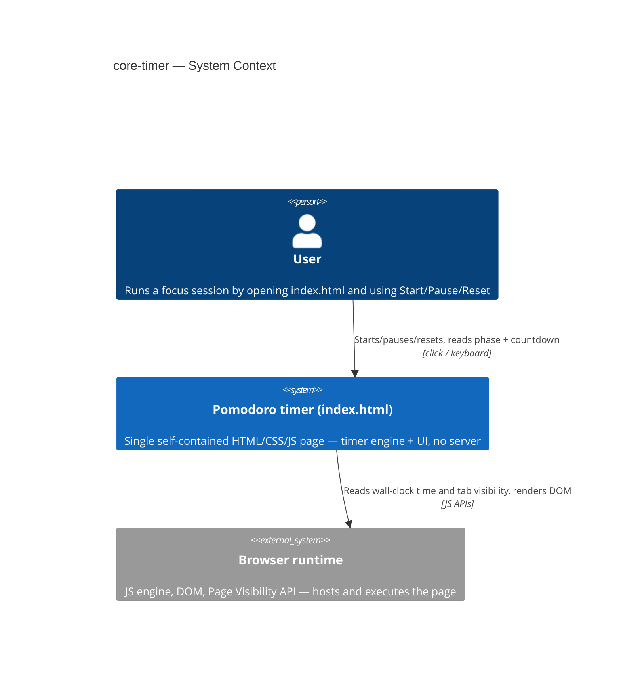
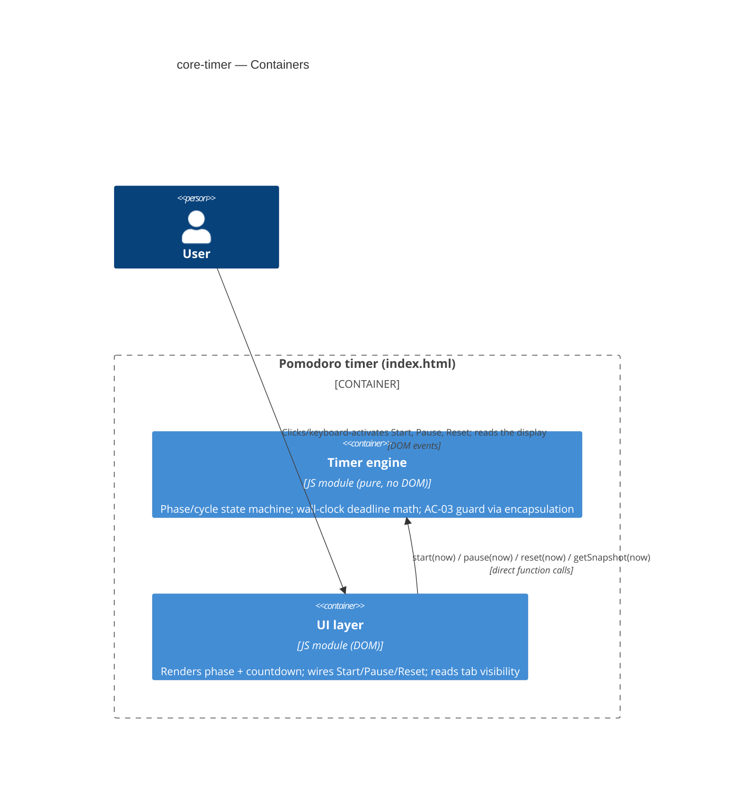
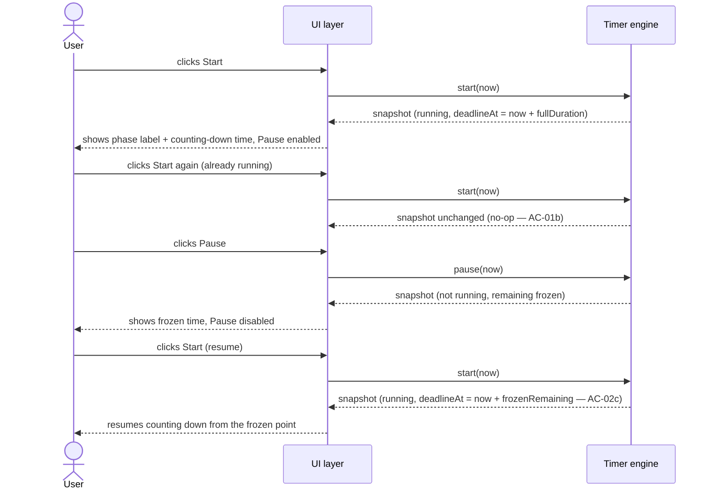
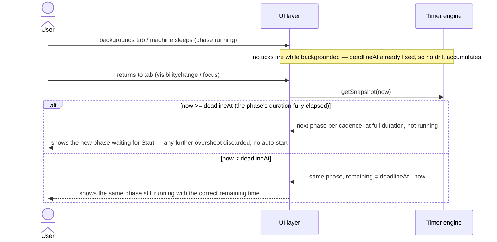

# Software Architecture Document — core-timer

<!-- 12 Arc42 sections. Empty section → <!-- N/A: <reason> -->. -->
<!-- C4 Context (L1) lives inline in §3. C4 Container (L2) lives inline in §5. -->
<!-- Numbers in §10 come VERBATIM from spec.md §6 NFR — no inventing, no rounding. -->

## 1. Introduction and goals

**Intent.** core-timer builds the engine everything else in the pomodoro-timer roadmap depends on:
a User who wants to run a focused work session gets a timer that reliably follows the classic
Pomodoro cadence (25 min focus, 5 min short break, 15 min long break every 4th focus session) using
only Start/Pause/Reset, and that stays correct even if they switch away from the tab or the machine
itself sleeps mid-session. It is the first feature to fill in the scaffolded `src/logic/` and
`src/ui/` modules.

**Top-3 quality goals (1-liners; full scenarios in §10):**

1. Countdown accuracy under backgrounding/throttling — displayed time never drifts from real
   elapsed time by more than a trivial rendering tolerance.
2. Concurrency / state safety — at most one phase is ever "running"; redundant control presses are
   no-ops, never double-counted elapsed time.
3. Self-contained, zero-network execution — the shipped page makes zero network requests beyond its
   own initial load, matching the single-file, no-backend foundation.

**Stakeholders.**

| Role | Interest | Sign-off owner? |
|---|---|---|
| User | Runs a focus session with Start/Pause/Reset; needs a countdown they can trust even away from the tab | No |
| PM (sergii.kushnir@gmail.com) | Owns the roadmap step; confirms the drift/cadence NFRs are met before it's marked done | No |
| Tech Lead | SAD approval | Yes |

<!-- Decision overrides (¶4) — none from the critic pass yet. -->

## 2. Constraints

**Technical.**
- JavaScript (ES modules), Node.js ≥18 for tooling/tests only — the shipped artifact runs in any
  modern browser with zero runtime dependency on Node (`architecture-map.md` §Stack).
- No framework — deliberately vanilla JS/CSS/HTML (`CLAUDE.md`, [`adr/0002-no-backend-for-v1`](../../adr/0002-no-backend-for-v1.md)).
- No datastore for this step — ephemeral in-memory state only; `localStorage` is explicitly deferred
  to the "Session tracking" roadmap step (spec §3 Non-goals).
- Architecture convention: layered — `src/logic/` (pure state machine, no DOM/browser API) →
  `src/ui/` (DOM/SVG/Web Audio/`localStorage`) → `src/main.js` (single manual wire-up), per
  `CLAUDE.md` and [`adr/0001-generate-single-file-from-modular-source`](../../adr/0001-generate-single-file-from-modular-source.md).

**Organisational.**
- Effort budget: XS — 1 PR, ≤1 day (`.size`, `docs/roadmap.md` step 2).
- Deadline: none hard, but the "Session tracking" and "Adjustable durations" roadmap steps are
  blocked on this one shipping first (`docs/roadmap.md` dependency graph).
- Team: solo — Architect/Tech Lead/PM are the same person (sergii.kushnir@gmail.com, per spec.md
  owner).

**Conventions.**
- `docs/architecture-map.md` is the only convention source so far (no separate authored
  `docs/architecture.md` yet) — module inventory, layering, and error-handling conventions come from
  there.
- No ID strategy needed — no persisted records beyond scalar counters/strings, and none of those are
  written by this step ([`adr/0002-no-backend-for-v1`](../../adr/0002-no-backend-for-v1.md)).
- Error handling: fail-soft in `src/ui/` only — clamp invalid input, never throw to the User
  (`CLAUDE.md` Conventions).

**Regulatory / external.**
- Data classification: internal — the only data is ephemeral in-memory timer state for the current
  page load; nothing persisted or transmitted (spec §6.1).
- No personal data touched, no accounts, no AuthN — the only access boundary is the AC-03 engine
  guard (§4, §8), reinforced by (not resting solely on) the browser's own tab isolation.
- No compliance controls apply — static client-side page the User runs themselves (spec §6.1
  Security review: N/A).

## 3. Context and scope

core-timer is the timer engine and controls behind the single-page pomodoro app: a User opens
`index.html` and runs a complete classic Pomodoro cycle — 4 focus phases, 3 short breaks between
them, then 1 long break — end to end using only Start, Pause, and Reset, with the display always
showing which phase is active and how much time remains in it.

<!-- brownfield: reflects docs/architecture-map.md (mode: greenfield-bootstrap) — `scaffold` already
     materialized src/logic/index.js, src/ui/index.js, src/main.js as placeholder stubs (commit
     8e8e5cf); core-timer is the first feature to fill them in. Map is fresh relative to HEAD (only
     the scaffold commit touched src/ since the map's reflects_commit); no re-scan needed. -->

**External systems (in / out):**

| Actor or system | Type | Interaction |
|---|---|---|
| User | Person | Opens `index.html`; clicks or keyboard-activates Start/Pause/Reset; reads the phase label and countdown |
| Browser runtime | System (external, the host) | Executes the page; delivers click/keyboard events; exposes wall-clock time and tab-visibility state via standard JS/DOM APIs |

No other external systems — deliberate, no backend, no third-party API, no analytics
([`adr/0002-no-backend-for-v1`](../../adr/0002-no-backend-for-v1.md)).

**C4 Context (L1):**



The Context shows only the User talking to the single self-contained page, which in turn depends on
nothing but the browser's own JS/DOM APIs — there is no server, no identity provider, no third-party
service in this feature's context at all.

## 4. Solution strategy

**Top strategic choices (the seeds for ADRs):**

1. **Target surface: `web-frontend` only, single container.** There is no backend to declare a
   surface for — `index.html` is both "the app" and "the delivery mechanism". Fixed by
   [`adr/0002-no-backend-for-v1`](../../adr/0002-no-backend-for-v1.md), not a new decision; no
   legitimate alternative exists, so no ADR. Written to this document's frontmatter:
   `target_surfaces: [web-frontend]`.
2. **UI architecture: static single-view, vanilla-JS client rendering, no framework, no routing.**
   The SSR/SPA/hybrid choice has no real alternative here — a framework is explicitly excluded by
   `CLAUDE.md` ("No framework. No server.") and the ADR above; picking one would violate an existing
   constraint, not weigh a trade-off. No ADR.
3. **Module integration: direct function calls, `src/ui/` → `src/logic/` only, wired once in
   `src/main.js`.** Already decided in
   [`adr/0001-generate-single-file-from-modular-source`](../../adr/0001-generate-single-file-from-modular-source.md)
   and `architecture-map.md`'s "no event bus" convention. This SAD documents the existing decision;
   no new ADR.
4. **Timing mechanism: an absolute wall-clock deadline (`Date.now()`-based), not a per-tick
   counter.** → [ADR-0001](adr/0001-wall-clock-deadline-timing.md). Already committed in spec.md §1
   ("real elapsed wall-clock time rather than a naive tick counter"); this ADR records it formally
   because it's irreversible and has a named rejected alternative — exactly the kind of decision
   worth a permanent record, even though it wasn't re-litigated here.
5. **AC-03 control-input guard: structural encapsulation, not a runtime trusted-call token.** →
   [ADR-0002](adr/0002-structural-encapsulation-control-guard.md). The one genuinely open decision in
   this pass — resolved via the Socratic walk (Recommended option chosen).
6. **Persistence / cache: none this step.** Ephemeral in-memory state only (spec §3 Non-goals;
   [`adr/0002-no-backend-for-v1`](../../adr/0002-no-backend-for-v1.md)). No new ADR.

Every tactical decision in §5–§8 traces to one of these six. No tactical decision below contradicts
a strategic choice.

## 5. Building block view

Layered: `src/logic/` (domain — the pure phase/cycle state machine) → `src/ui/` (infra — DOM
rendering, control wiring) → `src/main.js` (app — the single wire-up point), per `CLAUDE.md` and
`architecture-map.md`'s module inventory. `src/logic/` never imports `src/ui/`.

**Internal decomposition:**

```
src/
├── logic/         <pure state machine: phase/cycle transitions, wall-clock deadline math>
│   └── index.js   <createTimerEngine() → { start, pause, reset, getSnapshot } — no other exports>
├── ui/            <DOM: renders phase label + countdown, wires the three controls>
│   └── index.js   <mount(root) — the only caller of the logic factory's methods>
└── main.js        <wiring: instantiates the logic engine, hands it to ui.mount>
```

**C4 Container (L2):** one `Container` for the declared `web-frontend` surface — this feature draws
no separate backend-API container (there is none) and no `ContainerDb` (no persistence this step).



The Containers view shows the whole app as one deployable boundary split into two internal modules:
the UI layer is the only thing the User touches and the only caller of the timer engine, and the
timer engine exposes exactly those four functions — nothing else, and nothing reaches it any other
way (§4 point 5 / ADR-0002).

## 6. Runtime view

**Critical flow 1: Start → running countdown, then Start/Pause redundancy (AC-01, AC-01b, AC-02,
AC-02b, AC-02c)**



**Critical flow 2: Backgrounding / return reconciliation (AC-05, US-06)**



Flow 1 walks the happy path plus the two redundant-press no-ops that make the controls' disabled
state trustworthy (§10 QG-2). Flow 2 is the architecturally distinctive one: because timing rests on
an absolute deadline (ADR-0001), reconciliation on return is a single comparison, and the "at most
one boundary" rule (AC-05) falls out of the next phase starting idle rather than needing to be
special-cased.

## 7. Deployment view

<!-- N/A: reuses the existing single-file deployment unit (index.html, generated by `npm run build`
     and committed at the repo root) — no server, no infra, no change to how the app is delivered. -->

## 8. Crosscutting concepts

| Concept | Convention | Where defined |
|---|---|---|
| Logging | N/A — no server; browser devtools only, no structured logging for a single-file client app | — |
| Authentication | N/A — no accounts, single local User, no login | — |
| Authorization | The AC-03 control-input guard: `src/logic/` exports only `{start, pause, reset, getSnapshot}`, `src/ui/` is the only caller, no `window` `'message'` listener is ever registered | [ADR-0002](adr/0002-structural-encapsulation-control-guard.md), §4, §5 |
| Error handling | Fail-soft in `src/ui/` only — clamp invalid input, never throw to the User | `CLAUDE.md` Conventions |
| ID strategy | N/A — no persisted records beyond scalar counters/strings, and none are written this step | [`adr/0002-no-backend-for-v1`](../../adr/0002-no-backend-for-v1.md) |
| Internationalisation | N/A — single language (English UI text) | — |
| Observability | N/A — no metrics/tracing infra; the drift NFR is verified by the manual check in §10 QG-1 | spec §6 |
| Events | N/A — no event bus; direct function calls only (§4 point 3) | `architecture-map.md` |

## 9. Architecture decisions

| # | Title | Status | Section |
|---|---|---|---|
| 0001 | Use an absolute wall-clock deadline for countdown timing, not a per-tick counter | Accepted | §4 |
| 0002 | Enforce AC-03's control-input guard through structural encapsulation, not a runtime token | Accepted | §4 |

ADR files live under `docs/features/core-timer/adr/NNNN-<title>.md`.

## 10. Quality requirements

**QG-1. Countdown accuracy under backgrounding/throttling**
- **When:** a focus or break phase is running and the User backgrounds the tab, minimizes, or the
  machine itself sleeps for any length of real time, then the User returns.
- **Then:** countdown drift after backgrounding or sleep is ≤ 1s versus true wall-clock elapsed
  time (spec §6 NFR, verbatim).
- **How verify:** manual check — background the tab (and separately, suspend the machine) for 5 min
  mid-phase, compare displayed remaining time to a stopwatch on return (spec §6 NFR, verbatim).

**QG-2. Concurrency / state safety**
- **When:** the User presses Start while the timer is already running, or presses Pause while it is
  not running (AC-01b, AC-02b).
- **Then:** the system takes no action — at most one phase is ever "running" at a time; no
  double-counted elapsed time (spec §6 NFR, verbatim).
- **How verify:** enforced by unit tests on the state machine (spec §6 NFR, verbatim).

**QG-3. Display update rate and rounding**
- **When:** a phase is running and the tab is foreground/visible.
- **Then:** ≥ 1 update per second while running and visible; remaining time is always shown rounded
  up to the next whole second (ceiling) — full duration shown immediately, never skips to one second
  less (spec §6 NFR, verbatim, two rows).
- **How verify:** manual/visual check during a running phase (update rate); unit test on the
  time-formatting function (rounding) (spec §6 NFR, verbatim).

## 11. Risks and technical debt

<!-- brownfield gotchas: N/A — greenfield feature; src/logic/ and src/ui/ are still scaffold
     placeholder stubs (commit 8e8e5cf), no legacy code to carry debt from. -->

| Risk / debt | Severity | Mitigation | Owner |
|---|---|---|---|
| The ≤1s drift NFR (QG-1) is verified only manually (stopwatch), no automated backgrounding/sleep test | Medium | Documented manual-check procedure in spec §6; a scripted fake-timer test could be added in a later hardening pass, not required for this step | Tech Lead |
| A User can edit the fixed 25/5/15 duration constants via their own browser devtools | Low | Accepted per spec §6.1 abuse cases — it's the User's own local copy of the page, not an action against another party | N/A (accepted) |

**Accepted debt (acceptable in v1, plan to fix later):**
- Visual progress ring, tab-title countdown mirror, and completion chime are deferred to the later
  "Sensory feedback" roadmap step — this step ships a plain text/numeric display only (spec §3
  Non-goals).
- The daily completed-session counter is not persisted across reloads — only the ephemeral in-cycle
  focus count is tracked in memory for the current page load, deferred to "Session tracking" (spec
  §3 Non-goals).

## 12. Glossary

| Term | Meaning |
|---|---|
| User | The single person running the timer in their own browser tab; no other roles (`CONTEXT.md`) |
| Phase | The current segment of the cycle — Focus, Short break, or Long break, each with its own duration (`CONTEXT.md`) |
| Focus session | A Focus phase whose countdown reached zero naturally, not ended early by Reset (`CONTEXT.md`) |
| Cycle | The repeating sequence of 4 Focus phases separated by 3 Short breaks, then one Long break (`CONTEXT.md`) |
| In-cycle focus count | The ephemeral, in-memory count of Focus sessions completed since the last Long break; resets to zero the instant a Long break begins (`CONTEXT.md`) |
| Session counter | The persisted, cross-reload count of completed Focus sessions for the current day — introduced by the later "Session tracking" step, out of scope here (`CONTEXT.md`) |
| Wall-clock deadline | The absolute timestamp (`deadlineAt`) at which the current running phase will complete, computed once on Start/resume and re-read on every query — the mechanism ADR-0001 chose over a per-tick counter. Not yet in `CONTEXT.md` — flagging for a `glossary` follow-up since it's a term this feature introduces. |
