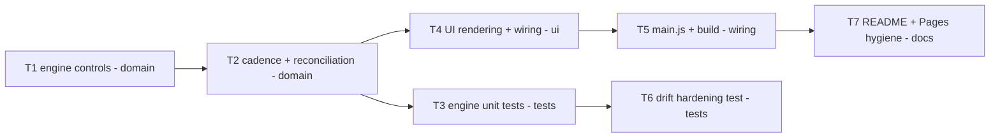

# Epic — core-timer

> **Spec:** [spec.md](../spec.md) · **Design:** [sad.md](../sad.md) · **ADRs:** [adr/](../adr/)

## Goal

Ship the wall-clock Pomodoro timer engine and its minimal UI: a User can run a complete classic
cycle (4 focus phases, 3 short breaks, 1 long break) using only Start/Pause/Reset, with a countdown
that stays accurate even after the tab is backgrounded or the machine sleeps (spec §2 Goals).

## Scope

- **In:** `src/logic/` pure state machine, `src/ui/` DOM rendering + control wiring, `src/main.js`
  wire-up, the regenerated committed `index.html`, unit tests, and repo hygiene (README, CI).
- **Out:** visual progress ring, tab-title mirror, completion chime, persisted daily counter,
  adjustable durations, task-label input — all deferred per spec §3 Non-goals.

## Task map

## Tasks

See [tracker.md](./tracker.md) for status. Machine contract: [tasks.json](../tasks.json).

| # | Task | Layer | Blocked by | DoD (short) |
|---|---|---|---|---|
| T1 | Engine control state machine (start/pause/reset + no-ops) | domain | — | Unit tests for AC-01/01b/02b/02c/06/08 pass |
| T2 | Phase cadence + backgrounding reconciliation | domain | T1 | Unit tests for AC-04/05/07 pass |
| T3 | Unit tests for the engine state machine | tests | T1, T2 | `npm test` green for all engine ACs |
| T4 | UI rendering + control wiring | ui | T1, T2 | Manual check: AC-08/02/05 hold in the browser |
| T5 | Wire main.js + regenerate index.html | wiring | T4 | `npm run build` clean, zero network requests |
| T6 | Automated backgrounding/drift hardening test | tests | T3 | Deterministic drift assertions pass |
| T7 | README + GitHub Pages hygiene | docs | T5 | CI green, README accurate |

## Risks / Hard rules

- Fail-soft only in `src/ui/` — never throw to the User (`CLAUDE.md` Conventions).
- `src/logic/` must stay pure (no DOM/browser APIs) and export only `{start, pause, reset, getSnapshot}` (AC-03, ADR-0002).
- `index.html` is generated — never hand-edited; must be regenerated and committed alongside any `src/` change (`CLAUDE.md` build-then-commit workflow).
- The ≤1s drift NFR (QG-1) was previously verified only manually — T6 exists specifically to close that sad §11 risk.
