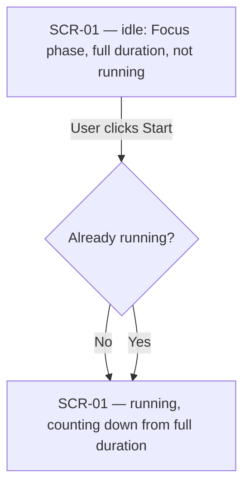
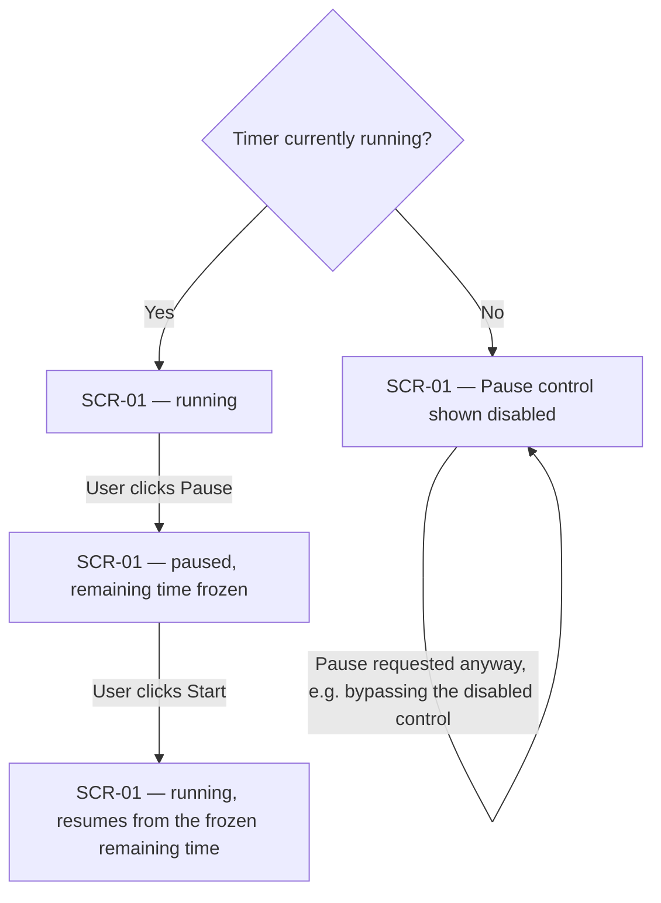
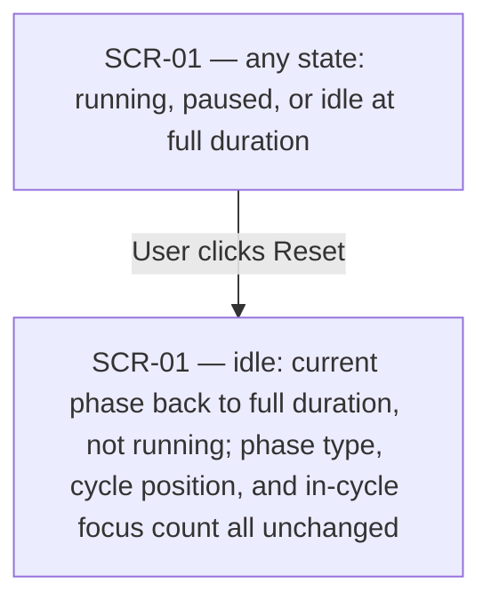
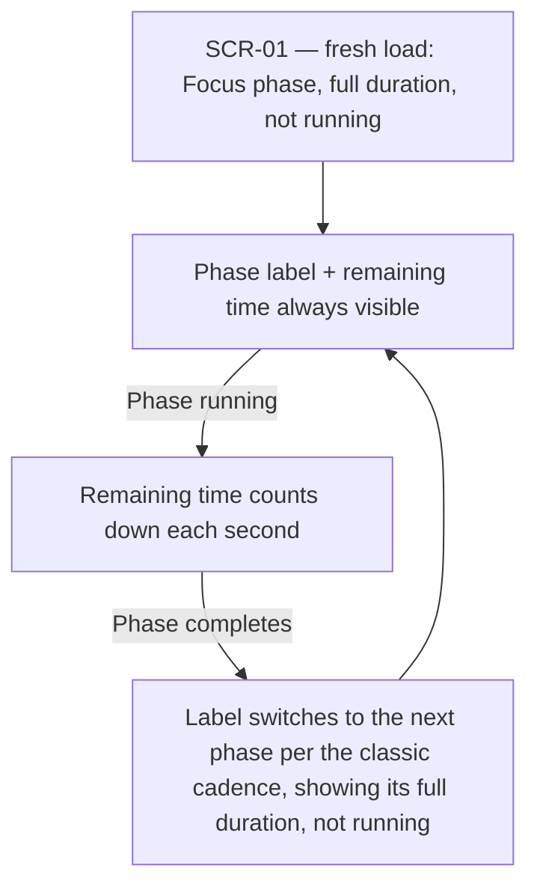
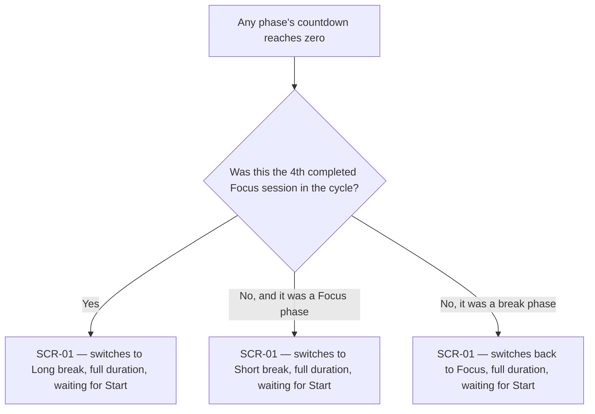
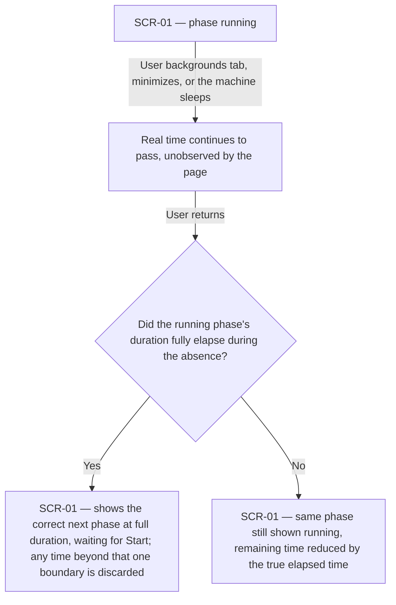

# UX flows — core-timer

> User flows for every UI-touching §4 user story, produced by `ux-flows` (after `clarify`, before
> `design`) and read by `design` (evidence for the target-surface + UI-architecture decisions),
> `sequences` (UI-driven flows align on SCR ids), `screens` (details every inventory row) and
> `plan-tests` (the e2e-through-UI paths). Always markdown + mermaid `flowchart`.

## Platform decisions

- **Posture:** responsive single web page, code-only — no `docs/design-system.md` exists yet (recommend running `/sdd:design-system`); this matches `docs/architecture-map.md` exactly: one static `index.html`, no separate mobile/desktop targets, no design tool.
- The whole feature is one screen — there is no navigation. Every "transition" below is an internal state change on that same screen (phase, running/paused/idle), not a page change.

## Screen inventory

| ID | Screen | Purpose | Entry | Exit |
|---|---|---|---|---|
| SCR-01 | Timer screen | Shows the active phase, its remaining time, and the Start/Pause/Reset controls; the only screen this feature has | Opening `index.html` | None — a single-page app, no navigation away within the feature |

## Flows

### Flow: US-01 — Start a focus session

On a fresh load the timer sits idle at the Focus phase, full duration, not running. Clicking Start begins the countdown from that full duration. If the User clicks Start again while it's already running, nothing changes — the phase keeps counting down uninterrupted, with no reset and no double-counted time (AC-01b).

### Flow: US-02 — Pause and resume

While the timer is running, the User can pause it — the remaining time freezes exactly where it was. Pressing Start again resumes from that frozen point, never restarting at full duration (AC-02c). While the timer is not running, the Pause control is shown disabled so there's visibly nothing to pause (AC-02); even if a pause request reaches the engine anyway, it's a no-op (AC-02b).

### Flow: US-03 — Reset the current phase

Reset works from any state and always does the same thing: the current phase returns to its full duration and stops, without touching which phase it is, where the cycle is, or the in-cycle focus count (AC-06).

### Flow: US-04 — See which phase is active

The phase label and remaining time are always on screen, from the very first load (AC-08), while counting down (AC-01), and the moment a phase completes and the display switches to the next one (AC-07) — the User is never looking at a blank or ambiguous state.

### Flow: US-05 — Follow the classic cadence automatically

Whenever a phase finishes, the system decides the next one for the User: the 4th completed Focus session in the cycle is always followed by a Long break (AC-04, never a Short break), the three in between are followed by a Short break, and any break is always followed by Focus. In every case it switches the display and waits for the User to press Start — it never starts the next phase on its own (AC-07).

### Flow: US-06 — Trust the countdown when I'm away from the tab

However long the User is away — a backgrounded tab or the machine itself asleep — the timer reconciles against real elapsed time on return. If that was enough to finish the running phase, it shows the correct next phase already waiting for Start (AC-05); if not, it just shows the same phase with the correct time now remaining. Either way, at most one phase boundary is ever crossed automatically — no unattended chain of transitions, however long the absence.

## AC coverage

| AC | Shown by | Notes |
|---|---|---|
| AC-01 | Flow US-1 → B(No)→C; also Flow US-4 → B/C | Fresh start + the remaining-time display it produces |
| AC-01b | Flow US-1 → B(Yes)→C | Redundant Start is a no-op |
| AC-08 | Flow US-4 → A | Initial load state |
| AC-02 | Flow US-2 → A(No)→E | Pause shown disabled while not running |
| AC-02b | Flow US-2 → E self-loop | Pause request no-op while not running |
| AC-02c | Flow US-2 → C→D | Resume from frozen remaining time |
| AC-03 | N/A — not a user-driven branch | AC-03's trigger is a non-actor input source (another tab/origin, or an unwired input); there is no User action that reaches it, so it doesn't appear as a flow branch. It's an engine-level guard, verified by inspection/unit test, not a UX path. |
| AC-04 | Flow US-5 → B(Yes)→C | 4th-session → Long break invariant |
| AC-05 | Flow US-6 → C(Yes)→D and C(No)→E | Both branches follow from the same wall-clock reconciliation |
| AC-06 | Flow US-3 → A→B | Reset from any state |
| AC-07 | Flow US-4 → C→D; Flow US-5 → all branches | Phase-complete display switch, always waiting for Start |
