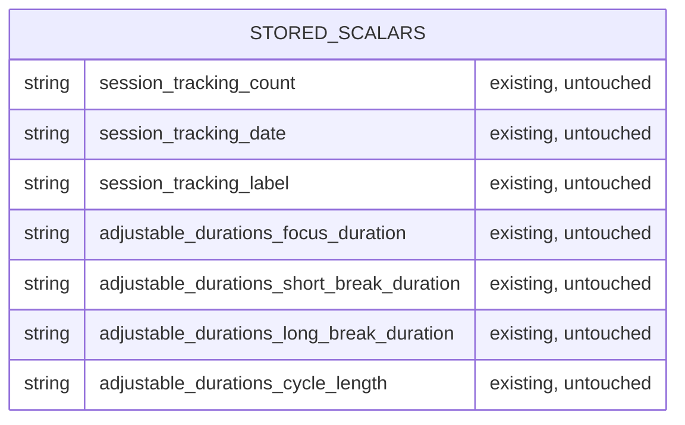

# Data model — sensory-feedback

**No schema change.** This feature adds no entity, column, key or index. It has no database at all:
persistence is browser `localStorage` scalars only ([`docs/adr/0002-no-backend-for-v1.md`](../../adr/0002-no-backend-for-v1.md)),
and sensory-feedback reads and writes none of them (`spec.md` §6.1: "no new stored values";
`sad.md` §2, §6 Flow 5: "no new stored value from this feature"). Every cue it adds (chime, ring,
tab title, sound-unavailable notice) is derived at render time from the engine snapshot, and the two
new snapshot fields (`phaseFullMs`, `justCompleted`) live in memory only (ADR-0002).

No `sad.md` §6 flow carries a persist note for this feature, so there is no index candidate. This
run is the valid "no schema change" outcome: zero staged migrations.

## ER diagram

There are no relational entities, so the diagram is empty by design.

## Entities

Existing stored scalars this feature touches: **none**. For reference, the complete set in
`localStorage` today (owned by earlier features, all in `src/ui/index.js`) is:

| Key | Owner feature | Touched by sensory-feedback |
|---|---|---|
| `session-tracking:count` | session-tracking | No (only triggered by the same completion, unchanged) |
| `session-tracking:date` | session-tracking | No |
| `session-tracking:label` | session-tracking | No |
| `adjustable-durations:focus-duration` | adjustable-durations | No (read path unchanged, the ring pins its own length in memory) |
| `adjustable-durations:short-break-duration` | adjustable-durations | No |
| `adjustable-durations:long-break-duration` | adjustable-durations | No |
| `adjustable-durations:cycle-length` | adjustable-durations | No |

**Aggregate root:** none.

## Indexes

None. No query, no database.

## Test fixtures

None. The existing structural test `test/logic/write-guard.test.js` (scans `src/` for
`storage.setItem` callers) stays untouched and now doubles as the guard that this feature adds no
storage writer (`sad.md` §2 Conventions).

## Migrations

None staged. `docs/features/sensory-feedback/migrations/` is intentionally not created.
