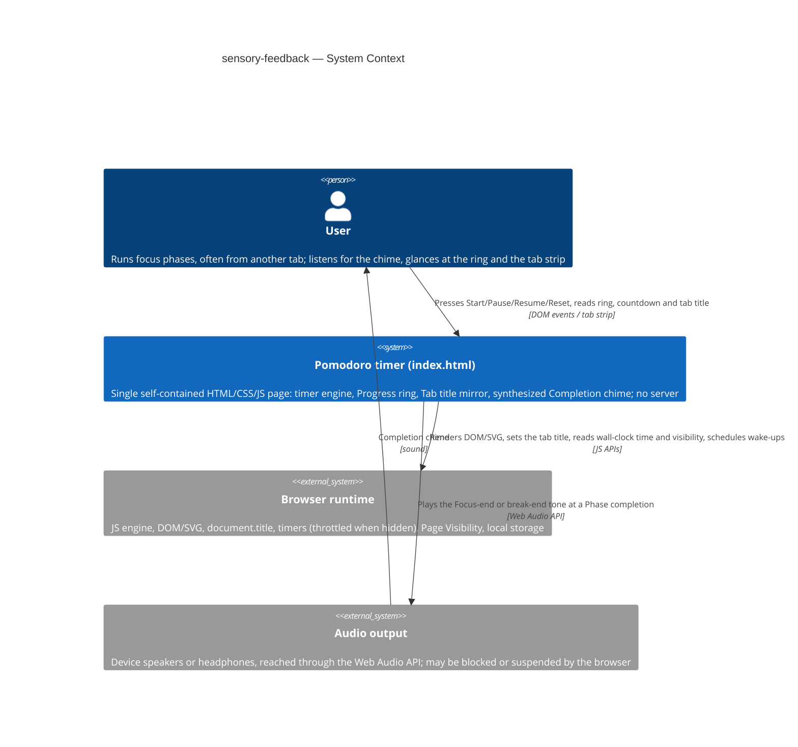
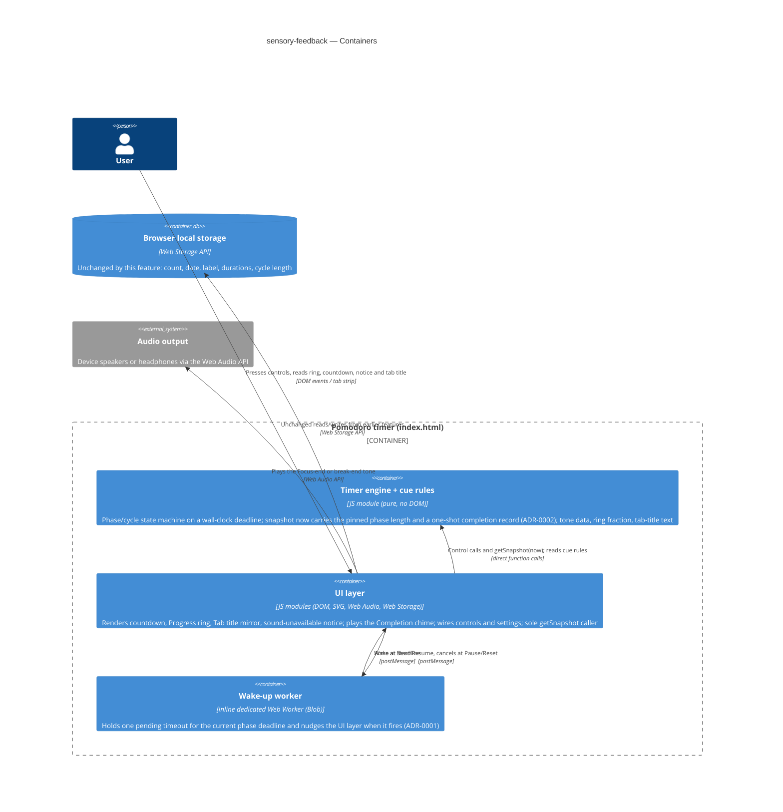
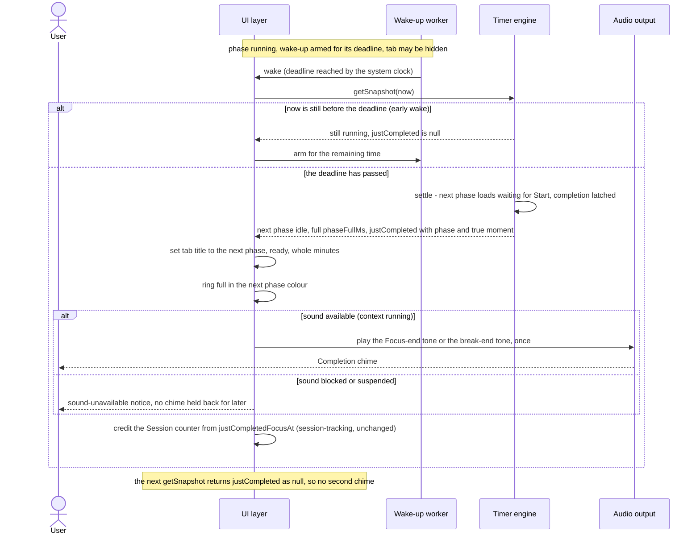
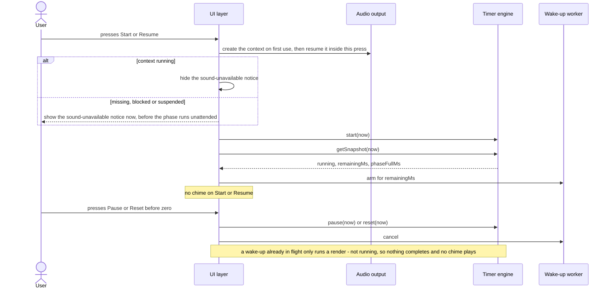
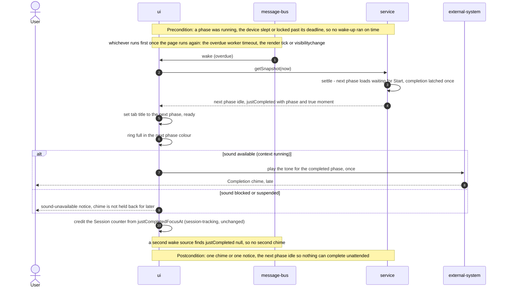
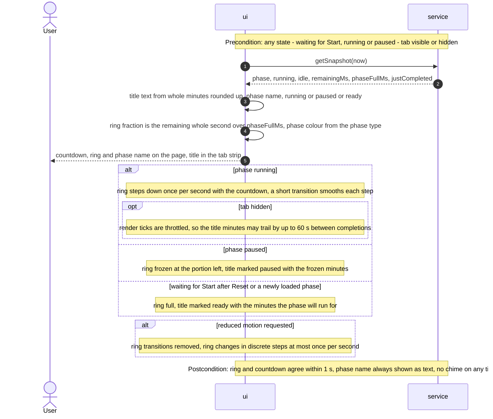
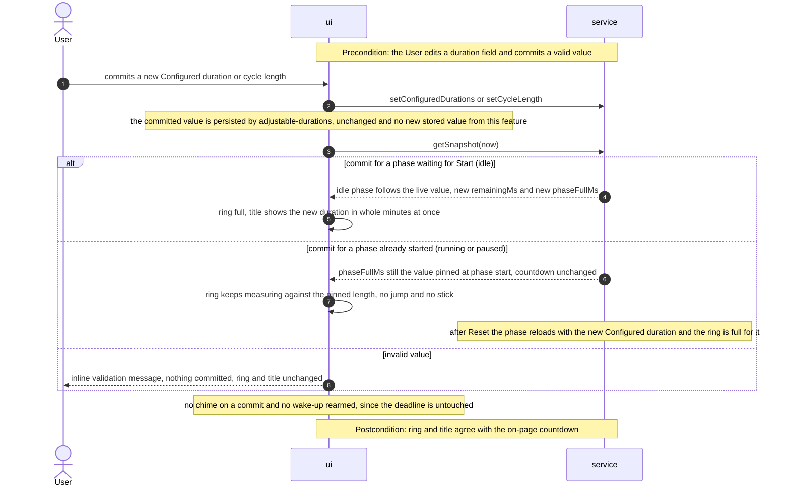

# Software Architecture Document — sensory-feedback

<!-- 12 Arc42 sections. Empty section → <!-- N/A: <one-line reason> -->. -->
<!-- C4 Context (L1) lives inline in §3. C4 Container (L2) lives inline in §5. -->
<!-- Numbers in §10 come VERBATIM from spec.md §6 NFR — no inventing, no rounding. -->

## 1. Introduction and goals

**Intent.** sensory-feedback adds the eyes-off cue layer the timer has lacked since core-timer. A
Completion chime with a distinct Focus-end tone and break-end tone plays at every Phase completion,
including while the tab is in the background of an awake desktop browser. A Progress ring, coloured
per phase type, depletes against the length the phase started with. The Tab title mirror shows the
remaining whole minutes, the phase, and whether the timer is running, paused or waiting for Start.
All of it sits in one dark palette that meets WCAG AA and fits a 320 CSS px screen. The segment is
the owner, using the timer as a personal focus tool, and anyone opening the page to judge the work
(`spec.md` §1–§2). Everything the step adds is output: it adds no stored value, no permission and
no network access, and it leaves every core-timer, session-tracking and adjustable-durations
guarantee as it is.

**Top-3 quality goals (1-liners; full scenarios in §10):**

1. **Background cue timeliness**: the Completion chime plays ≤ 1 s after the true Phase completion
   moment (never before it) in a hidden desktop tab of an awake device, and the Tab title mirror
   already shows the next phase waiting for Start when it does.
2. **Exactly-once, completion-only chime**: one chime per Phase completion, never on
   Start/Pause/Resume/Reset/duration commit, never repeated on return to the tab, and a
   sound-unavailable notice in its place (never a delayed chime) when sound cannot play.
3. **Accessible, consistent visual cues**: the ring agrees with the countdown within 1 s, it is
   measured against the phase's own starting length, and every text and non-text colour pair meets
   WCAG AA. Reduced motion and 320 CSS px layouts are honoured.

**Stakeholders.**

| Role | Interest | Sign-off owner? |
|---|---|---|
| User | Learns of every phase end by sound while working in another tab; reads remaining time, phase and state from the ring and the tab strip at a glance | No |
| PM (sergii.kushnir@gmail.com) | Owns roadmap step 5 and the KPI "phase ends the owner misses while working in another tab → 0 over 7 days" (`spec.md` §7) | No |
| Tech Lead | SAD approval; owner of `spec.md` §8's screen-reader open question | Yes |

<!-- Decision overrides (¶4) — populated by the critic resolution loop, empty otherwise. -->

- Decision override: the worker-unavailable fallback stays silent (§8 Error handling, ADR-0001) —
  rationale: the background timing promise (`spec.md` AC-06) is held for current stable desktop
  Chrome and Firefox, where dedicated workers are available. That is confirmed by the `file://`
  spike and the manual stopwatch run (§11). A browser that blocks workers (enterprise policy, an
  extension) is outside that promise, and the chime still plays there, possibly late. A visible
  warning would be new UI the spec and `ux-flows.md` don't have. (Critic finding, 2026-09-30.)
- Decision override: the feature stays size S despite four new files and two new snapshot fields —
  rationale: the files are splits inside the existing `src/logic/` and `src/ui/` modules, not new
  architectural modules. The snapshot fields are an internal read-only interface between two layers
  of the same `index.html`, not a public API. There is no migration, and 2–5 PRs remains realistic.
  Re-run `/sdd:classify-size sensory-feedback` if `tasks` comes out above 5 PRs. (Critic finding,
  2026-09-30.)

## 2. Constraints

**Technical.**
- JavaScript (ES modules). Node.js ≥18 is used for tooling and tests only; the shipped `index.html`
  runs in any modern browser and has no runtime dependency on Node (`CLAUDE.md`).
- No framework. The app stays vanilla JS/CSS/HTML and one generated, self-contained `index.html`,
  bundled by esbuild ([`adr/0001`](../../adr/0001-generate-single-file-from-modular-source.md),
  [`adr/0003`](../../adr/0003-esbuild-as-the-build-tool.md)). No CDN, no fetched asset, no audio
  file. Both tones are synthesized in the browser (`spec.md` §6 "Self-contained": 0 network
  requests, 0 audio files shipped).
- No backend, no new persisted value. This feature writes nothing to local storage
  ([`adr/0002`](../../adr/0002-no-backend-for-v1.md), `spec.md` §6.1).
- Browser APIs used, all without a permission prompt (`spec.md` AC-12): the Web Audio API for the
  tones, `document.title` for the Tab title mirror, inline SVG for the ring, the
  `prefers-reduced-motion` media query, and the Page Visibility API (already wired by core-timer).
- Target browsers for the background timing promise: current stable desktop Chrome and desktop
  Firefox (`spec.md` §3, AC-06). Phones and frozen tabs take the after-sleep path (AC-06b).
- Architecture convention: layered, `src/logic/` (pure, no DOM, no browser API) → `src/ui/` (DOM +
  browser APIs) → `src/main.js` (the one wiring point), unchanged (`CLAUDE.md`).

**Organisational.**
- Effort budget: S, meaning 2–5 PRs in about a week (`.size`, `docs/roadmap.md` step 5, the last
  roadmap step).
- Deadline: none hard.
- Team: solo. The Architect, Tech Lead and PM are the same person, as in the three earlier features.

**Conventions.**
- `docs/architecture-map.md` is **stale** (`reflects_commit: 9c8717e`, which predates all three
  shipped features). This SAD was drafted against a direct read of current `HEAD` (`61700da`):
  `src/logic/index.js`, `src/ui/index.js`, `src/main.js`, `src/styles.css` and `test-e2e/`. The
  stale map is carried as a §11 risk with a `survey` refresh recommended. It does not block this
  pass, the same accepted gap the adjustable-durations SAD flagged.
- The engine's public surface is structurally encapsulated
  ([`core-timer/adr/0002`](../core-timer/adr/0002-structural-encapsulation-control-guard.md)). The
  engine changes only through its six control methods, called only by `src/ui/`. This feature adds
  **no** control method; it only reads more from `getSnapshot(now)` (§4).
- Timing is an absolute wall-clock deadline, not a tick counter
  ([`core-timer/adr/0001`](../core-timer/adr/0001-wall-clock-deadline-timing.md)). Every cue here
  (chime, ring, title) is derived from that deadline, never from counting render ticks.
- Error handling is fail-soft in `src/ui/`: clamp, never throw to the User (`CLAUDE.md`). Sound
  failure is the one visible case. It is surfaced as a plain-language inline notice (AC-11), never
  as a thrown error or a dialog.
- Design tokens are CSS custom properties on `:root` in `src/styles.css`, dark-mode only. There is
  no `docs/design-system.md` yet, and `ux-flows.md` recorded a **mobile-first** posture.
- Already-shipped structural tests are affected. `test/logic/write-guard.test.js`, which scans
  `src/` for `storage.setItem` callers, is **untouched**, because this feature adds no storage
  writer. `test/logic/timer-engine.test.js` needs two changes. The first is a **mechanical**
  amendment of the pinned snapshot shape (ADR-0002). The second is a **deliberate rework** of the
  AC-03 source scan, which today forbids `postMessage(` / `onmessage` anywhere under `src/`. That
  scan must now allow them in `src/ui/wakeup.js` alone, while `window` `message`/`storage`
  listeners and `BroadcastChannel` stay forbidden everywhere. This amends core-timer ADR-0002 (see
  ADR-0001 "Amends core-timer ADR-0002" and §11). Both changes are `tasks`-stage items.

**Regulatory / external.**
- Data classification: public. The step adds no data at all (`spec.md` §6.1).
- No personal data is touched and no new stored value is added (`spec.md` §6.1).
- WCAG 2.x AA applies as a self-imposed accessibility bar (4.5:1 / 3:1 text, 3:1 non-text,
  reduced motion), not as a legal obligation (`spec.md` §6).
- Security review: N/A. There is no new data, storage, network access or permission boundary
  (`spec.md` §6.1).

## 3. Context and scope

sensory-feedback extends the same single-page Pomodoro app. The User still opens `index.html`,
presses Start, Pause, Resume and Reset, and sets durations. The page now also answers back through
three new channels: a sound through the device's audio output, a ring on the page, and the title
text in the browser's tab strip. The only new external dependency is the browser's audio output.
It is reached through the Web Audio API with no permission prompt, and it is still inside the same
browser runtime the earlier features declared.

<!-- brownfield: direct read of HEAD 61700da (the architecture map is stale — §2 Conventions).
     src/logic/index.js (321 lines): createTimerEngine() → frozen {start, pause, reset, getSnapshot,
     setConfiguredDurations, setCycleLength}; snapshot {phase, running, idle, remainingMs,
     focusCount, justCompletedFocusAt}; private phaseFullMs pinned per phase (not in the snapshot);
     settle(now) advances at most one boundary and only when now ≥ deadlineAt. src/ui/index.js
     (485 lines): mount(root, engine), a 250 ms setInterval render loop + a visibilitychange
     re-render, two storage gatekeepers; no ring, no title update, no audio, no Worker today.
     src/styles.css: :root tokens --bg/--fg/--muted/--accent/--control-bg/--control-border.
     test-e2e/: playwright-core harness with a fake page clock, and an existing zero-network-request
     check (durations.e2e.js:226). -->

**External systems (in / out):**

| Actor or system | Type | Interaction |
|---|---|---|
| User | Person | Presses Start/Pause/Resume/Reset and commits durations; hears the Completion chime; reads the ring, countdown and phase name on the page, and the Tab title mirror in the tab strip |
| Browser runtime | System (external, the host) | Runs the page and exposes wall-clock time, tab visibility, timers, DOM/SVG and `document.title`. It also throttles the page's timers while the tab is hidden, which is the constraint §4 designs around |
| Audio output (via the browser) | System (external) | Plays the synthesized tones through the Web Audio API. It is enabled only by the User's own Start/Resume press, with no permission prompt (AC-12). The browser may block or suspend it (AC-11); an OS-level mute is invisible to the page |

Nothing crosses the system boundary to a network: no backend, no third party, no analytics, no
fetched asset. That is a deliberate choice (`spec.md` AC-12, §6 "Self-contained").

**C4 Context (L1):**



The User talks only to the single self-contained page. The page depends on the browser for
rendering, the tab title, time and wake-ups, and now also on the audio output, which it reaches
only through the browser's Web Audio API. The sound travels back to the User, even when the tab is
out of sight. There are no network edges.

## 4. Solution strategy

**Top strategic choices (the seeds for ADRs):**

1. **Target surface: `web-frontend`, the same single page (SCR-01) the three earlier features
   declared.** `ux-flows.md` inventories one app page plus the browser's own tab strip (SCR-02) and
   other tabs (SCR-03), which are not app surfaces. There is no backend
   ([`adr/0002-no-backend-for-v1`](../../adr/0002-no-backend-for-v1.md)). There's no legitimate
   alternative, so no ADR. Written to this document's frontmatter: `target_surfaces: [web-frontend]`.
2. **UI architecture: unchanged static single view, vanilla-JS client rendering.** The new cues
   use the platform directly. The ring is inline SVG built by `src/ui/`, the Tab title mirror is
   `document.title`, and the tones are synthesized with the Web Audio API (oscillator + gain), so no
   audio file ships. Inherited from `CLAUDE.md` and the earlier SADs' §4 point 2. No ADR.
3. **Background wake-up: an inline dedicated worker wakes the page at the phase deadline.** →
   [ADR-0001](adr/0001-wake-the-page-at-the-deadline-from-an-inline-worker.md). Chrome's intensive
   throttling would make a hidden-tab chime up to about a minute late. A worker created from an
   in-bundle Blob is armed on Start/Resume and cancelled on Pause/Reset. Its message only triggers
   the ordinary `render()`, and the engine still decides completion against the one wall-clock
   deadline, so an early or stale wake-up is harmless. The worker dies with the tab. Phones take
   the after-sleep path (AC-06b), as `spec.md` §3 scopes it.
4. **Engine read-surface: extend `getSnapshot()` with `phaseFullMs` and a one-shot
   `justCompleted: {phase, at}` for every phase type, and add no new control method.** →
   [ADR-0002](adr/0002-extend-engine-snapshot-with-phase-length-and-completion-record.md). The ring's
   "length the phase started with" (AC-08) and "which phase completed, exactly once" (AC-05/AC-07)
   are rules the engine already owns. They are exposed read-only and unit-tested in Node,
   generalizing session-tracking's `justCompletedFocusAt` pattern, which stays unchanged.
5. **Sound lifecycle: one lazily created `AudioContext`, unlocked only inside the User's own
   Start/Resume press, and checked at unlock and at each completion.** The context is created on
   the first Start and `resume()`d on every Start/Resume, which is the User's gesture, so there's
   no permission prompt (AC-12). If it is missing or not `running` right after that, or at a
   completion, the sound-unavailable notice shows and **no chime is queued for later** (AC-11,
   AC-06b). A later Start/Resume that finds it `running` hides the notice. Low blast radius,
   contained in `src/ui/audio.js`, so it stays inline.
6. **Cue rules as pure data and functions in `src/logic/`, rendering in `src/ui/`.** Tones are note
   lists, each note having a frequency, start offset, duration and peak gain. The ring fraction and
   the tab-title text are pure functions of a snapshot. So ≤ 2 s per tone, peak gain ≤ 0.3, the
   rising-vs-falling distinctness (AC-05), the whole-minute rounding-up (AC-04) and the
   ring-vs-countdown agreement are all Node unit tests. `src/ui/` only plays or draws what the logic
   returns. This follows the existing `formatDuration` / `controlStates` precedent, so it's inline.

Every tactical decision in §5–§8 traces to one of these seeds. None contradicts a strategic choice.

## 5. Building block view

The layering is unchanged: `src/logic/` (domain, pure) → `src/ui/` (DOM + browser APIs) →
`src/main.js` (unchanged wiring). `src/logic/` still never imports `src/ui/`. This feature is also
the **first to split `src/ui/` into sibling modules**, because `src/ui/index.js` is already 485
lines and three independent browser-API adapters (worker, audio, SVG ring) would roughly double it.
`index.js` keeps `mount()` and the render loop and imports the three adapters. esbuild bundles
them into the one `index.html` as before. The split becomes the precedent for later UI features
(`CLAUDE.md`: "whatever it builds in `src/ui/` becomes the precedent").

**Internal decomposition:**

```
src/
├── logic/
│   ├── index.js      <createTimerEngine(): getSnapshot(now) gains phaseFullMs and the one-shot
│   │                  justCompleted {phase, at}, latched in settle() for every phase type and
│   │                  consumed by the next getSnapshot() (ADR-0002). justCompletedFocusAt and the
│   │                  six control methods are unchanged.>
│   └── feedback.js   <NEW, pure, re-exported from index.js: TONES (focusEnd / breakEnd note lists)
│                      + toneFor(phase); ringFraction(snapshot), which is the remaining whole
│                      second ÷ phaseFullMs clamped to [0, 1], so it steps with the countdown once
│                      per second; tabTitle(snapshot), which gives whole minutes rounded up + the
│                      phase name + the running / paused / ready state (AC-04, exact wording owned
│                      by `screens`).>
├── ui/
│   ├── index.js      <mount(root, engine): unchanged responsibilities, plus it builds the ring, the
│   │                  sound-unavailable notice and the title updates, and runs them in the fixed
│   │                  render order (§6 Flow 1). Start/Resume unlock sound and arm the wake-up;
│   │                  Pause/Reset cancel it. It remains the ONLY getSnapshot() caller (ADR-0002).>
│   ├── wakeup.js     <NEW: createWakeup(onWake) → {arm(delayMs), cancel()}, one inline Blob worker
│   │                  per page, URL revoked after creation, main-thread setTimeout fallback
│   │                  (ADR-0001).>
│   ├── audio.js      <NEW: createChimePlayer() → {unlock() → available?, play(tone) → played?}, one
│   │                  lazily created AudioContext; each note is an OscillatorNode + GainNode
│   │                  envelope scheduled relative to the context's currentTime (§4 decision 5).>
│   └── ring.js       <NEW: createRing() → {element, update(fraction, phase)}. It is an inline SVG
│                      track + arc; the arc length is set through stroke-dashoffset, and the phase
│                      colour through a data-phase attribute mapped to CSS tokens.>
├── styles.css        <new :root tokens: one ring colour per phase type + the ring track + the
│                      notice colours + a focus-indicator colour; a short ring transition, removed entirely under
│                      @media (prefers-reduced-motion: reduce); layout checked at 320 CSS px.>
└── main.js           <unchanged: mount(document.getElementById('app'), createTimerEngine())>
```

**C4 Container (L2):** still one `Container` for the declared `web-frontend` surface. The two
modules it contains are drawn as the containers the earlier SADs drew. The new pieces are the
wake-up worker (a separately running thread the page spawns) and the audio output it now drives.



The UI layer stays the hub. It calls the pure engine and cue rules, arms and cancels a small
wake-up worker that nudges it back at the deadline, and plays the tones out through the audio
output. Local storage is drawn only for continuity, since this feature neither reads nor writes
anything new there.

## 6. Runtime view

**Critical flow 1: Phase completion, including in a hidden tab (ADR-0001 + ADR-0002)**



**Critical flow 2: Start/Resume unlock sound and arm; Pause/Reset cancel**



**Critical flow 3: After a device sleep, lock or frozen tab (AC-06b)** — no separate diagram. It is
Flow 1's "deadline has passed" branch entered from whichever wake source runs first once the page
runs again: the overdue worker timeout, the throttled render tick or `visibilitychange`. The
one-shot `justCompleted` makes that single chime (or the notice) happen exactly once. The next
phase is idle, so nothing further completes unattended. `sequences` expands this and covers every
§5 AC.

**Participant legend for Flows 3-5.** Generic roles, mapped to the §5 blocks: `ui` = UI layer, `service` = Timer engine, `message-bus` = Wake-up worker (its only job is delivering the wake message), `external-system` = Audio output. Flows 1 and 2 predate this pass and keep the §5 block names, and they were left as drawn.

### Critical flow 3 (diagram): After a device sleep, lock or frozen tab (AC-06b)



### Flow 4: Render tick, ring and Tab title mirror (AC-01, AC-02, AC-03, AC-04)



### Flow 5: Duration or cycle-length commit (AC-07, AC-08, AC-09)



**AC and use-case coverage (`sequences` step 7).**

| Story or AC | Shown by |
|---|---|
| US-01 (AC-01, AC-02, AC-08) | Flow 4 (ring steps, frozen on pause, full when waiting) and Flow 5 (pinned length) |
| US-02 (AC-03) | Flow 4 (phase colour from the phase type, phase name as text) |
| US-03 (AC-04, AC-09) | Flow 4 (title states, hidden trailing tolerance) and Flow 5 (waiting phase shows the new minutes at once) |
| US-04 (AC-05, AC-07, AC-10, AC-11) | Flow 1 (tone per phase type, completion crediting), Flow 2 (no chime on controls, notice at Start or Resume) and Flow 5 (no chime on commit) |
| US-05 (AC-06, AC-06b) | Flow 1 (hidden tab wake-up) and Flow 3 (after sleep) |
| US-06 (AC-13) | Non-runtime N/A: a layout and contrast property checked by the 320 CSS px e2e and the palette unit test, not a message flow |
| AC-12 | Non-runtime N/A: a property of what is never called (no permission API, no network), verified by the zero-request e2e. Flow 2 shows sound unlocked by the User's own press |
| AC-10 midnight edge | Crediting rules stay in session-tracking (`justCompletedFocusAt`), Flow 1 shows only that the counter is credited from it |

**Async steps (`sequences` step 4).** The wake-up is an in-page timer nudge, not a webhook, queued job or third-party callback, so the async template does not apply in full. Its three parts are covered differently. The idempotency check is the engine's one-shot `justCompleted`: every wake source (worker, render tick, visibilitychange) reads the same snapshot, and only the first read returns the completion (Flows 1 and 3). There is no retry, because an early or missed wake-up is harmless: the next render tick or wake looks at the same wall-clock deadline. There is no dead-letter branch, because nothing is dropped: if the worker cannot start, ADR-0001's main-thread fallback still plays the chime, possibly late.

**Flags for `design` (none block).**
- No participant outside §5 was needed.
- Flow 5 covers a cycle-length commit as the same shape as a duration commit, so there is nothing new to record.
- This feature persists nothing, so §6 gives `data-model` no index hint, and `data-model` recorded no schema change.
- Block order: the existing Flows 1 and 2 stay where they were, and the new flows follow in number order. Story-to-flow order lives in the coverage table above, so no drawn block was moved.

## 7. Deployment view

<!-- N/A: reuses the existing single-file deployment unit — index.html generated by `npm run build`
     and committed at the repo root, opened directly or served as a static file. No server, no
     infra change; the wake-up worker ships inside that same file (Blob), not as a separate asset.
     Unchanged from core-timer / session-tracking / adjustable-durations §7. -->

## 8. Crosscutting concepts

| Concept | Convention | Where defined |
|---|---|---|
| Logging | N/A. There is no server; browser devtools only | — |
| Authentication / authorization | N/A. Single local User, no accounts, no permission requested. Sound is enabled only by the User's Start/Resume press (AC-12) | `spec.md` §6.1 |
| Input guard | The engine still changes only through its six control methods, called only from User-driven handlers in `src/ui/`. The one message channel in `src/` is the private page↔worker channel in `src/ui/wakeup.js`. Its handler sits on the page's own `Worker` object, never on `window`, and may only call `onWake` (= `render()`, a read), never a control method. The AC-03 source scan is reworked to allow exactly that file; `window` `message`/`storage` listeners and `BroadcastChannel` stay forbidden everywhere (amends core-timer ADR-0002) | [core-timer ADR-0002](../core-timer/adr/0002-structural-encapsulation-control-guard.md), [ADR-0001](adr/0001-wake-the-page-at-the-deadline-from-an-inline-worker.md) |
| Error handling | Fail-soft in `src/ui/`: a missing or blocked `AudioContext`, a failing `resume()`, a throwing `play`, or a worker that can't be constructed is caught. The timer, ring, title and Session counter carry on unchanged (AC-11). Only sound failure is User-visible, as the plain-language inline notice; worker failure silently falls back to a main-thread timer | `CLAUDE.md` Conventions; `spec.md` AC-11 |
| One-shot consumption | `render()` is the single `getSnapshot()` caller in `src/ui/`. Both `justCompletedFocusAt` and `justCompleted` are consumed there, in a fixed order: title → ring → chime/notice → Session counter | [ADR-0002](adr/0002-extend-engine-snapshot-with-phase-length-and-completion-record.md) |
| Timing source | Every cue derives from the engine's wall-clock deadline. The render loop and the worker only decide *when to look*, never *whether a phase completed* | [core-timer ADR-0001](../core-timer/adr/0001-wall-clock-deadline-timing.md) |
| Design tokens / theming | Dark-only CSS custom properties on `:root` in `src/styles.css`, extended with one ring colour per phase type, the ring track colour, the notice colours and a focus-indicator colour. `src/styles.css` stays the single token source; the contrast unit test reads the tokens from it, not from a copy | `architecture-map.md` §Frontend; `spec.md` §6 contrast rows |
| Motion | The ring changes once per second (ringFraction steps with the displayed second). A short transition smooths each step. Under `prefers-reduced-motion: reduce`, all ring transitions (depletion, refill, colour change) are removed | `spec.md` AC-01, §6 "Reduced motion" |
| Accessibility | Phase name stays visible text (colour is an extra cue, AC-03). How the sound-unavailable notice and a Phase completion are announced to screen readers (live-region semantics) is **not decided here**. It goes to `sdd:screens`, together with `spec.md` §8's open question (Tech Lead, before `sdd:screens`) | `spec.md` AC-03, AC-11, §8 |
| ID strategy / i18n / events | N/A. No records, single language (English UI text), no event bus (direct calls + one worker message) | [`adr/0002-no-backend-for-v1`](../../adr/0002-no-backend-for-v1.md) |
| Observability | N/A. NFRs are verified by unit tests, e2e and the manual timing runs in `spec.md` §6 | `spec.md` §6 |

## 9. Architecture decisions

| # | Title | Status | Section |
|---|---|---|---|
| 0001 | Wake the page at the phase deadline from an inline dedicated worker | Accepted | §4 |
| 0002 | Extend the engine snapshot with the pinned phase length and a one-shot completion record for every phase | Accepted | §4 |

ADR files live under `docs/features/sensory-feedback/adr/NNNN-<title>.md`. Inherited and still
binding: [core-timer ADR-0001](../core-timer/adr/0001-wall-clock-deadline-timing.md) (wall-clock
deadline), [core-timer ADR-0002](../core-timer/adr/0002-structural-encapsulation-control-guard.md)
(control guard; amended by this feature's ADR-0001 to allow the one private worker channel), [session-tracking ADR-0001](../session-tracking/adr/0001-expose-true-focus-completion-timestamp.md)
(Focus-completion timestamp), and the project-wide [`docs/adr/`](../../adr/) 0001–0003.

## 10. Quality requirements

**QG-1. Background cue timeliness**
- **When:** a phase reaches its Phase completion while running in a desktop Chrome or desktop
  Firefox tab that is hidden, on an awake device, including after ≥ 30 min hidden. Also the visible
  case.
- **Then:** hidden tab: chime "≤ 1 s after the true Phase completion moment (the phase's start plus
  its length, by the clock — not when the page next redraws 0:00), never before it, including after
  ≥ 30 min hidden". Visible tab: "≤ 250 ms after the true Phase completion moment, never before it".
  Tab title: hidden, it "already shows the next phase waiting for Start when the Completion chime
  starts, and at most 60 s behind while running"; visible, it "shows the on-page countdown's whole
  minute (rounded up) within 1 s" (`spec.md` §6, verbatim).
- **How verify:** "e2e with the page hidden + manual stopwatch check in desktop Chrome and desktop
  Firefox (current stable)" for the hidden row, and e2e for the visible and title rows (`spec.md`
  §6). The engine-side "never before" is also a unit test: a wake-up before `deadlineAt` yields
  `justCompleted === null`. The fake page clock does not drive the worker (ADR-0001), so the hidden
  row's timing relies on the real-time e2e + the manual stopwatch run.

**QG-2. Exactly-once, completion-only chime**
- **When:** the User presses Start/Pause/Resume/Reset or commits a duration; a phase completes; the
  User returns to the tab; the device slept past the deadline; sound is unavailable.
- **Then:** no chime on any control or commit, and exactly one per Phase completion, never repeated
  (AC-07). After a sleep, exactly one chime at the moment the page runs again, and none after
  (AC-06b). Each tone "≤ 2 s, played once, never repeating"; "peak output gain of each tone ≤ 0.3 of
  full scale"; "0 network requests, 0 audio files shipped" (`spec.md` §6, verbatim). When sound
  cannot play, the notice appears and nothing is held back (AC-11).
- **How verify:** unit tests over `settle()`/`getSnapshot()` for one-shot `justCompleted` across
  completion-inside-a-control-call, repeated reads, and a late read after sleep. Unit tests over
  `TONES` (length, peak gain, rising vs falling). e2e under the fake page clock for "no chime on
  controls" and "one chime per completion", with the audio adapter observed, not heard. The existing
  self-contained-load e2e is extended (`spec.md` §6).

**QG-3. Accessible, consistent visual cues**
- **When:** any timer state, at any width down to 320 CSS px, with or without the reduced-motion
  preference.
- **Then:** "ring's remaining fraction within 1 s-equivalent of the countdown at every visible
  update". Text contrast "≥ 4.5:1 for normal text, ≥ 3:1 for large text (WCAG AA) for all text".
  "each phase's ring colour, and focus indicators, ≥ 3:1 against the background; the ring's
  remaining arc ≥ 3:1 against its elapsed track, for each phase colour". "0 px horizontal overflow at
  320 CSS px, with a three-digit countdown and every notice or validation message shown". Under
  reduced motion, "0 animated ring transitions … the ring changes at most once per second, in
  discrete steps" (`spec.md` §6, verbatim).
- **How verify:** unit tests for `ringFraction` against `formatDuration` over sampled snapshots
  (including a mid-phase duration commit, AC-08), plus an e2e sample of the rendered ring against the
  on-page countdown ("unit + e2e sample", `spec.md` §6). An automated contrast unit test parses the
  `:root` tokens from `src/styles.css` and checks the declared text-on-background pairs, the ring
  pairs (each phase colour on the background and on its track) and the focus-indicator pair. e2e
  viewport check at 320 CSS px. e2e with reduced motion emulated (`spec.md` §6).

## 11. Risks and technical debt

<!-- brownfield gotchas: the stale architecture map (row 1); the pinned engine-shape test (row 5);
     the e2e harness's fake page clock does not drive a worker (row 3). -->

| Risk / debt | Severity | Mitigation | Owner |
|---|---|---|---|
| `docs/architecture-map.md` is stale (`reflects_commit: 9c8717e`, which predates all three shipped features) | Medium | This SAD read `HEAD` directly (§3). Run `/sdd:survey` to refresh the map before the next feature | Tech Lead |
| A Blob-URL worker may fail to start when `index.html` is opened from `file://`, or the zero-network e2e check may count the `blob:` URL | Medium | A spike as the first `tasks` item, in desktop Chrome + Firefox. The ADR-0001 fallback (main-thread timer) keeps the chime working, late only in a long-hidden tab. The e2e check is adjusted only to exclude `blob:` URLs, which are not network requests | sergii.kushnir@gmail.com |
| True hidden-tab timing can't be proven by the headless e2e: headless doesn't throttle like a real hidden tab, and the fake page clock doesn't drive the worker | Medium | Split verification: exactly-once and tone choice under the fake clock; a real-time hidden-page e2e; the manual stopwatch run in desktop Chrome + Firefox that `spec.md` §6 already requires, recorded at `review` | sergii.kushnir@gmail.com |
| Browser throttling policy could change, for example if worker timers become throttled in hidden tabs | Low | The manual timing check above catches it. The spec already scopes the promise to current stable desktop Chrome/Firefox | Tech Lead |
| `test/logic/timer-engine.test.js` pins the snapshot shape; ADR-0002 adds two fields | Low | Mechanical amendment in the same PR, tracked as a `tasks` item | Tech Lead |
| The wake-up worker reopens core-timer ADR-0002. Its AC-03 source scan currently fails on any `postMessage(` / `onmessage` under `src/` | Medium | This is a deliberate amendment, not a mechanical edit (ADR-0001 "Amends core-timer ADR-0002", plus a pointer amendment in core-timer ADR-0002). The scan allows the page↔worker channel in `src/ui/wakeup.js` only and still forbids `window` `message`/`storage` listeners and `BroadcastChannel` everywhere. `review` checks that the worker handler calls only `onWake` | Tech Lead |
| A second `getSnapshot()` caller in `src/ui/` would silently consume a completion, so no chime and no session credit | Medium | §8 "One-shot consumption" convention. The `review` checklist item is "render() is the only getSnapshot caller"; a source-scan unit test like `write-guard.test.js` is optional | Tech Lead |
| The `AudioContext` stays open after the first Start for the life of the page | Low | Accepted for v1. It is silent between tones, and keeping it running is what lets a completion play without a new gesture. Revisit if battery impact is reported | sergii.kushnir@gmail.com |
| Spec open questions carried forward: mute control; screen-reader announcement of a completion; exact tone character | Open question | Owned in `spec.md` §8: mute (sergii.kushnir@gmail.com, 2 weeks after ship), screen reader (Tech Lead, before `sdd:screens`), tones (sergii.kushnir@gmail.com, before `sdd:implement`). `TONES` as data (§4 decision 6) keeps the tone answer a data-only change | per `spec.md` §8 |

**Accepted debt (acceptable in v1, plan to fix later):**
- Two tabs of the app each chime and title independently, and double chimes are possible
  (`spec.md` §3, §6.1).
- `justCompletedFocusAt` duplicates part of `justCompleted`. Folding it in is optional later clean-up
  (ADR-0002, Neutral).
- No mute control (`spec.md` §3, §8).

## 12. Glossary

| Term | Meaning |
|---|---|
| User | The single person running the timer in their own browser tab; no other roles (root `CONTEXT.md`) |
| Phase | The current segment of the cycle: Focus, Short break or Long break (root `CONTEXT.md`) |
| Phase completion | The moment any phase reaches zero on its own countdown. It is NOT a Reset or any other early end (feature `CONTEXT.md`) |
| Completion chime | The short synthesized sound played at a Phase completion, with a Focus-end tone and a break-end tone. It is NOT a repeating alarm (feature `CONTEXT.md`) |
| Progress ring | The circular indicator of the fraction of the current phase still remaining, measured against the full length that phase started with, not the live Configured duration (feature `CONTEXT.md`) |
| Tab title mirror | The tab's title showing whole minutes rounded up, the phase, and running/paused/ready. It is NOT a notification (feature `CONTEXT.md`) |
| Session counter | Today's count of completed Focus sessions, credited by session-tracking. This feature only triggers it through the same completion (root `CONTEXT.md`) |
| Configured duration | The User-set length per phase type; the ring ignores a change to it until the phase starts fresh (adjustable-durations `CONTEXT.md`) |
| Wake-up | *(technical, this SAD)* A nudge from the inline worker telling the page to look at the clock now. It never decides a completion by itself (ADR-0001) |
| Sound-unavailable notice | *(this SAD / `spec.md` AC-11)* The plain-language inline message shown when the page finds it cannot play sound. Candidate for `/sdd:glossary sensory-feedback` |
