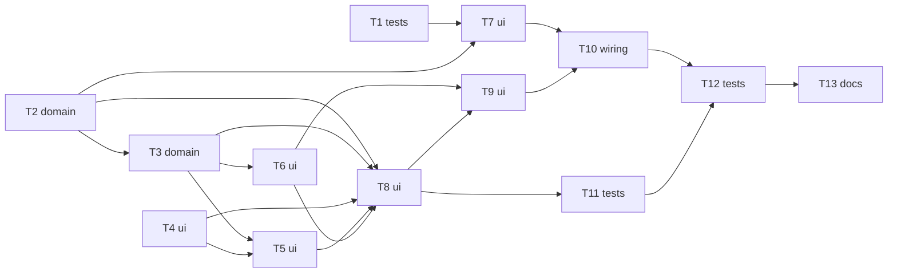

# Epic — sensory-feedback

> **Spec:** [spec.md](../spec.md) · **Design:** [sad.md](../sad.md) · **Data model:** [data-model.md](../data-model.md) (no schema change) · **API:** none (no backend) · **ADRs:** [adr/](../adr/)

## Goal

Deliver the eyes-off cue layer: a Completion chime with distinct Focus-end and break-end tones (also in a hidden desktop tab), a Progress ring coloured per phase, and a Tab title mirror, all in one WCAG-AA dark palette that fits 320 CSS px (`spec.md` §2).

## Scope

- **In:** `src/logic/` (snapshot fields, cue rules), `src/ui/` (ring, audio, wake-up worker, render wiring), `src/styles.css`, unit and e2e tests, the regenerated `index.html`.
- **Out:** a mute or volume control, system notifications, surviving a reload or discard, chime timing during sleep, the ≤ 1 s promise on phones and frozen tabs, coordinating two open tabs (`spec.md` §3).

## Task map

## Tasks

See [tracker.md](./tracker.md) for status. Machine contract: [tasks.json](../tasks.json).

| # | Task | Layer | Blocked by | DoD (short) |
|---|---|---|---|---|
| T1 | Spike: confirm an inline Blob worker starts from file:// in Chrome, and that the zero-network check ignores blob: URLs | tests | — | Spike result for Chrome is written next to ADR-0001. |
| T2 | Extend the engine snapshot with phaseFullMs and a one-shot justCompleted for every phase type | domain | — | Unit tests over `settle()`/`getSnapshot()` pass for every case in the table above. |
| T3 | Add the pure cue rules: tone data, ringFraction and tabTitle | domain | T2 | `test/logic/feedback.test.js` passes for tones, ring fraction and title. |
| T4 | Add the ring, notice and focus palette tokens, reduced-motion and 320px layout rules, and a contrast unit test | ui | — | `test/logic/contrast.test.js` passes for all declared pairs. |
| T5 | Build the Progress ring component (inline SVG track + arc) | ui | T3, T4 | `createRing().update()` sets the arc length and `data-phase` as specified. |
| T6 | Build the audio adapter: lazy AudioContext, unlock inside Start/Resume, play a tone once | ui | T3 | `test/logic/audio.test.js` passes with a fake context. |
| T7 | Build the inline wake-up worker and rework the message-channel source scan | ui | T1, T2 | Fallback and worker paths both covered by tests; cancelled arm never fires. |
| T8 | Render the ring, Tab title mirror and sound-unavailable notice from the snapshot in mount() | ui | T2, T3, T4, T5, T6 | Manual/e2e check: title and ring change in step with the countdown in all three states (full e2e in T11). |
| T9 | Play the chime or show the notice at completion; unlock sound in Start/Resume | ui | T6, T8 | Unit tests over the wiring pieces that can run in Node pass; e2e in T12 asserts one chime per completion and none on controls. |
| T10 | Arm the wake-up on Start/Resume and after an early wake; cancel on Pause/Reset; build | wiring | T7, T9 | `npm run build` succeeds and the committed `index.html` matches `src/`. |
| T11 | e2e: ring vs countdown, tab title states, 320px layout and reduced motion | tests | T8 | `npm run test:e2e` passes with the new file. |
| T12 | e2e: exactly-once chime, no chime on controls, hidden-tab timing, sound-unavailable notice, no permission or network | tests | T10, T11 | `npm run test:e2e` passes. |
| T13 | Run the manual stopwatch check in desktop Chrome and record the review checklist | docs | T12 | `_review/manual-timing-check.md` exists with both browsers' results. |

## Risks / Hard rules

- **One `getSnapshot()` caller:** `render()` is the only one in `src/ui/`; a second caller silently consumes a completion (`sad.md` §8, §11).
- **Input guard:** the only message channel is the page↔worker one in `src/ui/wakeup.js`; its handler calls only `onWake` (`sad.md` §8, ADR-0001). T7 reworks the core-timer AC-03 source scan, it does not delete it.
- **Timing source:** every cue derives from the wall-clock deadline; wake sources only decide when to look (core-timer ADR-0001).
- **No storage writer:** `test/logic/write-guard.test.js` stays untouched and guards it.
- **Build-then-commit:** regenerate and commit `index.html` with every change under `src/` (`CLAUDE.md`).
- **Open items carried:** tone character (`spec.md` §8, decided in T3), screen-reader announcement (§8, Tech Lead), `screens.md` was not produced so the tab-title wording is fixed in T3.
