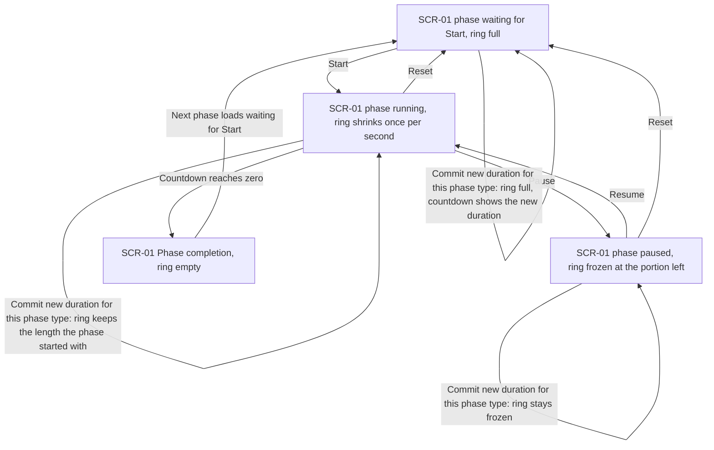
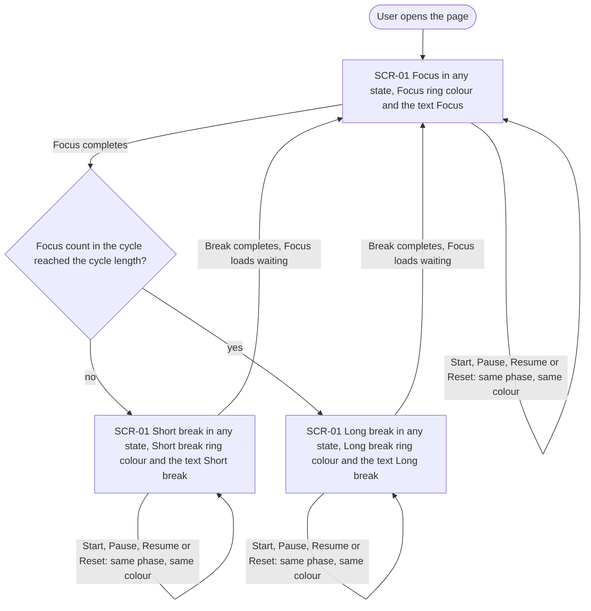
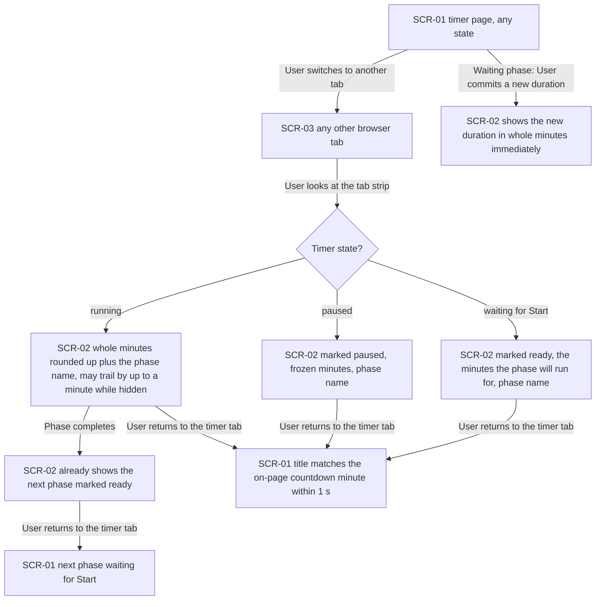
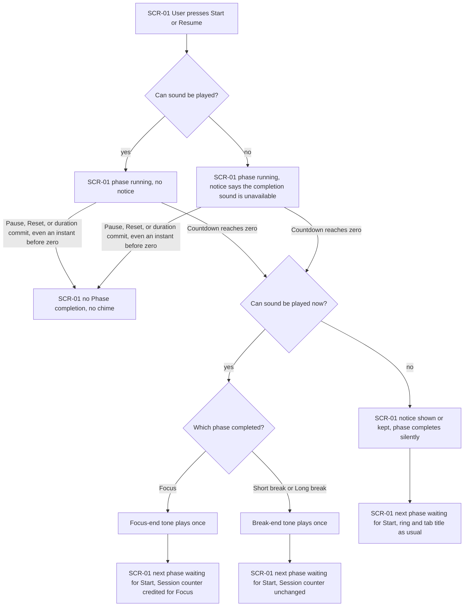
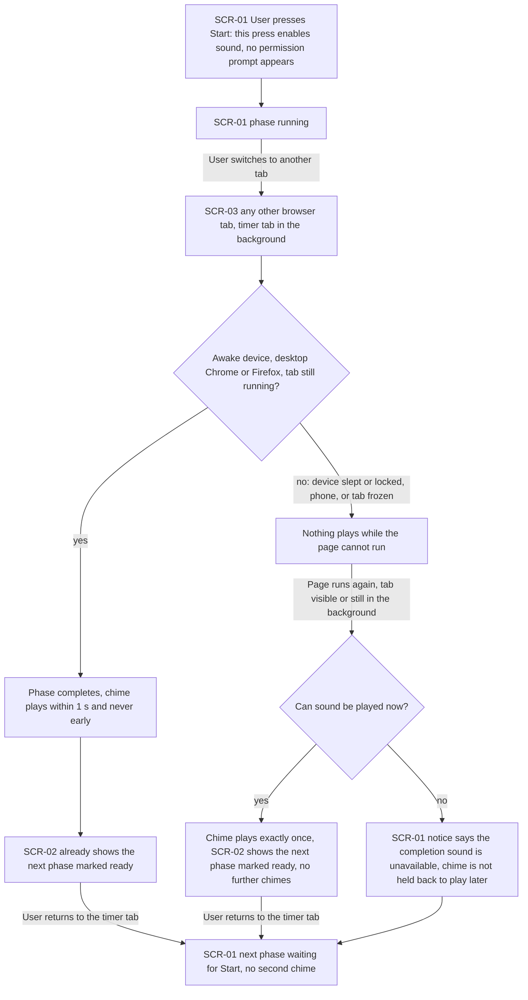
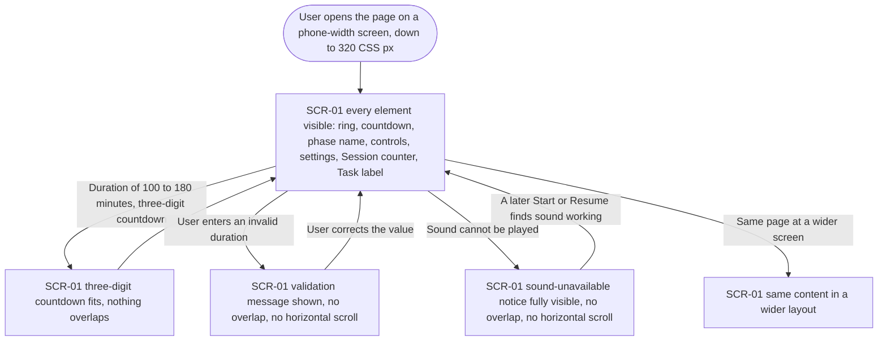

# UX flows — sensory-feedback

> User flows for every UI-touching §4 user story, produced by `ux-flows` (after `clarify`, before
> `design`) and read by `design` (evidence for the target-surface + UI-architecture decisions),
> `sequences` (UI-driven flows align on SCR ids), `screens` (details every inventory row) and
> `plan-tests` (the e2e-through-UI paths). **Always markdown + mermaid `flowchart`**, whatever the
> design tool — this artifact is flow-altitude, not visual design.

## Platform decisions

- **Posture:** mobile-first — owner's choice at this stage, a deviation from the recommended
  responsive-both. `docs/design-system.md` does not exist yet, so there is no canon to inherit; run
  `/sdd:design-system` to record one. Consequences the flows respect: the phone-width layout
  (AC-13) is drawn as the primary case in Flow US-06; the two behaviours that are desktop-only by
  spec — the ≤ 1 s background chime (AC-06) and the tab-title mirror as a tab-strip cue (AC-04) —
  stay desktop-scoped, and a phone in the background takes the sleep path (AC-06b, spec §3).
- **Navigation shape:** the app is a single page. There is no navigation between in-app screens;
  the "movement" in these flows is between the timer page, the browser's tab strip and other tabs.
- **Modality:** no dialogs, no permission prompts (AC-12). The only interruptions are inline: a
  validation message and the sound-unavailable notice, both on the timer page.
- **Sound is not a screen:** the Completion chime appears in flows as an event node, not an SCR.
- **Flagged for `design` (not decided here):** (1) the flows require the phase end, the chime and
  the tab title to be correct even when the page's own per-second redraw is throttled or paused
  (hidden tab, sleep); (2) sound must be enabled by the User's own Start press (AC-12) and its
  availability must be checked at Start or Resume (AC-11); (3) the two-tab case is unreconciled
  by design (spec §3). Target-surface and architecture choices stay with `design`.
- **Flagged for `screens`:** spec §8 OQ on whether a screen reader announces a Phase completion.

## Screen inventory

| ID | Screen | Purpose | Entry | Exit |
|---|---|---|---|---|
| SCR-01 | Timer page | The app's one page: Progress ring, countdown, phase name, controls, duration settings, Session counter, Task label, plus the inline validation message and the sound-unavailable notice | Opening the page; switching back to the timer's tab | Switching to another tab |
| SCR-02 | Browser tab strip (Tab title mirror) | The timer tab's title as seen in the browser's tab strip, without opening the tab | Glancing at the tab strip, from the timer page or from another tab | Clicking the timer tab (→ SCR-01) or carrying on elsewhere |
| SCR-03 | Any other browser tab | The User's work outside the app — where the User is when the timer tab is in the background (external to the app) | Switching away from the timer's tab | Switching back to the timer's tab (→ SCR-01) |

## Flows

### Flow: US-01 — See phase progress at a glance

The User starts on the timer page with a phase waiting for Start and the ring full. Pressing Start
runs the phase and the ring shrinks once per second, in step with the countdown, so it reads as a
continuous sweep. Pausing freezes the ring at the portion that was left, and Resume carries on from
there. Reset, from running or from paused, puts the same phase back to waiting with a full ring
(after a duration change, "full" means the new Configured duration). If the countdown reaches zero,
the ring is empty at exactly that moment, and then the next phase loads waiting for Start with a full
ring. Three duration-change branches: committing a new duration for the same phase type while the
phase is running or paused changes nothing visible — the ring keeps measuring against the length the
phase started with, so it neither jumps nor sticks; committing it while the phase is waiting makes
the ring full and the countdown show the new duration immediately.

### Flow: US-02 — Tell the phase apart at a glance

On opening the page the User sees Focus, waiting for Start, with the Focus ring colour and the words
"Focus" shown as text. Whatever the timer is doing — waiting, running or paused — the ring shows the
current phase type's colour, always different from the other two phase types, and the phase name is
always printed as well, so the phase can be told apart without relying on colour. Start, Pause,
Resume and Reset never change the phase, so they never change the colour. When Focus completes the
next phase depends on the cycle: if the Focus count in the cycle has reached the Configured cycle
length, the Long break loads with its own colour and text; otherwise the Short break loads with its
own colour and text. When either break completes, Focus loads waiting again with the Focus colour.

### Flow: US-03 — Follow the timer from another tab

The User leaves the timer in some state and switches to another tab. Glancing at the tab strip they
see the timer tab's title, which depends on the state. Running: the remaining whole minutes, rounded
up so it never reads zero while time is left, plus the phase name; while the tab is hidden the
minutes may trail the real countdown by up to a minute. Paused: the title is marked paused and shows
the frozen minutes. Waiting for Start: the title is marked ready and shows the minutes the phase
will run for. When a running phase completes, the title already shows the next phase marked ready —
it is never behind at a completion. Coming back to the timer tab from a running, paused or waiting
title, the title matches the on-page countdown's whole minute within a second; coming back after a
completion, the next phase is waiting for Start. Separately, if the User is on the timer page with a
phase waiting and commits a new duration for that phase type, the tab title shows the new duration
in whole minutes immediately, matching the on-page countdown.

### Flow: US-04 — Hear which phase just ended

The User presses Start or Resume. The page checks whether sound can be played. If it can, the phase
runs with no notice. If it cannot (sound unavailable, blocked, or silently suspended by the browser),
the phase still runs, and a plain-language notice appears straight away, before the phase runs
unattended, saying the completion sound is unavailable so the User knows to rely on the ring and the
tab title. While the phase runs, pressing Pause or Reset, or committing a duration change, plays no
chime — and a Pause or Reset an instant before zero means the phase never completes, so no chime
either. When the countdown reaches zero the page tries again: if sound cannot be played at that
moment the notice appears or stays and the phase completes silently, otherwise the tone depends on
what ended — Focus plays the Focus-end tone, Short break or Long break plays the break-end tone, each
once, soft and short, with the two distinguishable. Either way the next phase loads waiting for Start
and nothing else plays. A Focus completion is credited to the Session counter exactly as
session-tracking decides (normally plus one; a completion whose true moment fell before a midnight
that has since passed still chimes but is not carried into the new day's count); a break completion
never changes the counter. The notice stays until a later Start or Resume finds sound working.

### Flow: US-05 — Get the chime while working elsewhere

The User presses Start — that press is what enables sound, and no permission prompt of any kind ever
appears — and then switches to another tab to work. Main branch, for an awake device in desktop Chrome
or Firefox with the tab running in the background: however long the User is away, when the phase
completes the chime plays within one second of that moment and never before it, and by the time it
starts the tab title already shows the next phase marked ready. Back on the timer tab, the next phase
is waiting for Start and no second chime plays on return. Alt branch, for a device that slept or
locked past the moment, a phone with the browser in the background, or a frozen tab: nothing plays at
the true moment. As soon as the page's code runs again — whether the tab is visible or still hidden —
the chime for that phase plays exactly once, the tab title shows the next phase waiting for Start, and
nothing further follows, because the next phase never starts on its own. If sound cannot be played at
that moment, the sound-unavailable notice appears instead and the chime is not held back to play
later. Either way the User lands on the timer page with the next phase waiting.

### Flow: US-06 — Use a readable dark interface on any screen

The User opens the page on a phone-width screen, as narrow as 320 CSS pixels. Every element — the
ring, countdown, phase name, controls, settings fields, Session counter and Task label — is visible
and usable, in one dark palette, with no horizontal scrolling and nothing overlapping. Three
situations must not break that: a three-digit countdown (a duration of 100 to 180 minutes, the allowed maximum being 180), which still fits; an invalid duration
entry, whose validation message appears without overlap and clears when the User corrects the value;
and the sound-unavailable notice, which appears fully visible and clears when a later Start or Resume
finds sound working. Opening the same page at a wider screen shows the same content and the same
movements in a wider layout — no different flow.

### Out of scope

No backend-only stories: all six user stories (US-01 to US-06) touch the UI, and the app has no
backend. Considered and not drawn as flows: the contrast and reduced-motion behaviours (§6 NFRs, not
movements between screens — `screens` and `plan-tests` own them), and the two-tab case (spec §3
non-goal).

## AC coverage

| AC | Shown by | Notes |
|---|---|---|
| AC-01 | Flow US-01 → A→B (Start), B→D (countdown reaches zero) | ring full at start, shrinking, empty at Phase completion; reduced motion is a §6 NFR |
| AC-02 | Flow US-01 → B→C (Pause), B→A and C→A (Reset), D→A (next phase loads) | frozen on pause, full after Reset and for a newly loaded phase |
| AC-03 | Flow US-02 → nodes A, C, D and their self-edges | colour per phase type plus the phase name as text, in every state |
| AC-04 | Flow US-03 → C→D, C→E, C→F | the three tab-title states; the 60 s trailing tolerance sits on node D |
| AC-05 | Flow US-04 → Y→F (Focus-end tone), Y→G (break-end tone) | distinctness and loudness are §6 / unit-test matters |
| AC-06 | Flow US-05 → D→E→F | chime within 1 s, never early, title already on next phase |
| AC-06b | Flow US-05 → D→G→H→I | sleep, lock, phone or frozen tab: chime once when the page runs again, no chimes after |
| AC-07 | Flow US-04 → A→X and W→X; Flow US-05 → F→K and I→K | no chime on Start, Pause, Resume, Reset or duration commit; none again on return to the tab |
| AC-08 | Flow US-01 → self-edges on B and C (commit while running or paused) | ring keeps the starting length; Reset → A gives the new full length |
| AC-09 | Flow US-01 → self-edge on A; Flow US-03 → A→J | ring full and title in new whole minutes immediately |
| AC-10 | Flow US-04 → F→J and G→K | Session counter credited for Focus, unchanged for breaks; the midnight case is in the node text |
| AC-11 | Flow US-04 → V→W (at Start or Resume), Z→N (at completion); Flow US-05 → H→J | notice shown early or at completion, stays until a later Start or Resume finds sound working |
| AC-12 | Flow US-05 → node A | the User's own Start press enables sound; no permission prompt in any flow |
| AC-13 | Flow US-06 → nodes B, C, D, E | 320 px, three-digit countdown, validation message and sound notice all visible; contrast is a §6 NFR |
