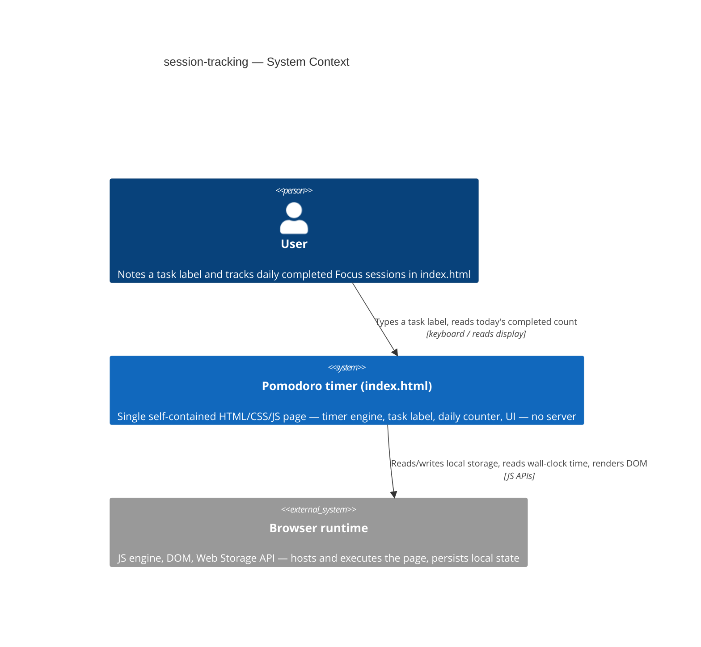
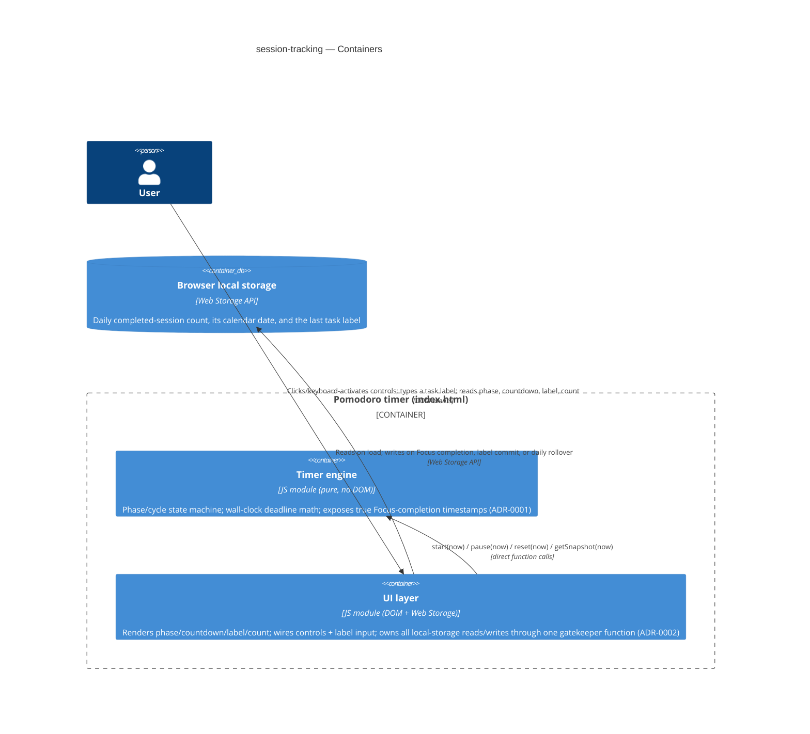
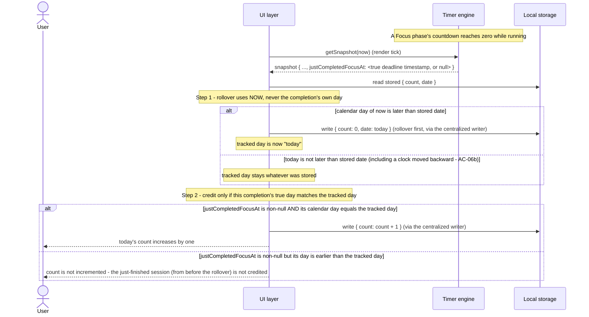
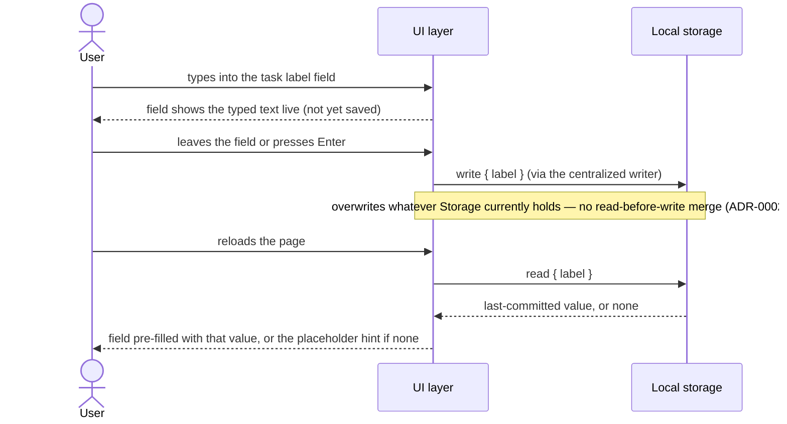

# Software Architecture Document — session-tracking

<!-- 12 Arc42 sections. Empty section → <!-- N/A: <reason> -->. -->
<!-- C4 Context (L1) lives inline in §3. C4 Container (L2) lives inline in §5. -->
<!-- Numbers in §10 come VERBATIM from spec.md §6 NFR — no inventing, no rounding. -->

## 1. Introduction and goals

**Intent.** session-tracking adds a task-label note and a trustworthy daily completed-Focus-session
count to the core-timer app: a User running a focus session can note what they're working on (a
value that survives reloads) and see, at a glance, how many Focus sessions they've genuinely
completed today — correctly starting over at the beginning of each new calendar day, even if the tab
stayed open across midnight.

**Top-3 quality goals (1-liners; full scenarios in §10):**

1. Daily-count correctness across a midnight boundary — including crediting a session to the
   calendar day it actually finished on, not the day the app happens to notice.
2. Resilience — corrupted, missing, or unwritable persisted state never breaks the app or loses more
   than the affected field.
3. Persisted-state integrity — only the app's own three legitimate triggers (a Focus completion, the
   label's own commit, the daily-rollover check) ever determine what gets saved.

**Stakeholders.**

| Role | Interest | Sign-off owner? |
|---|---|---|
| User | Notes a task label and tracks today's completed Focus sessions; needs both to survive reloads and the count to be trustworthy across a day boundary | No |
| PM (sergii.kushnir@gmail.com) | Owns the roadmap step; confirms the daily-reset and write-integrity NFRs are met before it's marked done | No |
| Tech Lead | SAD approval | Yes |

<!-- Decision overrides (¶4) — none from the critic pass yet. -->

## 2. Constraints

**Technical.**
- JavaScript (ES modules), Node.js ≥18 for tooling/tests only — the shipped artifact runs in any
  modern browser with zero runtime dependency on Node (unchanged from core-timer).
- No framework — deliberately vanilla JS/CSS/HTML (`CLAUDE.md`, [`adr/0002-no-backend-for-v1`](../../adr/0002-no-backend-for-v1.md)).
- Persistence: browser local storage only, written exclusively from `src/ui/` (never `src/logic/`),
  reusing the boundary core-timer's own architecture already established.
- Architecture convention: layered — `src/logic/` (pure) → `src/ui/` (DOM + storage) → `src/main.js`
  (wiring), unchanged from core-timer, per `CLAUDE.md`.

**Organisational.**
- Effort budget: XS — 1 PR, ≤1 day (`.size`, `docs/roadmap.md` step 3).
- Deadline: none hard; `docs/roadmap.md`'s dependency graph notes this step "needs the
  phase-completion event to increment/display against" — the true-completion-timestamp mechanism
  (§4, [ADR-0001](adr/0001-expose-true-focus-completion-timestamp.md)) is exactly that event.
- Team: solo — same as core-timer (Architect/Tech Lead/PM are the same person).

**Conventions.**
- `docs/architecture-map.md` is **stale** (`reflects_commit: 9c8717e`, predating core-timer's actual
  implementation entirely) — this SAD relies on a fresh explorer scan of current `HEAD` instead of
  the map; flagged as a §11 risk recommending a `survey` refresh, not blocking this pass.
- No ID strategy needed — no persisted records beyond scalar counters/strings/a date, same reasoning
  as [`adr/0002-no-backend-for-v1`](../../adr/0002-no-backend-for-v1.md).
- Error handling: fail-soft in `src/ui/` for storage reads (corrupted/missing → per-field defaults)
  and writes (failure → silent, in-memory continues) — **except** the task-label length limit, which
  deliberately rejects-with-message rather than clamps, a documented divergence from `CLAUDE.md`'s
  default already stated in `spec.md` §1.

**Regulatory / external.**
- Data classification: internal — the only data is a completed-session count, its calendar date, and
  a free-text task label, persisted only in this browser's local storage; nothing transmitted
  (spec §6.1).
- No personal data touched beyond whatever free text the User chooses to type into the label — never
  processed, transmitted, or logged, only stored raw (spec §6.1).
- No compliance controls apply — same reasoning as core-timer (spec §6.1 Security review: N/A).

## 3. Context and scope

session-tracking extends the single-page Pomodoro app: a User opens `index.html`, and in addition to
running Focus/break phases, can now type a task label (remembered across reloads) and see how many
Focus sessions they've completed today, correctly reset each calendar day. No new external actor —
the same User, the same Browser runtime core-timer already declared.

<!-- brownfield: reflects a fresh explorer scan (2026-09-28) of current HEAD (912edce), not
     docs/architecture-map.md (stale — see §2 Conventions). Current state: src/logic/index.js
     (127 lines: createTimerEngine, controlStates, formatDuration, PHASES — all pure, zero DOM/
     browser API contact); src/ui/index.js (90 lines: mount(root, engine), the only DOM/browser-API
     site, imports from src/logic/ only); src/main.js (4 lines: mount(document.getElementById('app'),
     createTimerEngine())). No localStorage code exists yet — session-tracking is the first feature
     to touch it. Rendering is pull-based: a 250ms interval + a visibilitychange listener both call
     engine.getSnapshot(Date.now()) and diff against the DOM; there is no callback/event system from
     the engine outward. -->

**External systems (in / out):**

| Actor or system | Type | Interaction |
|---|---|---|
| User | Person | Types a task label; reads the phase, countdown, label, and today's completed-session count |
| Browser runtime | System (external, the host) | Executes the page; exposes wall-clock time, tab-visibility state, and the Web Storage API |

No other external systems — deliberate, no backend, no third-party API, no analytics
([`adr/0002-no-backend-for-v1`](../../adr/0002-no-backend-for-v1.md)), unchanged from core-timer.

**C4 Context (L1):**



The Context is unchanged in shape from core-timer's — still only the User talking to the single
self-contained page, which depends on nothing but the browser's own JS/DOM/Storage APIs. Local
storage is drawn as part of the Browser runtime's own capabilities here (it becomes its own
`ContainerDb` in §5, once the feature actually owns data in it).

## 4. Solution strategy

**Top strategic choices (the seeds for ADRs):**

1. **Target surface: `web-frontend`, continuing the surface core-timer already declared.** No new
   surface — `ux-flows.md` confirms the same single screen (`SCR-01`), just extended. No legitimate
   alternative exists (there is still no backend); fixed by
   [`adr/0002-no-backend-for-v1`](../../adr/0002-no-backend-for-v1.md), not a new decision. No ADR.
   Written to this document's frontmatter: `target_surfaces: [web-frontend]`.
2. **UI architecture: static single-view, vanilla-JS client rendering — unchanged.** Inherited from
   core-timer's own §4 point 2 and the `CLAUDE.md` "no framework" constraint; no legitimate
   alternative, no ADR.
3. **Module integration: extend the existing `src/logic/` and `src/ui/` files, no new modules.**
   `src/main.js` stays exactly as it is — session-tracking's new UI pieces live inside the same
   `mount()` call tree, not a separate wiring point. Direct function calls, no event bus, per
   `architecture-map.md`'s convention and core-timer's own precedent. The pure decision logic (the
   rollover check, and validating/defaulting corrupted stored values) lives in `src/logic/` as plain
   functions — `src/ui/` owns only the actual `localStorage` calls and the DOM — so it stays
   unit-testable under plain Node, matching core-timer's own `formatDuration`/`controlStates`
   precedent and `CLAUDE.md`'s convention that `test/logic/` covers `src/logic/` only (this repo has
   no DOM/jsdom test environment). No ADR for the boundary itself — but widening `src/logic/`'s
   public contract to serve it is decision 4.
4. **True-completion detection: extend `getSnapshot()`'s return shape with a `justCompletedFocusAt`
   field, latched internally regardless of which public method triggers the underlying transition,
   rather than a callback or UI-side snapshot-diffing.** →
   [ADR-0001](adr/0001-expose-true-focus-completion-timestamp.md). The engine currently exposes only
   `{phase, running, remainingMs, focusCount}` — nothing tells the caller *when* a Focus phase's
   deadline actually passed, which the already-resolved spec decision ("credit the day a session
   truly finished, not the day it's noticed" — `spec.md` AC-04/AC-06) requires. A subtlety the
   Socratic pass first missed and the critic caught: `start`, `pause`, and `reset` each call the same
   internal `settle(now)` that `getSnapshot` does, so a transition can fire inside any of the four
   public methods, not only `getSnapshot` — the engine must latch the completion internally the
   instant `settle()` detects it, and have `getSnapshot()` consume-and-clear that latch on the next
   call, so the signal survives regardless of which method actually triggered it. This is a genuine
   fork with real alternatives and it touches an already-shipped module's public contract — exactly
   the kind of decision worth a permanent record.
5. **Write guard structure: one centralized write function, called only from the three legitimate
   triggers.** → [ADR-0002](adr/0002-centralize-session-tracking-writes.md). The *policy* — only a
   Focus completion, the label's own commit, and the daily-rollover check may write, and the app's
   own next write always overwrites anything changed externally — was already locked in during
   `clarify` (`spec.md` AC-07). What this ADR records is the *structural* choice for how that policy
   is implemented in code, extending core-timer's own
   [`core-timer/adr/0002-structural-encapsulation-control-guard`](../core-timer/adr/0002-structural-encapsulation-control-guard.md)
   to the new local-storage writes. (The task label does **not** get a 4th write trigger for clearing
   on a Long break — `spec.md` §8 resolved during this design pass that it persists indefinitely.)
6. **Persistence shape: three independent local-storage keys (count, date, label), not one combined
   JSON blob.** Each field's fail-soft fallback (`spec.md` §6 NFR "Corrupted or missing persisted
   state") is then trivial — a bad value in one key never requires partially recovering a shared
   object. Low blast radius (contained to one module, and there is no existing user data to migrate
   since this feature hasn't shipped yet); inline, no ADR.
7. **Rollover-check timing: resolved on every read and always immediately before crediting an
   increment, never on a background timer.** This is not a fresh choice — it extends core-timer's own
   [`core-timer/adr/0001-wall-clock-deadline-timing`](../core-timer/adr/0001-wall-clock-deadline-timing.md) philosophy
   ("resolve from real elapsed time on query, never accumulate from ticks") to the daily counter.
   The check itself has two distinct parts, kept separate on purpose (§6 Flow 1 walks both): whether
   to **roll the tracked day forward** compares the real current date against the stored date;
   whether a **completing session gets credited** separately compares that session's own true
   completion day against the (possibly just-rolled) tracked day. Conflating the two was an error the
   critic caught in an earlier draft of this SAD. Inline, no ADR.
8. **Task-label UI copy: resolved during this design pass, not left to `screens`.** `spec.md` §8's
   second open question is closed here — the placeholder hint reads "What are you focusing on?" and
   the over-limit inline message reads "Task label is limited to 100 characters." Both are plain
   product copy, not architecture; `screens` may still refine the exact visual treatment.

Every tactical decision in §5–§8 traces to one of these. No tactical decision below contradicts a
strategic choice.

## 5. Building block view

Layered, unchanged from core-timer: `src/logic/` (domain, extended) → `src/ui/` (infra, extended) →
`src/main.js` (unchanged wiring). `src/logic/` still never imports `src/ui/`; `src/ui/` remains the
only module that touches the DOM or the Web Storage API. New to this feature: the pure *decision*
functions (rollover, fallback validation) live in `src/logic/` even though nothing calls them from
the timer engine itself — they're pure data-in/data-out functions with no engine-state access, kept
there specifically so they're testable under plain Node without a DOM, the same reasoning that put
`formatDuration`/`controlStates` there in core-timer.

**Internal decomposition:**

```
src/
├── logic/
│   └── index.js   <createTimerEngine() extended: settle() now latches the true deadline of a
│                   Focus phase the instant it completes, regardless of whether settle() was
│                   invoked via start/pause/reset/getSnapshot; getSnapshot(now) consumes and
│                   clears that latch, returning it once as justCompletedFocusAt (a ms timestamp,
│                   or null) (ADR-0001). New pure functions, no engine-state access: a rollover
│                   decision (given a stored date + now, should the tracked day roll forward?)
│                   and per-field fallback validation (given a raw stored value, its safe default
│                   if corrupted/missing) — both unit-testable exactly like formatDuration.>
├── ui/
│   └── index.js   <mount(root, engine) extended: the task-label input (commit on blur/Enter,
│                   placeholder "What are you focusing on?", over-limit message "Task label is
│                   limited to 100 characters"), today's-count display, and all localStorage
│                   reads/writes — still the only site touching Web Storage. Calls src/logic/'s
│                   rollover + validation functions for the decisions; writes go through one
│                   centralized function called only from the three legitimate triggers (ADR-0002)>
└── main.js        <unchanged: mount(document.getElementById('app'), createTimerEngine())>
```

**C4 Container (L2):** still one `Container` for the declared `web-frontend` surface — session-tracking
adds a `ContainerDb` (local storage now genuinely holds feature data, not just a placeholder note).



The Containers view keeps core-timer's two-module split intact and adds the local-storage
`ContainerDb` this feature actually populates. The UI layer remains the sole caller of the timer
engine *and* the sole owner of persistence — nothing else reaches either.

## 6. Runtime view

**Critical flow 1: Focus completion → true-day credit, midnight-rollover interaction (ADR-0001 in
action)**



**Critical flow 2: Task-label commit and reload restore (ADR-0002's overwrite-wins guard in action)**



Flow 1 is the architecturally distinctive one, and deliberately two separate checks rather than one:
whether to roll the tracked day forward depends on the real current date versus the stored date
(never on the completing session's own day — a conflation an earlier draft of this SAD made and the
critic caught); whether *this* completion gets credited depends on comparing its own true day against
the (possibly just-rolled) tracked day. That ordering is what makes the sleep-across-midnight case
correct: a session that truly finished before midnight rolls the counter to a fresh 0 for the new day
without being counted into it. The `justCompletedFocusAt` value itself survives even if the actual
phase transition happened inside a `start`/`pause`/`reset` call rather than `getSnapshot` — the engine
latches it internally the instant `settle()` fires and `getSnapshot()` consumes it exactly once
(ADR-0001). Flow 2 shows the write-guard's practical shape (ADR-0002): every write is a plain
overwrite through one function, never a merge with whatever the User might find already there.

## 7. Deployment view

<!-- N/A: reuses the existing single-file deployment unit (index.html, generated by `npm run build`
     and committed at the repo root, served by GitHub Pages) — no server, no infra, no change to how
     the app is delivered. Unchanged from core-timer §7. -->

## 8. Crosscutting concepts

| Concept | Convention | Where defined |
|---|---|---|
| Logging | N/A — no server; browser devtools only | — |
| Authentication | N/A — no accounts, single local User, no login | — |
| Authorization | The AC-07 write guard: only a Focus-completion event, the label's own commit, and the daily-rollover check may trigger a write; the app's own next write always overwrites anything changed externally (no adoption) | [ADR-0002](adr/0002-centralize-session-tracking-writes.md), `spec.md` §5 AC-07 |
| Error handling | Fail-soft in `src/ui/` for storage reads (corrupted/missing → per-field defaults) and writes (failure → silent, in-memory continues) — except the task-label length limit, which deliberately rejects-with-message rather than clamps | `CLAUDE.md` Conventions; `spec.md` §1 (documented exception) |
| ID strategy | N/A — no persisted records beyond scalar counters/a date/a string, none of them requiring an identifier | [`adr/0002-no-backend-for-v1`](../../adr/0002-no-backend-for-v1.md) |
| Internationalisation | N/A — single language (English UI text) | — |
| Observability | N/A — no metrics/tracing infra; NFRs verified by unit tests + the manual checks in `spec.md` §6 | `spec.md` §6 |
| Events | N/A — no event bus; direct function calls only, extended by one new return-value field (not a callback) — see §4 decision 4 | [ADR-0001](adr/0001-expose-true-focus-completion-timestamp.md) |

## 9. Architecture decisions

| # | Title | Status | Section |
|---|---|---|---|
| 0001 | Extend the timer engine's snapshot with a true Focus-completion timestamp | Accepted | §4 |
| 0002 | Centralize session-tracking's local-storage writes through one gatekeeper function | Accepted | §4 |

ADR files live under `docs/features/session-tracking/adr/NNNN-<title>.md`.

## 10. Quality requirements

**QG-1. Daily-count correctness across a midnight boundary**
- **When:** the tab is left open, backgrounded, or the machine sleeps across local midnight, whether
  mid-session or between sessions.
- **Then:** the count resets to 0 on the first read after local midnight has passed (never resetting
  for a backward clock/date change), verified across 100% of ≥5 mocked midnight-boundary test cases
  (exactly-at-midnight, mid-sleep crossing, long-absence crossing, a true-completion-before-midnight
  crossing, and a backward clock change) (`spec.md` §6 NFR, verbatim).
- **How verify:** unit test using a fixed/mocked date boundary (`spec.md` §6 NFR, verbatim).

**QG-2. Resilience to corrupted, missing, or unwritable persisted state**
- **When:** the stored count, date, or label is missing, malformed, or of the wrong type; or a write
  to storage itself fails (quota exceeded, private browsing, storage disabled).
- **Then:** each field falls back to its own default independently (an invalid/negative/non-numeric
  count resets to 0; an unparseable stored date is treated as no prior date, forcing a fresh rollover;
  an invalid stored label falls back to empty) with 0 thrown exceptions across all fuzzed/invalid
  stored-data cases; a failed write leaves the app functioning normally in-memory for the current
  page load with 0 exceptions thrown and no error shown to the User (`spec.md` §6 NFR rows
  "Corrupted or missing persisted state" and "Storage write failure", verbatim).
- **How verify:** unit test with invalid stored data; unit test simulating a write failure
  (`spec.md` §6 NFR, verbatim).

**QG-3. Persisted-state write integrity**
- **When:** a write attempt arrives from anything other than the app's own Focus-completion event,
  its own task-label commit, or its own daily-rollover check.
- **Then:** 100% of external write attempts are confirmed to trigger no app logic, and confirmed
  overwritten by the app's own next legitimate write (`spec.md` §7 KPI "Counter/label write
  integrity", verbatim).
- **How verify:** unit tests on the centralized write function and the source-level guard, mirroring
  core-timer's own AC-03 test style.

## 11. Risks and technical debt

<!-- brownfield gotchas: docs/architecture-map.md predates core-timer's implementation entirely — see
     the stale-map risk row below. No other legacy code carries debt into this feature; src/logic/
     and src/ui/ are the same two files core-timer shipped and tested. -->

| Risk / debt | Severity | Mitigation | Owner |
|---|---|---|---|
| `docs/architecture-map.md` is stale (`reflects_commit: 9c8717e`, predates core-timer entirely) | Medium | This SAD used a fresh explorer scan instead; recommend running `survey` to refresh the map, not blocking this pass | Tech Lead |
| Extending `getSnapshot()`'s return shape touches an already-shipped, reviewed module (core-timer) | Medium | Kept purely additive (one new field, no signature change, no altered existing behavior) and covered by new unit tests alongside core-timer's existing suite | Tech Lead |
| The completion latch (ADR-0001) can be set by `start`/`pause`/`reset`, not only `getSnapshot` — a caught-during-review subtlety, easy to under-test | Medium | Dedicated unit test for the "transition triggered via start/pause/reset, consumed by the next getSnapshot" path specifically, not only the everyday "completed during a getSnapshot poll" path | Tech Lead |
| Two tabs of this same app open at once can race on writes to the same shared local storage | Low | Accepted per `spec.md` §6.1 — each tab's own next write (ADR-0002) overwrites the other's; no reconciliation attempted this step | N/A (accepted) |
| A User's task label may contain personal free text, stored in plaintext local storage | Low | Accepted — same reasoning as any local-only browser storage; never transmitted, never logged (`spec.md` §6.1) | N/A (accepted) |

**Accepted debt (acceptable in v1, plan to fix later):**
- The two-tab write race (see risk row above) is accepted for v1; a future step could add cross-tab
  reconciliation via the storage-change event if it becomes a real problem (`spec.md` §6.1).
- No per-session history is kept, only a running daily total — deferred to a possible future step
  (`spec.md` §3 Non-goals).

## 12. Glossary

| Term | Meaning |
|---|---|
| User | The single person running the timer in their own browser tab; no other roles (`CONTEXT.md`) |
| Phase | The current segment of the cycle — Focus, Short break, or Long break (`CONTEXT.md`) |
| Focus session | A Focus phase whose countdown reached zero naturally, not ended early by Reset (`CONTEXT.md`) |
| Task label | The optional free-text note the User types to record what they're focusing on; a single current value, persisted across reloads (`CONTEXT.md`) |
| Session counter | The persisted, cross-reload count of completed Focus sessions for the current day — this feature's realization of the term `CONTEXT.md` already reserved for it |
| True completion timestamp | The exact wall-clock moment a Focus phase's deadline passed, as distinct from the later moment the app's polling loop detects that completion — the distinction ADR-0001 exists to preserve. Not yet in `CONTEXT.md` — flagging for a `glossary` follow-up (mirrors core-timer's own "Wall-clock deadline" precedent) |
