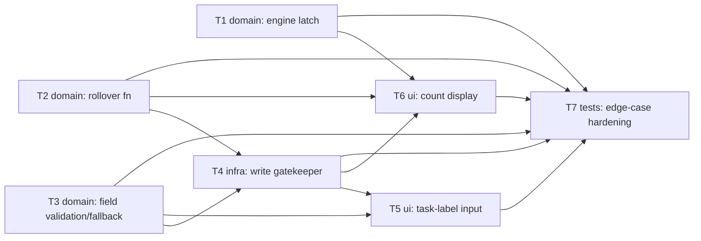

# Epic — session-tracking

> **Spec:** [spec.md](../spec.md) · **Design:** [sad.md](../sad.md) · **Screens:** [screens.md](../screens.md) · **ADRs:** [adr/](../adr/)

## Goal

Add a task-label note (persisted across reloads) and a trustworthy daily completed-Focus-session count to the shipped core-timer app — correct across a local-midnight boundary, resilient to corrupted/missing storage, and writable only through the app's own three legitimate triggers (`spec.md` §2 Goals).

## Scope

- **In:** `src/logic/` (engine's true-completion latch, the rollover-decision function, field validation/fallback functions), `src/ui/` (the centralized local-storage read/write gatekeeper, the task-label input, the daily-count display), their unit tests, and the regenerated root `index.html`.
- **Out:** per-session history, manually editing/resetting the counter, weekly/monthly aggregate stats, cross-device/cloud sync, a settings screen for the label limit (`spec.md` §3 Non-goals).

## Task map

## Tasks

See [tracker.md](./tracker.md) for status. Machine contract: [tasks.json](../tasks.json).

| # | Task | Layer | Blocked by | DoD (short) |
|---|---|---|---|---|
| T1 | Latch the true Focus-completion timestamp inside the engine's `settle()` | domain | — | `justCompletedFocusAt` reported once, regardless of triggering method |
| T2 | Add a pure daily-rollover decision function | domain | — | ≥5 mocked midnight-boundary cases pass |
| T3 | Add pure task-label length validation and per-field storage fallback functions | domain | — | 100-char hard stop + 0 exceptions on corrupted data |
| T4 | Build the centralized local-storage read + write gatekeeper | infra | T2, T3 | source-scan confirms one write call site; write failure swallowed silently |
| T5 | Wire the task-label input: typing, placeholder, limit, commit-on-blur/Enter | ui | T3, T4 | reload restores last-committed label; over-limit input rejected |
| T6 | Wire today's count display: load-time rollover check + Focus-completion crediting | ui | T1, T2, T4 | count increments only on true same-tracked-day Focus completions |
| T7 | Dedicated edge-case coverage: transition-source latch, write-integrity KPI | tests | T1, T2, T3, T4, T5, T6 | start/pause/reset-triggered latch + sleep-across-midnight cases green |

## Risks / Hard rules

- `src/logic/` never imports `src/ui/`; `src/ui/` is the only module touching the DOM or Web Storage API (`sad.md` §5).
- Only T4's centralized function may call `localStorage.setItem` for the count/date/label keys (`adr/0002-centralize-session-tracking-writes.md`).
- The task-label length limit rejects-with-message; it never clamps/truncates after the fact (`spec.md` §1, `CLAUDE.md` divergence).
- Rollover always resolves before crediting, on every read, never on a background timer (`sad.md` §4 point 7).
- The engine's completion latch must be set inside `settle()` itself, not only inside `getSnapshot()` — a User clicking Start/Pause/Reset at the completion instant must not lose the signal (`sad.md` §11).
