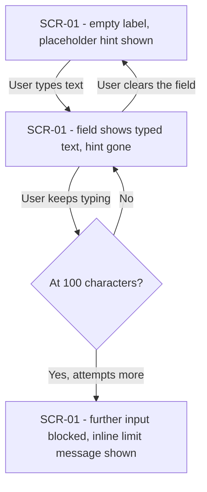
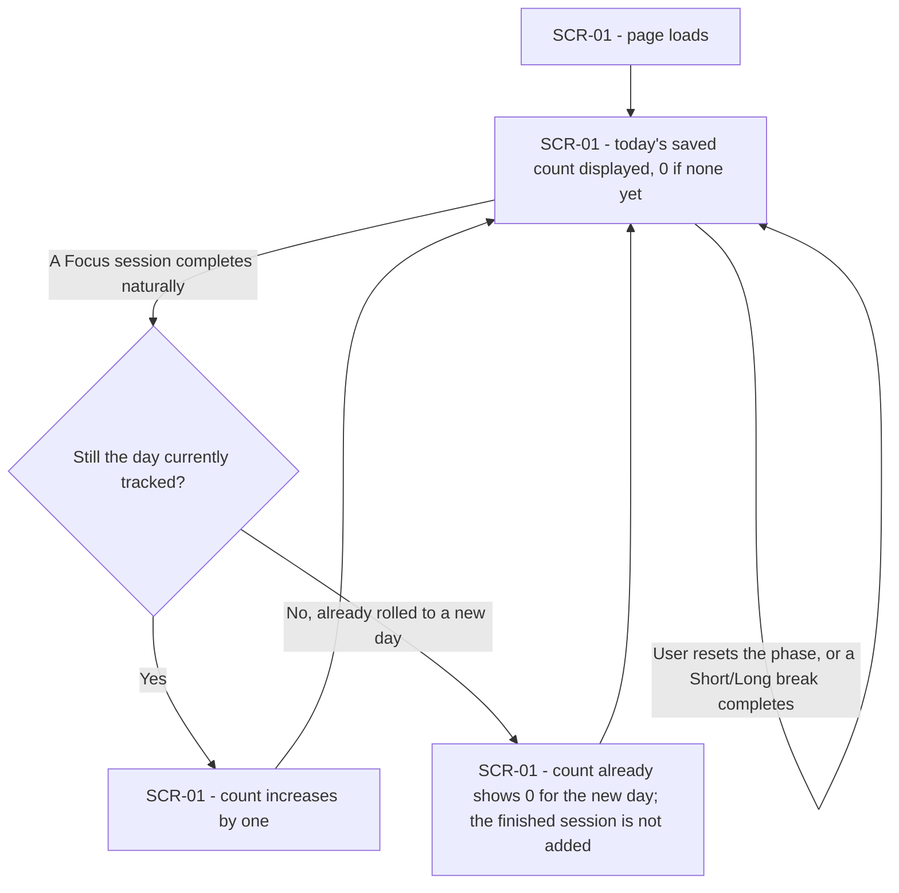
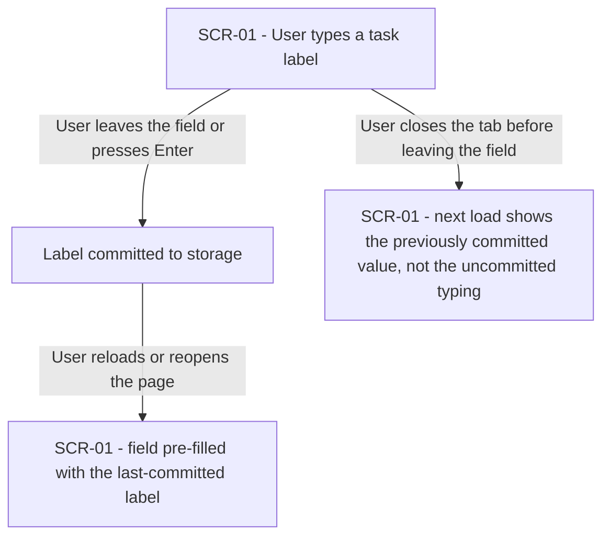
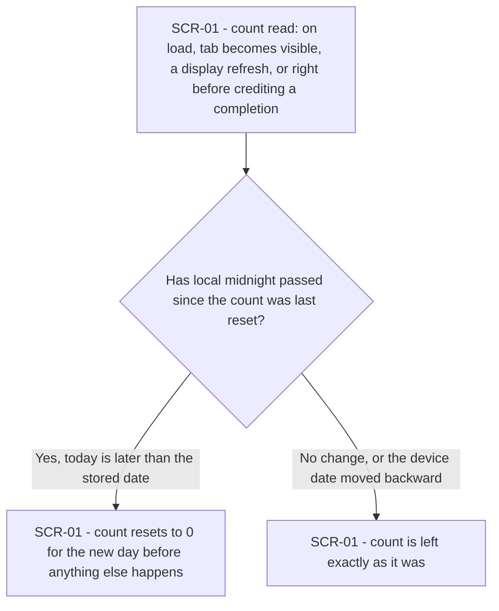

# UX flows — session-tracking

> User flows for every UI-touching §4 user story, produced by `ux-flows` (after `clarify`, before
> `design`) and read by `design` (evidence for the target-surface + UI-architecture decisions),
> `sequences` (UI-driven flows align on SCR ids), `screens` (details every inventory row) and
> `plan-tests` (the e2e-through-UI paths). Always markdown + mermaid `flowchart`.

## Platform decisions

- **Posture:** responsive single web page, code-only — no `docs/design-system.md` exists yet (recommend running `/sdd:design-system`); matches `docs/architecture-map.md` and `docs/features/core-timer/ux-flows.md` exactly.
- This feature adds to the **same single screen** core-timer already established — no navigation, no new screen. Every "transition" below is an in-place UI update (label text, displayed count), not a page change.

## Screen inventory

| ID | Screen | Purpose | Entry | Exit |
|---|---|---|---|---|
| SCR-01 | Timer screen | Shows the active phase, its remaining time, the Start/Pause/Reset controls, the task label input, and today's completed-session count | Opening `index.html` | None — a single-page app, no navigation away within the feature |

## Flows

### Flow: US-01 — Note what I'm focusing on

On first load with no saved label, the field shows a placeholder hint. Typing replaces the hint with the text as-is (AC-01), live. If the User keeps typing past 100 characters, the field simply stops accepting more and shows an inline message that the label is limited to 100 characters (AC-02) — no further keystroke or paste changes it beyond that point. Clearing the field back to nothing brings the placeholder hint back (AC-01b).

### Flow: US-02 — See today's completed focus count

On page load, the app shows today's saved count immediately, 0 if nothing has completed yet today (AC-04b). Whenever a Focus session completes naturally, if it's still the same calendar day the count is tracking, the display increases by one (AC-04); if a new day has already begun by the time the completion is processed (see US-04's rollover), that session isn't added to the fresh day's count — the User simply keeps seeing 0, not a phantom increment. Resetting the current phase, or a Short/Long break completing, never changes the count at all (AC-05).

### Flow: US-03 — Keep my last task label after reloading

The label is only committed when the User leaves the field or presses Enter — not on every keystroke. On the next load, the field is pre-filled with whatever was last committed (AC-03). If the User types something and closes the tab without leaving the field or pressing Enter, that in-progress text was never committed, so the next load shows the previous committed value, not the abandoned typing.

### Flow: US-04 — Trust the daily count starts over for a new day

Every time the count is about to be shown or changed — on load, when the tab becomes visible again, on any display refresh, or right before crediting a completed session — the app first checks whether local midnight has passed since the last reset. If today is genuinely later, the count resets to 0 for the new day before doing anything else (AC-06). If the date hasn't moved forward — including the rare case where the device's clock or date has actually moved backward — the count is left untouched; it only ever resets forward, never back (AC-06b).

### Out of scope: US-05 — Trust nothing but my own actions change the count

US-05's only acceptance criterion (AC-07) is an engine-level write guard triggered by non-actor input — a message from another tab/origin, or a devtools edit — not by any User action. There is no User-driven path that reaches it, so it has no flow to draw; it is verified by a unit test, not a UI path (same treatment `core-timer` gave its own AC-03).

## AC coverage

| AC | Shown by | Notes |
|---|---|---|
| AC-01 | Flow US-1 → A→B | Typing replaces the hint live |
| AC-01b | Flow US-1 → B→A (clearing) | Placeholder returns when emptied |
| AC-02 | Flow US-1 → C(Yes)→D | Hard-stop + inline message at 100 chars |
| AC-03 | Flow US-3 → B→C | Reload restores the last-committed label |
| AC-04 | Flow US-2 → C(Yes)→D | Same-day completion increments |
| AC-04b | Flow US-2 → A→B | Load shows the saved/zero count |
| AC-05 | Flow US-2 → B self-loop (Reset/break completes) | Count explicitly unchanged |
| AC-06 | Flow US-4 → B(Yes)→C | Midnight rollover resets forward |
| AC-06b | Flow US-4 → B(No/backward)→D | Backward clock leaves the count untouched |
| AC-07 | N/A — not a user-driven branch | AC-07's trigger is non-actor input (another tab/origin, a devtools edit); no User action reaches it — an engine-level guard verified by unit test, not a UX path (same treatment as core-timer's AC-03) |
