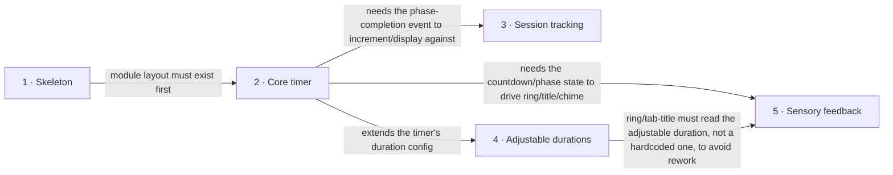

# Roadmap — pomodoro

> **A decomposition, not a promise.** The overall idea broken into incremental steps: what each
> step is, where it comes from, how big it is — or that nobody has looked at it yet — and in which
> order, and parallel lanes, we walk them. **No dates** (except shipped history), **no scores** —
> order is the prioritization. The *solution* for any step lives in its `docs/features/<slug>/`
> spec, not here.

## Destination

Anyone can open a single self-contained `index.html` and run reliable, visually/audibly-cued Pomodoro focus sessions with a persisted daily count — no install, no backend.

## Steps

| # | Step | Source | Size | Status |
|---|---|---|:---:|---|
| 1 | Materialize the greenfield skeleton | `architecture-map.md` §Stack | XS | shipped |
| 2 | [Core timer engine + controls](features/core-timer/spec.md) | `idea-brief.md` §1 Raw idea | XS | spec'd |
| 3 | Session tracking (task label + daily counter) | `idea-brief.md` §1 Raw idea | XS | idea |
| 4 | Adjustable durations | `idea-brief.md` §7 Recommendation | XS | idea |
| 5 | Sensory feedback (progress ring, tab-title mirror, chime, dark UI) — deferred, built last | `idea-brief.md` §1 Raw idea | S | idea |

## Not yet specified

<!-- none — every step above is already precisely formulated -->

## Out of scope

- Durable/cross-device session history via a backend + database — deferred to a possible future phase; would break the "open one file" promise (`idea-brief.md` §5, `docs/adr/0002-no-backend-for-v1.md`).
- Browser push/system notifications — tab-title countdown + completion chime judged sufficient (`idea-brief.md` §5).
- Multi-user or account features — no login, no sharing, single local user only (`idea-brief.md` §5).

## Open decisions

| # | Question | Type | Owner | Blocks |
|---|---|:---:|:---:|:---:|
| D1 | Does changing a duration mid-session restart the current phase, or finish it at the old value? | grilling | human | 4 |
| D2 | When does the daily session counter reset — local midnight, or a rolling 24h window? | grilling | human | 3 |

## Decisions so far

- Portfolio/demo scope, single self-contained `index.html`, vanilla JS, no framework, no backend for v1 → [`idea-brief.md`](idea-brief.md)
- Persistence is browser `localStorage` only; a backend-tracked history is a distinct future phase → [`adr/0002-no-backend-for-v1.md`](adr/0002-no-backend-for-v1.md)
- The shipped single-file `index.html` is generated from modular source by a build step, not hand-maintained → [`adr/0001-generate-single-file-from-modular-source.md`](adr/0001-generate-single-file-from-modular-source.md)
- esbuild is the dev-time build tool → [`adr/0003-esbuild-as-the-build-tool.md`](adr/0003-esbuild-as-the-build-tool.md)
- Greenfield skeleton scaffolded: vanilla JS/ES modules, `node:test`, ESLint, GitHub Actions CI → [`architecture-map.md`](architecture-map.md)

## Dependency graph

## Execution path

| Wave | Steps | Zone per step (why parallel-safe) | Unlocks |
|:---:|---|---|---|
| 1 | 1 | repo root (scaffold) | 2 |
| 2 | 2 | `src/logic/`, `src/ui/` | 3, 4 |
| 3 | 3 | `src/ui/` (shared — serialized, not parallel with 4) | — |
| 4 | 4 | `src/ui/`, `src/logic/` (shared — serialized, not parallel with 3) | 5 |
| 5 | 5 | `src/ui/`, `src/styles.css` (deferred — built last, after step 4 ships and is checked) | — |

## Shipped

| Step | Shipped | Link |
|---|---|---|
| Materialize the greenfield skeleton | 2026-09-05 | `8e8e5cf` |
